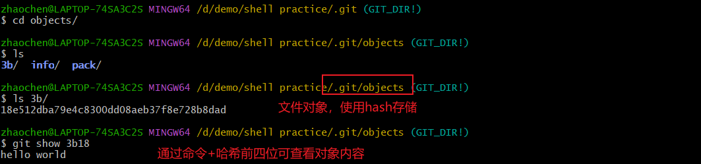
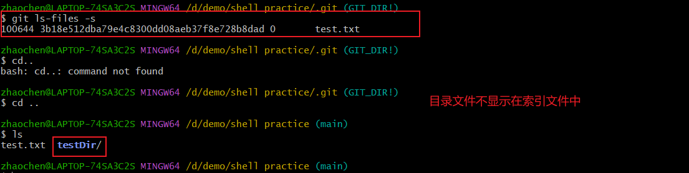
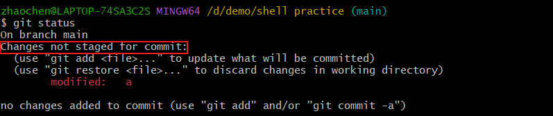
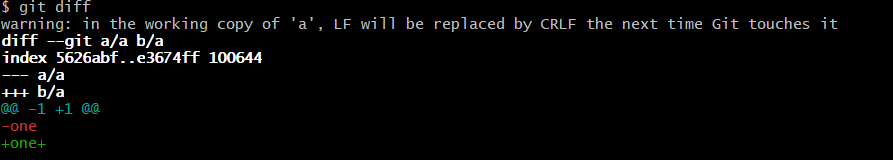
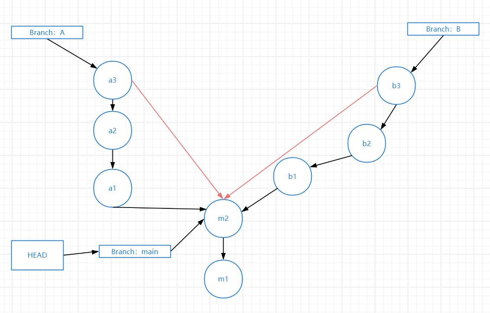
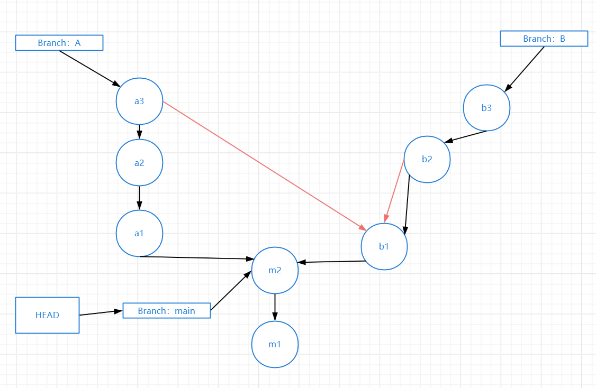
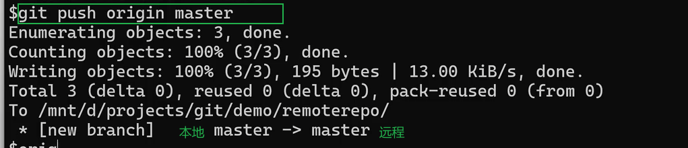
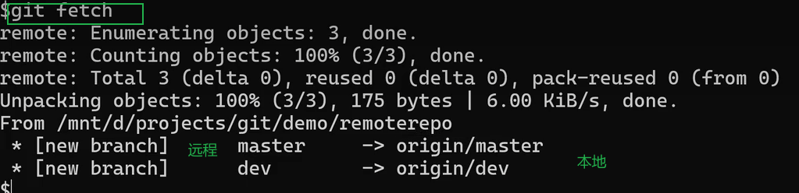

# 初始化仓库
- `git clone` 复制远程仓库
  - 默认将远程仓库所有的对象与历史都克隆
  -  `--depth` 浅克隆
  -  `--branch` 指定分支
  -  `--recurse-submodules` 同时克隆子模块(多用于C/C++项目)
-  `git init` 初始化本地仓库
--- 

# 配置
- 有系统级、用户级、项目级三种级别
- global表示用户级
- `git config`
  - --system 系统级 /etc/gitconfig
  - --global 用户级 ~/.gitconfig 或者 ~/.config/git/config
  - --local 项目级 .git/config (优先级最高)
```bash
git config --global user.name "Your Name"
git config --global user.email "youremail@domain.com"

cat $HOME/.gitconfig 查看配置信息
```
---
# 区域
- 工作区 与.git位于同级目录
- 暂存区/索引  
- 本地提交
- 远程仓库
---

# 暂存修改
- `git add` 暂存修改、包括文件的增删改查
- 文件对象存在本地对象目录
  - 按内容存储，不存储文件名，内容相同的不同文件使用同一个对象，以此来确保不同仓库的文件内容的唯一性
  - 内部对象:blob/tree/commit/tag
  - 查看对象 `git cat-file -p \<对象hash>` / `git show \<对象hash>`
- 索引中存储文件名和对象id
  - 查看暂存区 `git ls-files -s`
> 查看文件状态 `git status`
> - Untracked files: 表示文件没有被追踪，不归git管理
>- 对象存储在 .git/objects目录下
> 
> - 索引文件中只存文件，不存目录
> 
>   - 一般是在目录下存一个空文件

# .gitignore文件
- 作用：忽略制定规则的文件
- 作用范围：当前目录与子目录，可以多目录配置，子目录文件的优先级高
- 支持配置：通配符、否定符、指导目录等
---

# 提交
- `git commit` 提交（本地仓库），commit是仓库的一个快照，全量数据
- 操作
  - 通过索引构造commit对象，存储到本地目录对象
  - 更新当前分支对应的commit id
- HEAD引用，指向当前已提交的最新提交
- 分支引用，指向当前分支最新提交
  - 指向当前分支，如果不是指向分支，那就是Detached HEAD
  - 作为下一个提交的父提交
- branch引用，==指向一个commit id==
- 和commit相关的其他引用方式
  - ^后缀，父提交
    - 当存在`merge`，可通过^来选择父提交
  - ~后缀，祖先提交
    - 沿着链条向上寻找父提交
> commit指向一个tree类型的数据(递归指向blob/tree)，表示该时刻仓库的全量数据
> commit对象构造是通过索引构造的，从底层到上层，先创建blob->tree->commit
---

# 查看、对比
- `git status`查看工作区、索引和HEAD的对比
- `git diff` 
  - 默认工作区与索引比较
  - `--staged/--cached` 索引和HEAD比较，也可以指定HEAD之外的commit
  - 两个commit比较
  - 两个blob比较
- git show
  - 查看引用或者提交，也可以查看tree，blob等
  - A...B，查看A和B的合并基础
>
表示变更没有提交

默认是工作区与索引区的比较，a表示旧版本，b表示新版本
`git diff --staged`表示索引区与HEAD的比较
git diff 还可以比较两个blob
`git diff HEAD:a HEAD~:b`表示比较b文件与父提交的b文件
`@`可以用于表示HEAD
`git show HEAD` `git show HEAD:b`
---

# 删除和改名
- `git rm`删除
  - 基本和rm再add一样，从==工作区和索引区==删除
  - --cached，==从索引删除，工作区仍然保留==
- `git mv`
  - 工作区和索引区都会改变
  - 基本相当于删除旧文件，添加新文件
  - git不会记录改名操作，而是通过文件内容或者目录来判断的
- 注：
  - `git add` 可以处理删除和改名
---

# 分支管理
- 查看分支列表 `git branch`
- 新增分支
  - `git branch \<name>`
- 新增并切换分支
  - `git switch -c \<branch>` 新增并切换
  - `git checkout -b \<branch>` 新增并切换
- 切换和检出分支，修改HEAD，索引和工作区
  - `git switch \<branch>`
  - `git checkout \<branch>`
- 删除分支
  - `git branch -d/-D \<branch>` 
---

# 查看历史
- `git log` 查看commit历史
  - 默认查看HEAD， `--all`查看所有分支
  - 查看涉及到某一个文件的改动 `git log -- \<file>`
  - 查看改动的细节 `-p`,状态`-stat`，显示格式`--pretty=oneline --graph`
  - 查看指定数量的日志 `-\<num>`
  - 过滤 `--author` `--grep` `-S`
  - ^前缀相当于`--not A`，表示排除A可达的提交
  - `A..B`相当于`B ^A`,表示B可达，但A不可达的提交
  - `A...B`表示AB各自独有的提交
  
  # git merge
  - 三路合并：HEAD，对方commit，合并基础（共同的祖先节点）
    - 利用合并基础确认应该保留哪一方的版本
    - 三方都一致，保留任意一方；一方和base一致，保留另一方，两方一致，但和base不一致，保留任一方
    - 不能直接确认的，文本文件尝试自动合并；二进制文件，不能自动合并，作为冲突处理
  - 处理冲突
    - 手动处理，然后add，commit
    - 指定使用某一方的版本`git chaeckout --theirs/ours\<pathspec>`
  - 放弃合并
    - `git merge --abort`
    - `git reset --merge`
> 
---

# git cherr-pick
- 选择要合并的commit或者多个commit
- 三路合并
  - HEAD、commit、合并基础为commit的父提交
- 多个commit
  - 按照顺序先cherry-pick最早的提交
> 就是针对某次commit进行合并，而不是整个分支进行合并
> 
~~~bash
git cherry-pick <commit>
~~~
> 表示把commit相对于合并基础的所有提交拿出来，放在当前分支上，==动的是commit==
---

# git rebase
- 会**修改提交历史**
- 流程，使用多次cherry-pick
  - 设置当前分支A，rebase为B
  - 找到AB的基础
  - 以B为基础，把A从合并基础开始的提交进行cherry-pick
```bash
git rebase <branch>
```
> 表示将当前分支相对于合并基础的所有提交拿出来，放在目标分支上，和cherry-pick是相反的视角，==动的是自己==
---

# .gitattributes 属性配置文件
- 作用
  - 区别二进制还是文本文件
  - 控制 diff 行为
  - 控制 merge 行为
  - 换行符自动转换
  - 文件内容转换
- 作用范围
  - 当前目录及子目录
  - 可以在多个目录分别配置
- 配置方式
  - 前面是文件模式
  - 后面是相关的属性
---

# 回退某些文件的修改
- git restore
    - 默认将工作区恢复到和索引一致
    - `--source`：指定要恢复到的提交
    - `--staged`：将索引恢复到和 source 一致，默认是 `HEAD`
    - 如果不指定 `--staged`，默认是恢复工作区  
    - 如果要同时恢复索引和工作区，同时指定 `--worktree --staged`

- git checkout [\<tree-ish>] [--] \<pathspec>
  - 默认将工作区恢复到和索引一致
  - 指定了要恢复的源，则将工作区和索引恢复到和源一致
  - 处理合并冲突：`--ours` / `--theirs`
- git reset [\<tree-ish>] [--] \<pathspec>
  - 不修改 HEAD 和工作区，只修改索引
  - 默认是将索引恢复到和 `HEAD` 一致
---

# 回退某些文件的修改
- git restore
    - 默认将工作区恢复到和索引一致
    - `--source`：指定要恢复到的提交
    - `--staged`：将索引恢复到和 source 一致，默认是 `HEAD`
    - 如果不指定 `--staged`，默认是恢复工作区  
    - 如果要同时恢复索引和工作区，同时指定 `--worktree --staged`
- git checkout [\<tree-ish>] [--] \<pathspec>
    - 默认将==工作区恢复到和索引==一致
    - 指定了要恢复的源，则将工作区和索引恢复到和源一致
    - 处理合并冲突：`--ours` / `--theirs`
- git reset [\<tree-ish>] [--] \<pathspec>（带路径，安全）
    - 不修改 HEAD 和工作区，==只修改索引==
    - 默认是将索引恢复到和 `HEAD` 一致
---

# 整体回退
- git reset（危险），修改工作区/索引/HEAD到指定提交
  - --soft，只修改HEAD，不修改工作区和索引
  - --mixed（默认），修改HEAD和索引，不修改工作区
  - --hard，修改HEAD、索引、工作区
- git revert
  - 三路合并，HEAD、commit的父提交、合并基础为commit，这样就相当于将变更反转了。
  - 如果是多个commit，那么先revert最新的提交
- git commit --amend（修改历史）
  - 修改提交信息
- 危险的命令
  - 丢失修改，修改历史

# 暂存(工作区)修改
- git stash
  - git stash push，暂存修改
  - git stash list，查看暂存列表
  - git stash pop，==应用暂存修改并删除==，用到了三路合并功能，HEAD、暂存的索引构造的commit，合并基础为暂存时的HEAD。
  - git stash apply，==应用暂存修改==
  - git stash branch，将暂存恢复到一个新分支上
  - git stash drop，丢弃暂存
- 相当于:临时提交，但是不要push，然后git reset
---

# 远程分支
- 远程跟踪分支
  - 路径：.git/refs/remotes
- refspec 格式：`[+] \<src>:\<dst>`
- git fetch
  - 默认拉取全部远程分支
  - 可以指定分支，比如 `git fetch origin dev`
- git pull
  - 相当于 `git fetch`，再 `git merge`
  - 如果不指定远程分支，必须有 upstream 配置
- git push
  - 推送分支
  - 如果不指定远程分支，那么必须有 upstream 配置
- 删除远程分支
  - `git push origin --delete \<branch>`
  - `git push origin :\<branch>`
```bash
#推送到远程仓库
git push origin <branch>#表示把本地的分支推送在远程仓库的同名分支中
git push origin <local_branch>:<remote_branch>#完整写法
```
> 
> 
> 这里的两个远程分支对应的是你拉下来的存在本地的，与远程仓库的分支不是同步的
> 

# 本地分支自动追踪远程分支 upstream
- 作用:  
  1. 看本地和远程分支的差异  
  2. 拉取和 push 时，自动查找对应远程分支  
- 简写: @{u}
- 先有远程分支  
  - git clone 时，通常默认会自动追踪 master  
  - git checkout 远程分支名  
  - git checkout -b \<branch> origin/远程分支  
  - git switch -c \<branch> origin/远程分支  
- 先有本地分支  
  - git push --set-upstream/-u，推送远程时自动绑定  
  - git branch --set-upstream-to，直接指定绑定远程分支  
- 不常用的  
  - git fetch --set-upstream/-u  
  - git pull --set-upstream/-u
```bash
# 完整写法
# 设置远程分支并追踪
git push -u origin \<branch>
git push --set-upstream origin \<branch>
# 设置远程追踪不创建分支
git branch --set-upstream-to=origin/\<branch> \<branch>
```
---

标签管理
- tag 是一个引用
- tag 列表，git tag
- 新增 tag
  - git tag -a \<tag>，生成 tag 对象
  - git tag \<tag>，轻量级 tag
- 查看 tag，git show
- 检出 tag，git checkout
- 删除 tag，git tag -d
- 推送 tag 到远程仓库
  - git push origin tag \<tag> 或者 git push origin \<tag>
- 从远程仓库删除
  - git push origin :\<tag>
  - git push origin --delete \<tag>
