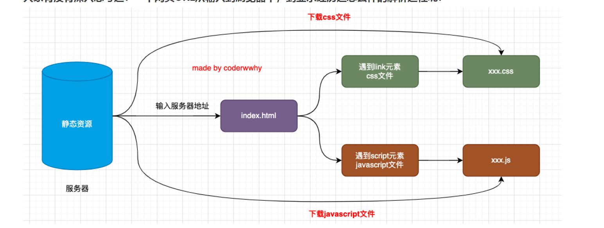
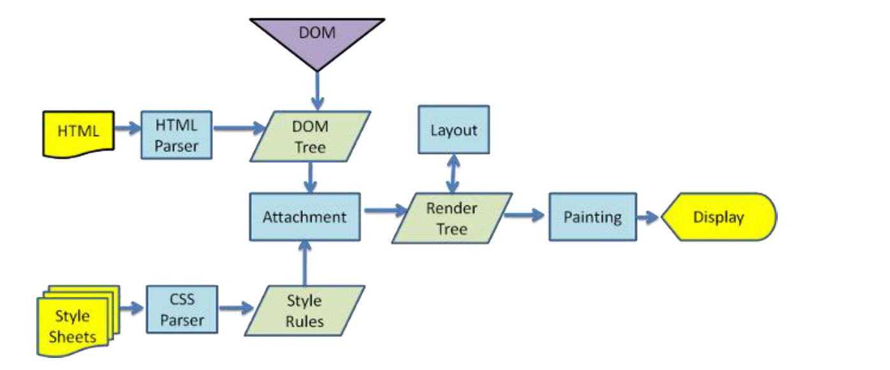
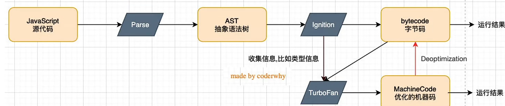

# 浏览器工作原理

- DNS解析获取IP地址(服务器地址) -> (一般)返回一个HTML文档 -> 下载 & 解析遇到的CSS&JS文件 -> 渲染
---
## html显示在网页上的过程
- 浏览器通过浏览器引擎对文件解析，最终渲染到页面上
- 浏览器内核
   - 通常所指的是浏览器**排版引擎**（layout engine），又叫==浏览器引擎/渲染引擎/样板引擎==，负责对网页内容进行渲染、解析。

- 渲染过程

>浏览器拿到 HTML 后，会先通过 HTML 解析器把标签解析成 DOM 树；同时，CSS 会被 CSS 解析器解析成样式规则。接着浏览器会在 Attachment 阶段，把 CSS 规则和 DOM 结构结合起来，计算出每个节点的最终样式，然后生成只包含可见节点的 Render Tree。
有了 Render Tree 之后，浏览器会进行 Layout，计算每个元素在页面中的位置和尺寸；接下来进入 Painting 阶段，把这些元素按照样式绘制成像素；最后由合成和显示阶段把绘制结果输出到屏幕上。
整个过程里，DOM 决定结构，CSS 决定样式，Render Tree 决定哪些元素参与渲染，而 Layout 和 Paint 是性能开销最大的部分，页面的重排和重绘本质上就是这几个阶段被重新执行。
  - JavaScript引擎执行JavaScript代码(帮助翻译为CPU指令执行)

- 认识浏览器引擎 & 浏览器引擎与JavaScript引擎的关系
  - 浏览器引擎是一组引擎
    - 渲染层-WebCore 页面解析 & 布局 & 渲染
    - 逻辑层-JavaScriptCore 解析执行JS代码 

# V8引擎原理

- 解析过程分为两步；词法分析 & 语法分析
  - 词法分析：对语句分词，形成一串'token',并以k-v的形式存储
    - const - 关键字
    - name - 标识符
    - =  符号
    - “zhao” - 字符串字面量
  - 语法分析：对语句进行语法检查，并生成抽象语法树（AST）
    - 利用抽象语法树可以做很多事
      - ts -> 抽象语法树 -（修改）-> JS抽象语法树 -（生成代码）-> JS代码
      - ....
- 转换字节码是为了更好的适配不同平台环境(不同cpu的指令不同) - 跨平台
- TurboFan库对执行频率率高的代码会转换为机器码存储在内存中，方便下次使用，但当函数执行过程中出现数据的类型变化，则需要逆向转化为字节码重新执行