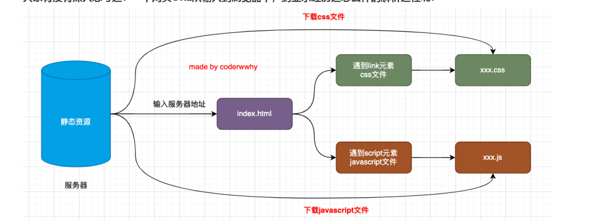
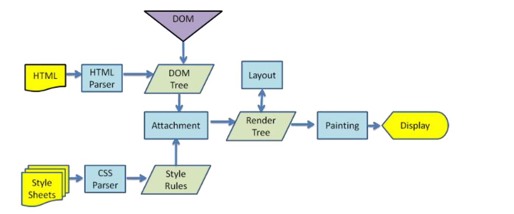
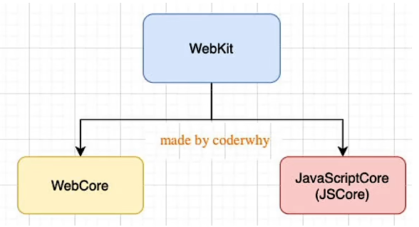
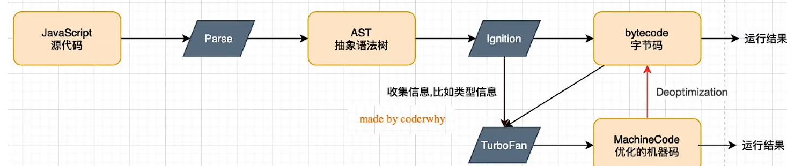
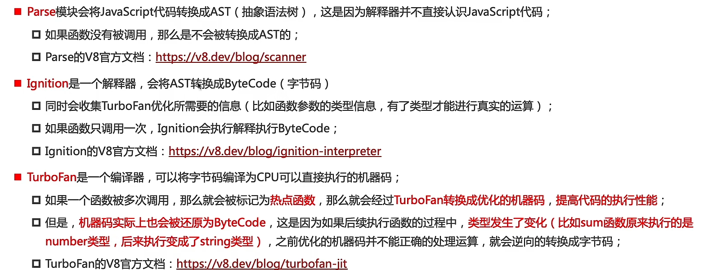
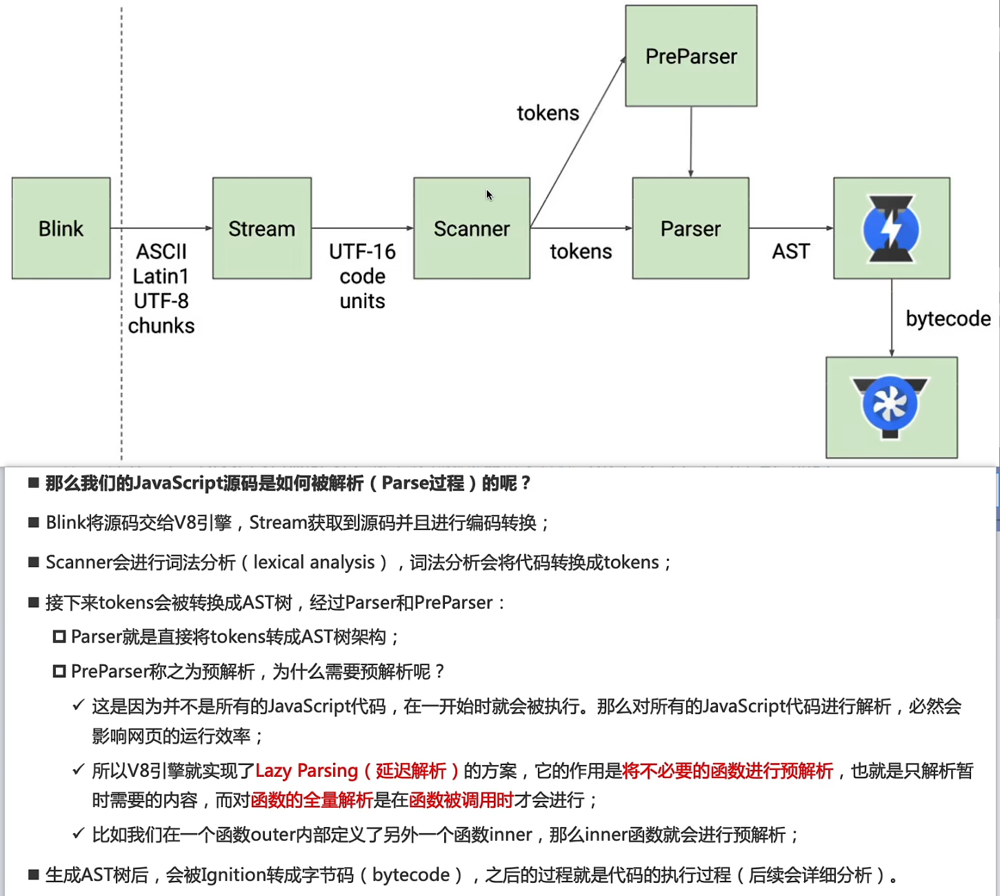

# 浏览器渲染过程 & V8执行机制

- DNS解析获取IP地址(服务器地址) -> (一般)返回一个HTML文档 -> 下载 & 解析遇到的CSS&JS文件 -> 渲染
- JS文件在浏览器中执行(通过浏览器内核)
## 从 HTML/CSS 到像素：浏览器渲染流水线
- 浏览器通过浏览器引擎对文件解析，最终渲染到页面上
- 浏览器内核
   - 通常所指的是浏览器**排版引擎**（layout engine），又叫浏览器引擎/渲染引擎/样板引擎，负责对网页内容进行渲染、解析。
---
- 渲染过程

>1. HTML文件由对应的解析器转换为DOM树，同时CSS样式也被对应的解析器转换为样式规则  
>2. 将CSS样式规则挂载(Attachment 阶段)在DOM树上，生成渲染树
>3. 根据渲染树进行页面布局(浏览器根据页面具体情况决定元素的布局)
>4. 绘制页面
>5. 展示

> 整个过程里，DOM 决定结构，CSS 决定样式，Render Tree 决定哪些元素参与渲染，而 Layout 和 Paint 是性能开销最大的部分，页面的重排和重绘本质上就是这几个阶段被重新执行。
---
- JS是一门**高级编程语言**，这表示对于计算机来说，读懂代码是困难的，JS引擎起到了**翻译代码**的作用，不同的CPU具有不同的指令集，JS引擎会将代码最终翻译为指令集让计算机执行
---
### 浏浏览器内核 vs JavaScript 引擎：分工、边界与协作
> 我们常指的浏览器内核表示排版引擎，这里我特别指出，浏览器内核是表示浏览器的核心整体
- 
  - 根据图片所示，浏览器内核由排版引擎&JS引擎组成：
    - 排版引擎负责渲染(HTML解析&布局&渲染等)
    - JS引擎负责逻辑上的功能实现(JS代码解析与实现)

## V8 如何执行 JavaScript：解析 → 字节码 → 优化编译
- V8引擎由C++编写，可作为一段程序代码嵌入在任何C++环境中

- 解析过程分为两步；词法分析 & 语法分析
  - 词法分析：对语句分词，形成一串'token',并以k-v的形式存储
    - const - 关键字
    - name - 标识符
    - =  符号
    - “zhao” - 字符串字面量
  - 语法分析：对语句进行语法检查，并生成抽象语法树（AST）
    - 利用抽象语法树可以做很多事
      - ts -> 抽象语法树 -（修改）-> JS抽象语法树 -（生成代码）-> JS代码
      - ....
- 转换字节码是为了更好的适配不同平台环境(不同cpu的指令不同)用于**跨平台**
- TurboFan库对**执行频率率高的代码**会转换为机器码存储在内存中，方便下次使用，但当函数执行过程中出现数据的类型变化，则需要逆向转化为字节码重新执行
  - 这就是为什么TS比JS更高效，因为TS对数据类型的严格控制，减少了频繁类型转换带来的性能损耗
### V8 执行关键细节：预解析、热点代码与去优化

> 重点了解预解析的概念