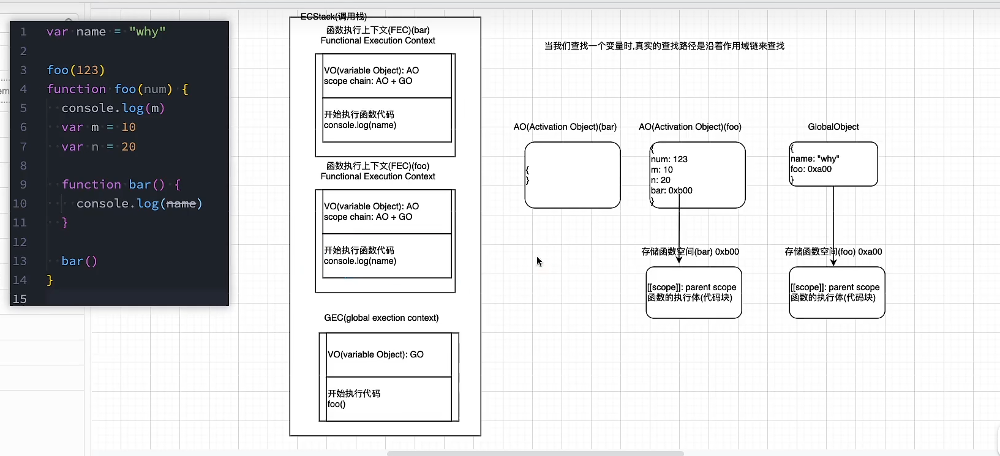

# 执行上下文、GO/VO/AO 与作用域链
## 全局代码执行
```js
var num = 10;
var num2 = 20;
var name = "zc";

var res = num + num2;

```
- 在**代码解析阶段**，V8引擎创建全局对象(GO)，存放变量(常用的函数&常数&...&window对象&代码变量)但没有赋值
- **运行代码阶段**
  - V8引擎创建一个执行上下文栈（函数调用栈），函数执行时入栈，执行后弹出栈
  - 全局代码需要执行时，会创建**全局执行上下文**，内有**VO对象**指向GO，在代码执行时，从VO中找到匹配的变量执行

> 若全局代码中存在函数，那么执行过程是什么样的？

```js
//...
//foo()
//...
function foo (num) {
  var n = 10;
  var m = 20;
  console.log(num+n);
}
//foo()
```
- 在**JS编译阶段**，编译器发现函数存在后，会在**内存中开辟一块空间，存放【作用域信息&函数参数信息&函数执行体】**，此时函数变量存放的是函数内存地址
- 在JS**代码执行阶段**，当执行函数时，会创建一个**函数执行上下文**入栈，栈中:存放【AO对象(存放函数体中的变量eg.n&m&...】，执行函数体代码，函数执行完成后，函数执行上下文出栈。

- 代码执行过程中变量的寻找路径是根据**作用域链**向上寻找的
- 由图可知，函数的作用域链是在编译阶段就决定的，而不是调用时决定的
---
> 变量环境与记录
> “VO&GO”都属于早期的ECMA版本规范:"每一个执行上下文会被关联到一个变量环境（VO），在源代码中的变量和函数声明会被当做**属性**添加在VO中，对于函数，其参数也会被添加在VO中"

> 在最新的ECMA版本规范中，做出了修改:"每一个执行上下文会被关联到一个变量环境中，在执行代码中，变量和函数声明会被当做**环境记录**添加在变量环境中，对于函数，其参数也会被添加在变量环境中"
VO=>环境变量
属性=>记录