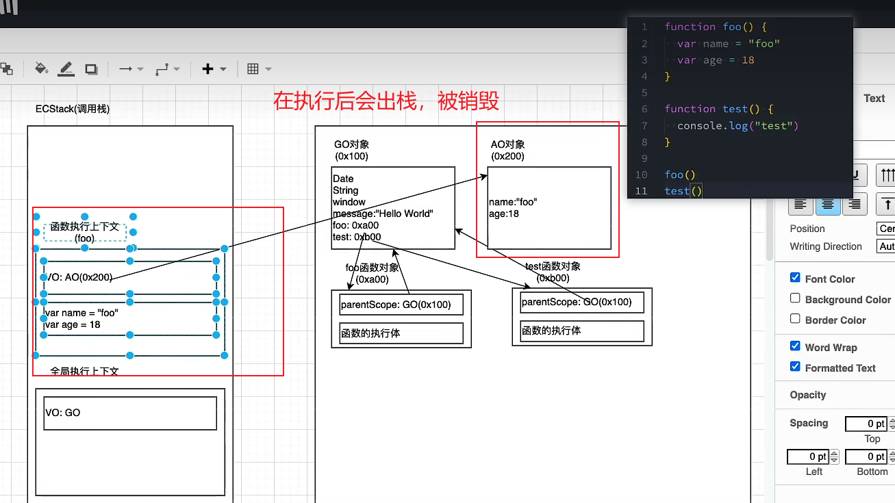
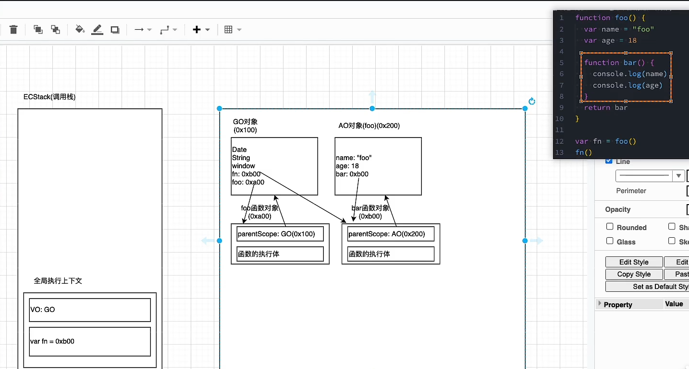

# JS内存管理与闭包
## 认识内存管理
- 无论什么编程语言都需要内存管理
- 内存管理的步骤：
  - 申请需要的内存
  - 使用分配的内存
  - 不需要时，进行释放
- 对于内存管理有手动与自动两种方式
### JS的内存管理
- JS在定义变量时自动分配内存
- 对于**基本数据类型**，直接分配在栈内存中
- 对于**复杂类型**，在堆内存中开辟空间，并将该空间地址返回变量引用
### JS垃圾回收
- 内存空间是有限的，所以需要垃圾回收(GC)
- 对于**不再使用的对象**，都称之为垃圾，需要回收释放更多的空间
- JS的引擎中有垃圾回收器，GC根据**GC算法**决定回收对象
> GC算法
> - 引用计数：
>   - 当一个对象有引用指向，那么对象引用计数+1，当对象的引用为0，那么对象会被销毁
>   - 弊端是会产生循环引用（两个对象互相引用）
> - 标记清除
>   - 设置一个根对象，垃圾回收器定期从根开始寻找所有被引用的对象，对于没有被找到的对象会被清除(可达性)
>   - 该算法解决了循环引用的问题

## 闭包
- 闭包是在支持头等函数的编程语言中，实现词法绑定的一种技术
- 是一个结构体，存储了函数与与函数有关的环境
- 函数与闭包的最大区别在于，当捕捉闭包时，它的自由变量会在捕捉是被确定，即使脱离了当前上下文，也能照常运行
- MDN中的定义：一个函数与对其周围状态的引用绑定在一起的组合就是闭包
  - 闭包可以使内层函数访问到外层函数的作用域
  - 在JS中，每创建一个函数，闭包就会在函数被创建出来的同时被创建
### JS函数是一等公民
- 函数可以被当做参数&返回值使用
- JS允许函数嵌套使用
- 高阶函数：若一个函数允许接受其他函数作为参数或者作为返回值，那么该函数就被称之为高阶函数
- 独立的函数就是函数，对象中的函数叫做方法

> 函数中的**数组操作**
> - 过滤：filter(),接受回调，回调参数是数组元素&元素下标&数组本身，返回一个新的符合条件的数组(true)
> - 映射：map()，接收回调，回调参数是数组元素&元素下标&数组本身，返回加工后的新数组
> - 迭代：forEach()，接收回调，~~，不会返回新数组
> - 叠加：reduce(),接受回调与初始值，回调参数为上一次返回结果&当前元素&元素下标&数组本身，返回多次累加值
> - 查找元素与元素下标：find()&findIndex()

```js
//第一版：
function foo(){
    function bar{
        
    }
    return bar
}

var fn =foo()
fn()

//第二版：
function foo(){
    var name = "zc"
    function bar{
        console("name",name)
    }
    return bar
}

var fn =foo()
fn()
```
> 执行过程：  
> 1. 创建全局对象，检测到函数->创建函数对象，**对于嵌套函数来说，会同样创建其函数对象**
> 2. 代码执行，全局执行上下文入栈，创建VO指向全局对象，执行代码
> 3. 在执行代码过程中遇到函数，函数执行上下文入栈，创建AO对象，执行函数代码，函数执行上下文出栈
> 4. 对于第二版，函数bar在创建时就构成了闭包的条件，连同其环境一同被保留
- 函数对象是在编译阶段创建的，AO对象是在执行时才会被创建
> 总结：
> 对于普通函数，如果可以访问外层作用域的自由变量，那么就是一个闭包
> 广义上:所有函数都可以访问到外层作用域的变量，都可以称为闭包
> 狭义上：函数只有访问了外层作用域的自由变量，才可以被称之为闭包

### 探究：闭包创建后内存中的发生过程

- 对于不存在闭包的代码执行后，函数空间会被销毁

- 对于存在闭包的代码执行中，内层函数被返回给外层作用域的变量，那么内层函数对象的引用就一直存在，相应的，其函数对象的父级作用域(就是存在的AO对象)也会存在引用，所以不会销毁AO对象
- **闭包引起的内存泄漏**：若引用了内层函数却只执行一次，但保留的内存空间一直不会被销毁，那么这种情况被称之为内存泄漏
  - 若出现**只执行一次的情况，建议在执行后，清除对闭包的引用，释放空间**
- V8引擎**会清除闭包不需要的变量，只保留需要的变量信息，进行内存优化**
- V8引擎对number类型也做出了优化，**对于小的数字类型，V8中称之为smi，占据4byte(原8byte)**