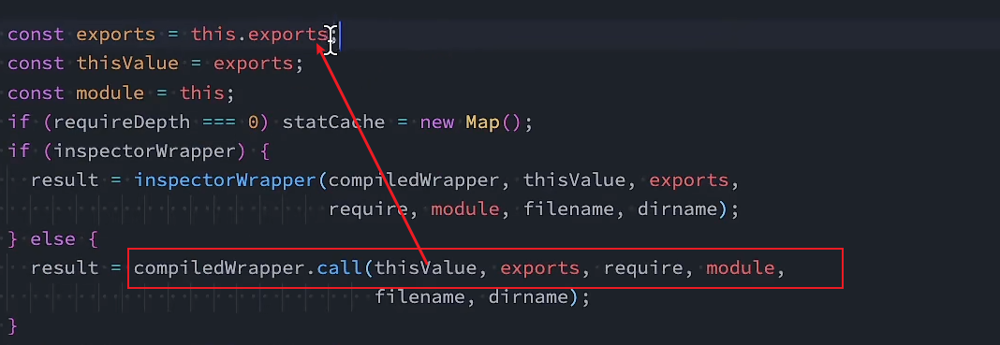
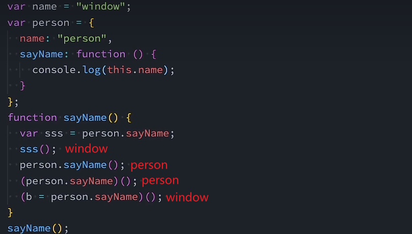
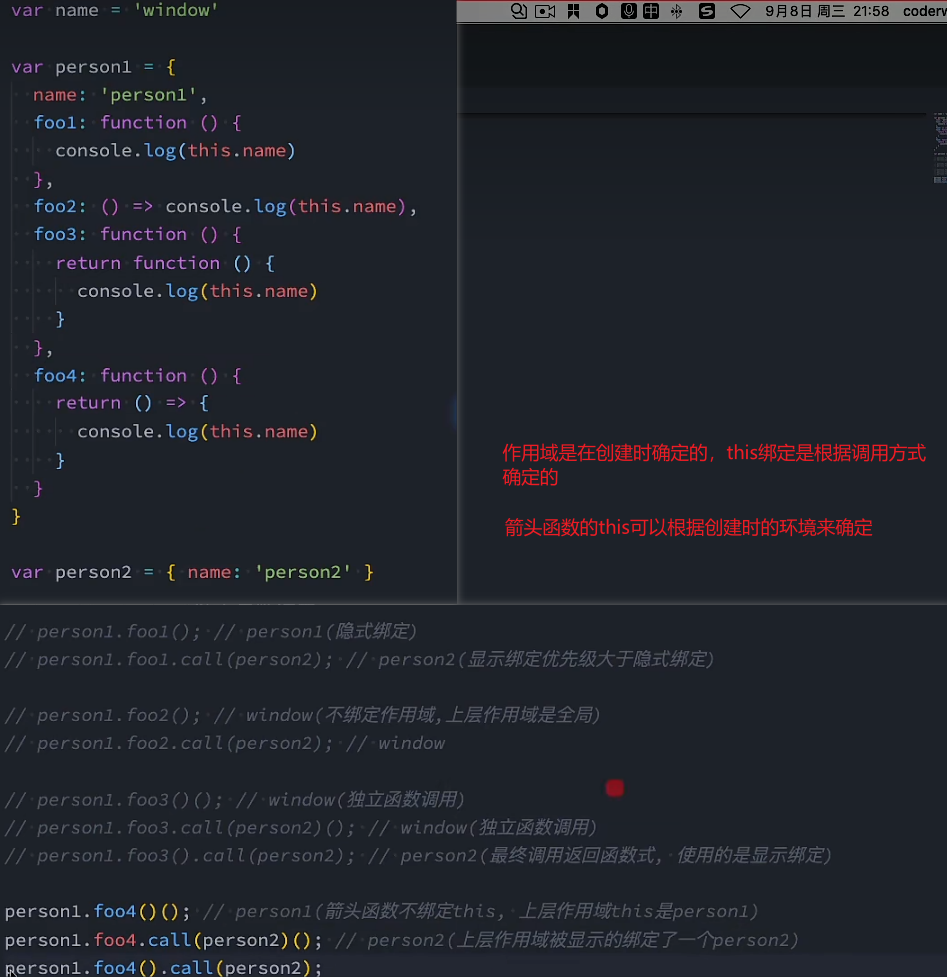

# JS中的this

## this在全局作用域的指向

> 在浏览器环境下：window(GlobalObject)
> 在Node环境下：{}
>
> - 在node环境下，每一个文件都被当做一个模块(Module)，加载->编译->放在一个函数中->执行函数.apply({})
>   

##

```js
functiopn foo(){
    console.log(this)
}

var obj ={
    name:"ax",
    foo:foo,
}
obj.foo()

foo.apply("ac");
```

- this通常在函数中使用
  - 每一个函数在执行时会创建一个执行上下文，this是该上下文中的一条记录
- this是动态绑定的，与函数所处位置无关，与**函数调用方式**有关，在运行时绑定

## this的绑定规则

- 默认绑定
- 隐式绑定
- 显式绑定
- new绑定

### 默认绑定

> 独立函数调用是默认绑定

- 默认绑定的绑定对象是window

### 隐式绑定

> 隐式绑定是指通过**某个对象调用时**的绑定规则

### 显式绑定

> 与直接调用的区别就是this绑定的不同  
> 可以实现在不添加对象属性的前提下为函数绑定this

> apply&call的区别：传递参数的形式不同  
>  call()传参是通过剩余参数的形式传递的  
>  apply()传参是通过数组的形式传递的

```js
foo.call("name", 20, 30, 40);
foo.apply("name", [20, 30, 40]);
```

> bind解决了每一次独立调用函数时需要执行显式绑定的操作，直接返回一个新的函数，this指向绑定的对象

```js
var newFoo = foo.bind("abc");

newFoo(); //绑定abc
```

### new绑定

- JS中的函数可以当做构造函数使用(new关键字实现)
- 使用new时的执行步骤:
  - 创建一个新对象
  - 新对象执行prototype连接
  - 新对象会被绑定在函数调用的this上(**this绑定**)
  - 如果函数没有返回其他对象，表达式会返回该新对象

```js
function foo() {
  //...
}

var bar = new foo();
//新对象：obj:{}
//obj._proto_ = foo.prototype
//foo.this = obj
```

### 补充：内置函数的this绑定

- 关于回调函数的this指向问题：
  - 回调函数的this是**独立调用，绑定window**
- 关于DOM监听事件的this指向
  - 事件回调**隐式绑定在DOM元素上**
- 数组函数的this绑定问题
  - forEach/map/filter/....此类函数的回调**默认绑定在window上，但这类函数的第二参数可用于指定绑定对象**

## 规则优先级

- new绑定 >> 显式绑定 >> 隐式绑定 >> 默认绑定
  - new一般不与apply/call同时使用，new的优先级高于bind

## 规则之外：会被忽略的显式绑定情况

- 当传入的显式绑定对象为`null&undefined`时，this的绑定对象是全局对象
- 间接函数使用：

```js
var obj1 = {
  name: "obj1",
  foo() {
    console.log(this);
  },
};

var obj2 = {
  name: "obj2",
};

obj2.foo = obj1.foo;
obj2.foo()(
  //隐式绑定，obj2

  (obj2.foo = obj1.foo),
)(); //当使用()将表达式圈起来时，会被当做一个独立函数调用，this绑定windows
// 赋值表达式返回右侧结果
```

> 表达式还是语句？
> 表达式是一个**有计算结果**的运算过程
> 语句是**一个指令，是一个动作**，不一定有返回值

## 特殊情况：箭头函数

- 箭头函数不绑定this,所有相关规则都不适用，箭头函数的this根据其外层作用域查找
- 在高阶函数中，灵活使用箭头函数可以便捷获取绑定对象
```js
var obj = {
  data:[],
  //...
  var _this = this,
  setTimeout(function(){
    var result = ["x",...]
    _this.data = result

  },2000)
}

//箭头函数之后
//...
setTimeout(()=>{
  this.data = result
})
```
## this面试题：
- 
- 

## apply&call&bind实现
- 只考虑核心实现，不考虑边界情况
> - 为全局添加函数的方式
>   - `Function.prototype.funName = function(){} `
> - ES6剩余参数：为了避免不知道具体参数数量而设置
>   - `function foo(...nums){}`
>   - nums是一个数组，接收所有参数
> - 展开运算符
>   - `...`运算符：遍历内容并取出
> - 统一的对象转换
>   - `Object()`
### call
```js
Function.prototype.mycall = function(thisArg,...args){
  //获取当前执行的函数
  var fn = this;
  //防止传入的是非对象类型，进行转换
  //对null与undefined进行处理
  thisArg = thisArg? Object(thisArg) : window 
  //调用需要被执行的函数
  thisArg.fn = fn
  var result = thisArg.fn(...args)
  delete thisArg.fn
  //返回数据
  return result
}
```
### apply
```js
Function.prototype.myapply = function(thisArg,argArray){
  var fn = this;
  thisArg = thisArg ? Object(thisArg) : window;
  thisArg.fn = fn;

  // var result
  // if(!argArray){
  //   result = thisArg.fn() 
  // }else{
  //   var result = thisArg.fn(...argArray);
  // }

  argArray = argArray || []

  delete thisArg.fn

  return result

}
```
- 由于apply接收参数是数组形式，若没有接收参数，那么第二参数**默认是undefined，展开运算符就会报错，所以需要进行判断**

### bind
```js
Function.prototype.mybind = function(thisArg,...argArray){
  var fn = this;
  thisArg = (thisArg !== null &&thisArg !== undefined) ? thisArg : window
  
  function proxyFn(...args){
    thisArg.fn = fn
    //将两次传参都合并
    var finalArgs = [...argArray,...args]
    var result = thisArg.fn(...finalArgs)
    delete thisArg.fn
    return result
  }

  return proxyFn
}
```

## arguments
- argument是一个类数组对象
  - 长得像数组，但实际上是一个对象
  - 函数接收的参数都保存在这里
- 常见操作
  - 获取函数参数长度
  - 根据索引获取参数
  - 根据callee获取当前arguments所在的函数 

> argument是类数组的表现
> 有length属性，可以通过index索引访问
> 没有forEach、map方法

### 常见需求：将arguments转换为数组
- 自己设计遍历
- 用 slice 借用数组的“截取并返回新数组”能力，把类数组 arguments 按下标和 length 复制成真正的数组。
- ES6语法：Array.from：接收一个数组或者类数组,并返回数组形式
- 展开运算符
```js
function foo() {
  //1. 自己遍历
  var newArr = [];
  for(var i = 0;i < arguments.length;i++){
    newArr.push(arguments[i])
  }

  //2. 用 slice 借用数组的“截取并返回新数组”能力，把类数组 arguments 按下标和 length 复制成真正的数组。
  //原型调用+call绑定可遍历对象
  // var newArr = Array.prototype.slice.call(arguments)
  var newArr = [].slice.call(arguments)

  //ES6
  var newArr2 = Array.from(arguments);

  //展开运算符
  var newArr3 = [...arguments]
}

```

> slice原理
```js
function(start,end){
  var newArr = [];
  start = start || 0;
  end = end || arr.length;
  for(var i =start;i < end;i++){
    newArr.push(this[i])
  };
  return newArr;
}
```

### 箭头函数的arguments
- 箭头函数没有arguments
- 箭头函数的arguments依赖上层作用域
- 全局环境中的arguments
  - 在node环境中存在
    - 原因是文件在node中被当做模块运行在函数中
  - 在浏览器中不存在
> 那么在箭头函数中传递的多余参数在哪？
> 推荐使用**剩余参数:...args**
- arguments是早期版本中的语法，现在已经不推荐使用