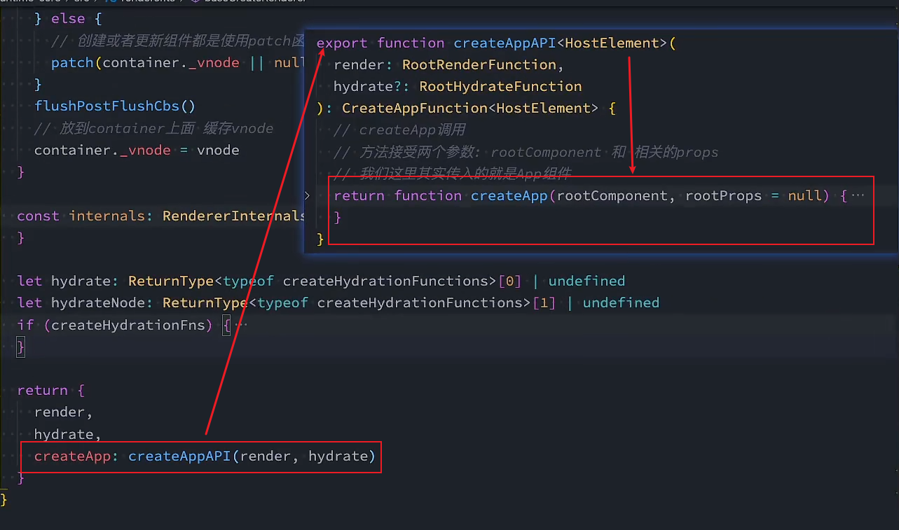

# 纯函数&组合函数&柯里化
## 纯函数
- 是在**函数式编程**中重要的概念
- 概念：
  - 函数**在相同的输入值下，产生相同的输出**
  - 函数的**输入和输出值以外的其他隐藏信息或者状态无关，和IO设备产生的外部输出无关**
  - 该函数不**能产生语义上的副作用**，eg.触发事件，输入输出行为，更改除了输出值以外的其他值的内容
> 总结:
> 确定的输入一定有确定的输出
> 在函数执行过程中，不能产生副作用

## 副作用
- 表示在函数执行时，**除了函数的返回值，还产生了其他影响**，eg.修改全局变量、修改参数、修改外部存储...
- 副作用是产生bug的"温床"

## 纯函数案例与优势理解
- `slice()`只需要传入start/end，对于同一个数组来说，会返回确定的值，且不会修改原本的数组，所以`slice()`是纯函数
- `splice()`接收start同样可以截取数组内容，但会修改原数组的值(副作用)，所以`splice()`不是纯函数
- 我们尽量使用纯函数
```js
//1. 
function sum(num1,num2) {
  return num1 + num2
}
//2.
let foo = 5;
function add(num) {
  return foo + num;
};

console.log(add(5));
foo = 10;
console.log(add(5));

//3. 
function printInfo(info){
  console.log(info.name,info.age);
  info.name ="zc"
}
```
- 场景一是纯函数
- 场景二不是纯函数，因为收到外界变量的影响
- 场景三不是纯函数，修改了内容，即使删除了最后一句，在**严格意义上也不是，因为产生了输出。**

- 使用纯函数只需要关心业务逻辑的实现，不需要关心传入的内容是不是依赖其他变量以及是否发生了修改
- 有确定输入就有固定的输出，不需要考虑额外的情况

## JavaScript柯里化
### 概念：
- 把接收**多个参数的函数**，变成**接收一个参数的函数**，然后返**回一个接收剩余参数，且会返回最终结果的函数**
- 总结：只**传递给函数一部分参数来调用它，让它返回一个函数去处理其它参数**
> 把接收N个参数的函数变成接收一个参数的N个函数的链式调用
```js
function sum(x,y,z){
  return x + y + z
}

function foo(x){
  return function(y){
    return function(z){
      return x + y + z
    }
  }
}

//简化：
foo = x => y => z => {
  return x + y + z
}
```
### 原因：
- (单一职责原则)函数式编程的原则就是希望函数处理的问题单一，不是将一堆处理过程交给一个函数处理
- 方便逻辑复用
```js
function log(date,type,mes){
  console.log(`[${date.getHours()}:${date.getMinutes()}][${type}]:[${message}]`)
}
console.log(new Date(),"debug","查找轮播图debug")
console.log(new Date(),"debug","查找菜单debug")
console.log(new Date(),"debug","查找数据debug")

//柯里化优化
var log = date => type => mes => {
  console.log(`[${date.getHours()}:${date.getMinutes()}][${type}]:[${message}]`)
}

//若传递的是同一时间的数据
var newLog = log(new Date())
newLog("debug")("查找轮播图debug")
//....
```
### 自动柯里化实现
1. 接收原函数，返回一个柯里化后的参数
2. 接收原函数后：
  - 参数数量够了，直接调用原函数输出结果
  - 参数数量不够，递归调用curried函数，curried2的主要目的是接收后续参数然后拼接在递归函数curried中的
```js
function Curring(fn){
  function curried(...args){
    //当接收的参数数量大于等于原函数的参数数量时，就没有必要返回函数调用了
      if (args.length >= fn.length){
        // 为了保证自动柯里化函数的this与原本函数的this一致，这里显式绑定
        return fn.apply(this,args)
      }else{
        function curried2(...args2){
          curried.apply(this,[...args,...args2])
        }
        return curried2
      } 
  }
  return curried
}
```
### 柯里化在Vue中的应用
- 在Vue3的源码中，有关渲染器的函数使用了柯里化的技术
  - 
  - 这里的"createApp"函数先传入了一个渲染函数，调用"createAppAPI"返回真正的实例化Vue根组件函数
    - 这样做的原因是：首先固定了渲染函数的使用，然后可以根据不同的环境进行渲染

## 组合函数
- 是函数的使用技巧：若对数据的操作总是需要多步相同的操作，且操作是依次执行的，那么可以使用组合函数
```js
function composeFn(m,n){
  return function(count){
    return n(m(count))
  }
}
```

### 实现组合函数
- "fns"收集所有传入的函数
- compose实现:
  - 若传入了函数，就执行`fns[0]`，否则`result = args`
  - while:顺序执行第二个函数，且该函数只接受上一个函数的结果作为参数
```js
function myCompose(...fns){
  //判断：传入的参数必须是函数，否则抛出错误
  var length = fns.length;
  for(var i = 0; i < length; i++){
    if(typeof fns[i] !== 'function'){
      throw new TypeError('Expected argument are function')
    }
  }
  //实现组合函数
  function compose(...args){
    var index = 0;
    var result = length ? fns[index].apply(this,args) : args;
    while(++index < length){
      result = fns[index].call(this,result)
    }
    return result
  }

  return compose
}
```
> 组合函数的实现：
> 1. 首先确定执行顺序与参数顺序  
> 2. 确保多个函数之间的接口匹配:只有第一个函数可以接受多个参数，其余函数只需要专心处理上一个函数的结果即可  
> 3. 建议第一个函数放"适配器"将多个参数处理为相同格式的对象