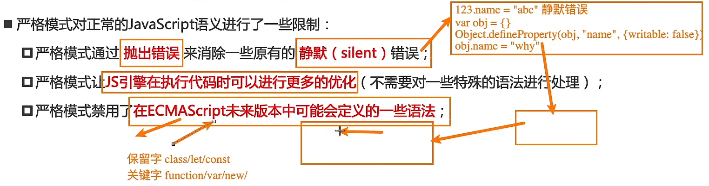
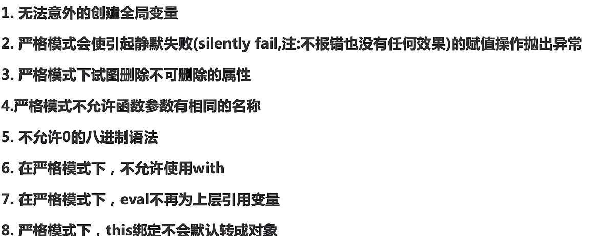
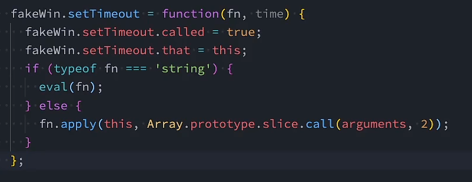

# JS额外知识
## with
- with语句可以形成自己的作用域
- with在现在版本中已经不建议使用，因为可能是**混淆问题和兼容性问题的根源**
- 在严格模式下，with语句不起作用
```js
var obj = {
    name:"zc",
    //...
}

function foo() {
    function bpp() {
        with(obj){
            console.log(message)
        }
    }
}
```
- 若使用with语句，那么首先会在obj内寻找变量，然后沿着作用域链向上寻找

## eval函数
- eval函数可以将传入的**字符串**当做JavaScript代码执行
- 不建议使用eval函数：
  - 代码可读性差(意味着代码质量差)
  - 字符串在执行过程中存在被篡改的可能，有被攻击的风险
  - eval的执行必须经过JS解释器，不能被JS引擎优化
    - 若是普通的代码，那么直接经过V8引擎优化，若是字符串需要解释转化为字节码执行

## 严格模式
- JS的特点：灵活
- 严格模式是**具有限制性的JavaScript模式，从而使代码隐式的脱离了"懒散模式"**
- **支持严格模式的浏览器**在检测到代码有严格模式时，会更加严格的对代码进行检测和执行
---
-
---
- 开启严格模式，严格模式支持**粒度话迁移**
  - 在JS文件中开启
  - 对某一个函数开启
```js
"use strict"
//...

//=====================

function foo(){
    "use strict"
    //...
}
```
- 现在使用打包工具对JS文件处理后，默认是开启严格模式的
### 严格模式下的常见限制

```js
//1. 意外的创建变量
bar = "zc"
//2. 不允许有相同的参数名称
function foo(x,y,x) {

}
//3. 静默错误
"123".name = xxx;
//4. 不允许使用原先的八进制，现在表示方式是0o123
var num = 0123
//5. 不允许使用with
//6. 不允许eval函数向上引用变量
var jsMessage = "var message = 'ac';console.log(message)";
console.log(message)//在非严格模式下，可以引用
//7. 在严格模式下，自执行函数的this指向undefined
//7.1.  严格模式下，setTimeout()函数内部的函数依然this绑定window
```

- (该图是浏览器对setTimeout()的实现源码)