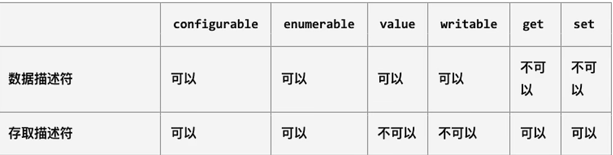

# JavaScript面向对象
## 什么是对象
- 是对多个相关联属性进行封装，描述事物的集合体
- 对具有强关联性的事物进行抽象，转化为代码
- JS支持多种编程范式：函数式编程&面向对象编程
  - JS对象是一组属性的无序集合，由key-value组成
  - key：标识符名称，value:任意类型(包含其他对象或者函数类型)
  - 值是一个函数，那么也叫做对象的方法
## 对象的创建方式
- 使用`new`关键字创建对象
- 使用字面量创建对象
## 对对象属性的操作
> 获取
```js
obj.xxx
```
> 赋值
```js
obj.xxx = xxx
```
> 删除
```js
delete obj.xxx
```
> 对属性的精确控制可以通过**属性描述符**实现 => Object.dafineProperty()
> 接收三个参数：
> - 目标对象
> - 目标对象的属性
> - 需要定义或者修改的属性描述符 (对象)
> 返回该对象本身 => 不是纯函数
## 属性描述符

### 数据属性
- `Configurable`：表示是否可以通过delete属性，是否可以修改特性，或者是否可以修改为存取属性描述符
  - 当直接在对象上定义属性时，默认为true
  - 当通过属性描述符定义时，默认为false
- `Enumerable`：表示是否可以通过for-in&Object.keys()返回该属性
  - 当直接在对象上定义属性时，默认为true
  - 当通过属性描述符定义时，默认为false
- `Writable`：表示是否可以修改属性值
  - 当直接在对象上定义属性时，默认为true
  - 当通过属性描述符定义时，默认为false
- `value`：属性值，读取是被返回，修改时，被修改
  - 默认undefined
### 存取属性
- 同样具有configurable&Enumerable两个属性
- 差别在于：
  - 【writable&value】和【get&set】不能同时出现
- get&set的使用场景：
	- 不希望对象属性暴露(**私有属性**)
	- 当希望**截取某一个属性的访问与设置的过程**时也会使用存取属性描述符【vue2响应式原理】

### 定义多个属性描述符
- `Object.defineProperties()`
	- 接受一个对象以及属性描述对象
```js
Object.defineProperties(obj,{
	name:{
		configurable:true,
		value:xx,
		//...
	},
	_age:{
		//...
	}
})
```
- 在属性前加下划线表示私有属性是一种**规范**而不是JS的语法**规则**，默认当作私有属性
- 当设置属性不可枚举时，无法通过打印显示该属性

### 获取属性描述符
- 获取单个属性描述符
	- `Object.getOwnPropertyDescriptor(obj,"xxx")`
- 获取对象所有属性描述符
	- `Object.getOwnPropertyDescriptors(obj)`
### 对象方法限制
- 禁止对象添加属性：`Object.preventExtensions()`
- 禁止对象属性删除：`Object.seal()` || 遍历对象进行属性精确配置
- 禁止对象属性修改：`Object.freeze`

### 大规模创建对象的方式
- 工厂模式 & 构造函数
```js
function createObj(name,age){
	var p = {}
	p.name = name,
	p.age = age
}

var P1 = createObj("zc1","18");
var p2 = createObj("zc2","25");
```
- 缺陷：
	- 无法得知具体的对象类型-->Object

### 构造函数
#### 认识构造函数
- 构造函数：创建对象时调用的函数
- JS的构造函数**是一个普通函数**，与其他函数的表现形式相同
- 若一个函数**被使用new调用了，那么这个函数称之为构造函数** 
#### new关键字
- 创建新对象
- 在对象内部的【prototype】指向构造函数的【prototype】属性
- 构造函数的this绑定新对象
- 指向函数内部代码
- 若构造函数没有返回非空对象，则返回新创建的对象 
```js
function person(){
	this.name = name
	this.age = age
	this.height = height
	this.eating = function(){
		//....
	}
	//...
}

var p1 = new person("zc",24,175)
```
- 为了区分构造函数与普通函数，**规范构造函数的首字母大写**
- 构造函数的缺陷：
  - 需要为每一个对象的函数去创建一个对象实例：常见形式就是方法写在构造函数里，使得每次都需要创建对应的对象实例 => 把方法写在原型上

### 原型理解

- \[[prototype]]是每一个对象内置的属性(一个指针) => (隐式原型对象)
- 浏览器提供API：\_proto\_用于指向该属性
- ES5之后提供了API去查询该属性：`Object.getPrototypeof()`
- 原型的作用
  - 当查看对象的属性时，会触发\[[get]]操作
  1. 在当前对象中查找对应属性，找到直接用
  2. 如果没有找到，会沿着原型链查找

#### 显式原型
- 函数因为是函数，所以还拥有显式原型prototype
- 通过内存图看原型：
	- 函数在堆内存中具有空间，包含：作用域&函数执行体&原型链
	- 原型链指向另一个空间：xxx的原型对象
	- 通过对该函数new得到的对象，内置隐式原型都指向同一个对象：xxx原型对象 

> 所有对象都有隐式原型指针指向一个对象(表示该对象按照原型链向上寻找的对象)，构造函数有一个显式原型，该对象是一个公共仓库，由该构造函数获得的实例对象的隐式原型指针指向该对象，但是实例对象的隐式原型指针指向是可以修改的(但不建议)

---

- 显式原型对象内有一个**不可枚举的**(无法显示在控制台)属性：constructor
  - JS引擎自动添加
  - 指向构造函数本身