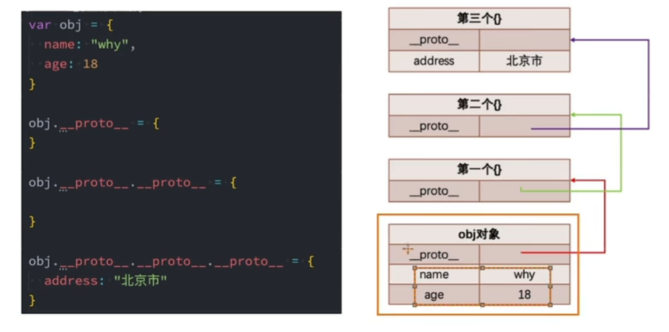
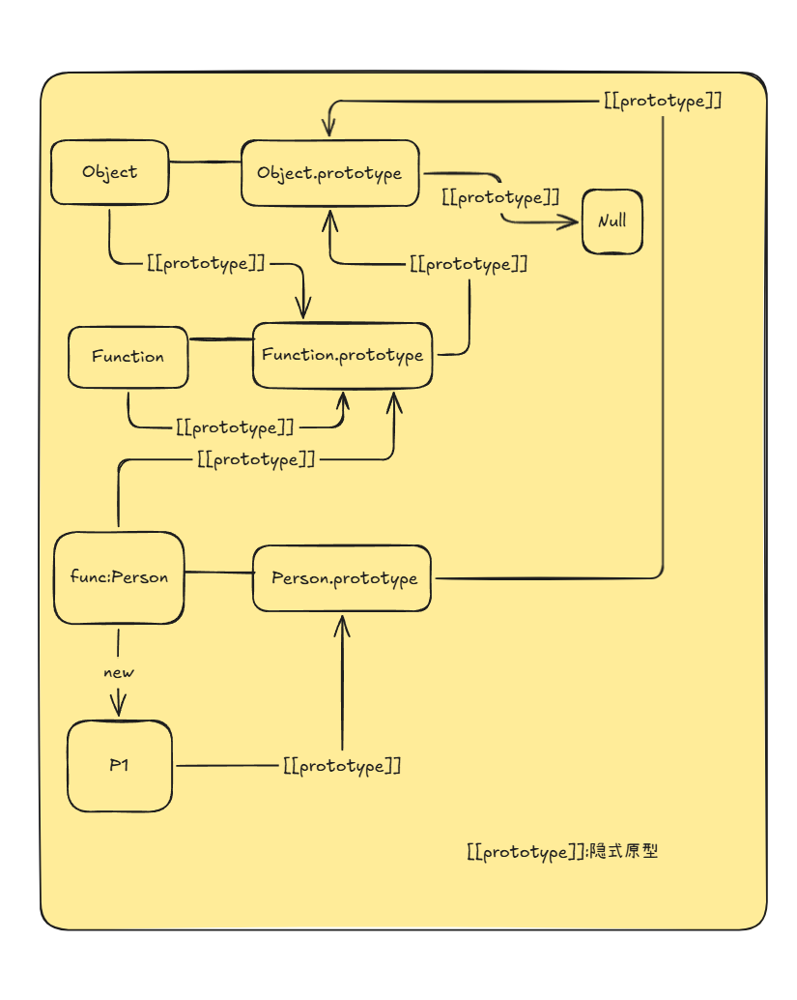
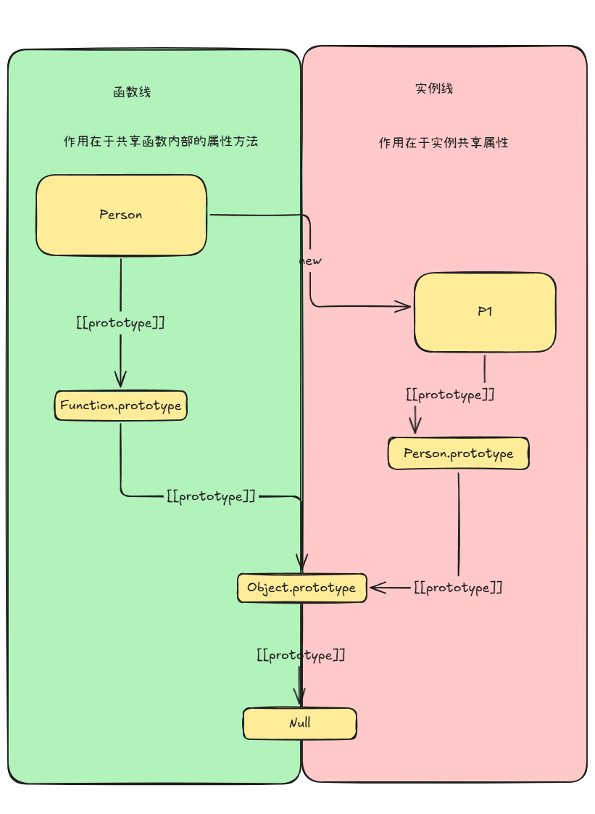

# 面向对象

## 三大特性

- 封装、继承、多态
  - 封装：将属性和方法封装到一个类中
  - 继承：减少代码数量，是多态的前提
  - 多态：不同对象在执行时表现出的不同形态

## JS继承的前提--原型&原型链

- JS属性查询顺序--触发"get"操作：
  - 在当前对象中查找
  - 未找到，在原型(\__proto\__)中查找
  - 这是一个链式查找过程，该查找链条称之为**原型链**
- 原型链的终点：
  - `Object.prototype`
- JS原型系统：
  - 
---
### 原型

- 原型是**双轨制**
  - 显式原型:prototype
    - **只有函数拥有**
    - 当函数**作为工厂**时，作为预设的"**公共共享**库"
  - 隐式原型:\__proto\__ / \[[prototype]]
    - 所有对象都拥有
    - 是对象的"**寻祖路线**"，指向创建该对象的构造函数的`prototype`
> - Function.\__proto\__ === Function.prototype  
>   - 因为Function本身就是由自己"构造"出来的
---
### 原型链：属性搜索的"路径"
- 原型链本质上是对象通过`__proto__`链接起来的一条**单向列表**
- 当查询一个对象(obj)的属性(prop)时，执行以下步骤：
  - 私有属性:检查 `obj` 自身是否有 prop，有则返回。
  - 溯源:若没有，通过 `obj.__proto__` 找到其构造函数的 prototype 检查。
  - 递归:若还是没有，继续顺着 `__proto__` 向上，直到 `Object.prototype`。
  - 终点:`Object.prototype.__proto__` 为 null。若搜寻到此仍未找到，返回 undefined。
- 当实例上拥有与原型同名的属性，实例属性会**遮蔽**原型属性
## JS继承
### 原型链继承
```js
Child.prototype = new Parent()
```
- 弊端
  - 控制台无法输出继承得来的属性
  - 若共享属性类型为**引用类型**，那么所有子类对象对该属性的修改都会被共享
### 构造器组合实现继承
```js
//Parent.call(this)
function Student(name,age,friends){
  Person.call(this,name,age,friends);
  //....
} 

var p = new Person();
Student.prototype = p;
```
- 弊端
  - 父类构造函数调用了两次(性能浪费)
    - 创建父类实例，获取继承的属性
    - 子类原型指向父类实例，获取父类方法
  - 创建的子类实例与子类指向的原型对象(父类实例)有属性重叠
### 原型式继承
```js
//原型式继承
var obj = {
  //...
  }

//利用原型实现继承(早期版本)
function createObject(obj){
  function Fn(){}
  Fn.prototype = o
  var newObj = new Fn()
  return newObj
}

//近代版本
function crearteObject(obj){
  var newObj = {}
Object.setPrototypeOf(newObj,obj)
  return newObj
}

//现代版本
var newObj = Object.create(obj)
```
- 弊端
  - 所有实例对象的类型都是Object
  - 需要手动初始化
  - 对性能不友好

### 寄生式继承
```js
var Person = {
    //...
}

function createXXX(n1,n2,n3){
    var newObj = Object.create(Person)
    newObj.x = n1
    newObj.xx = n2
    //...
}

var XXX1 = createXXX(n1,n2,n3)
//....
```
- 将初始化的工作交给了"工厂"，所有的子类生产过程都由"工厂决定"

### 寄生组合式继承
```js
function createObject(o){
  function Fn(){}
  Fn.prototype = o
  return new Fn()
}

function inheritPrototype(SubType,SuperType){
  SubType.prototype = createObject(SuperType.prototype)
  Object.defineProperty(SubType.prototype,"constructor",{
    enumerable:false,
    configurable:true,
    writable:true,
    value:SubType
  })
}
```
