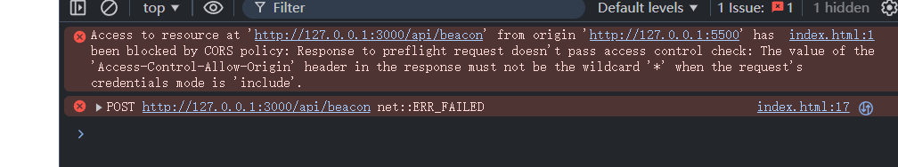

# 什么是navigator.sendBeacon
**浏览器提供的接口**，可以在页面卸载后发送一个异步请求，并且**不阻塞页面卸载**，返回值是一个**布尔值**，表示是否成功发送请求，但不负责服务端是否收到，只能是POST请求

## 优缺点：
- 使用`fetch/xhr`时，在页面卸载后，未发送的请求可能直接取消，或者可能会阻塞页面卸载
- navigator.sendBeacon不受卸载影响，异步执行，可发送跨域请求。但navigator.sendBeacon==传输数据少==，不能自定义请求头，只能传输 ArrayBuffer、ArrayBufferView、Blob、DOMString、FormData 或 URLSearchParams 类型的数据，且==若网络环境危险，或者开启了广告屏蔽插件，该请求就无效了==

# 使用场景
1. 发送心跳检测
2. 埋点
3. 发送用户反馈

# 基本使用
```js
navigator.sendBeacon(url);
navigator.sendBeacon(url, data);
```
- data用于表明传输的数据类型

```js
const express = require('express');
const cors = require('cors');
const app = express();
app.use(cors({
  origin: 'http://127.0.0.1:5500',  // 不能用 *
  credentials: true,               // 允许带凭据
  methods: ['POST', 'OPTIONS'],
  allowedHeaders: ['Content-Type'],
}));
app.use(express.json());

app.post('/api/beacon',(req,res)=>{
    console.log('beacon body:', req.body);
    res.send('ok');
});

app.listen(3000,()=>{
    
    console.log('server is running on port 3000')
})
```

客户端：
```js
<body>
  <button class="send">send</button>
  <script>
   const sendBtn = document.querySelector('.send');
   sendBtn.addEventListener('click',()=>{
     let data = JSON.stringify({name:'sendBeacon test'});
     const blob = new Blob([data],{
      type:'application/json'
     });
     navigator.sendBeacon('http://127.0.0.1:3000/api/beacon',blob);
   })
  </script>
</body>
```

## 注意事项
- 若需要使用sendBeacon发送Json数据，需要转换为blob格式

- sendBeacon()可以发送跨域请求，但仍然受到同源策略限制
- 请求头中设置了`Content-Type: application/json`触发了预检请求
- 解决方案:
  - 设置`Access-Control-Allow-Credentials: true`
  - 设置`Access-Control-Allow-Origin: 请求页面源`
> 若没有设置这两个字段，就表示浏览器允许所有的源携带cookie访问数据，不安全

