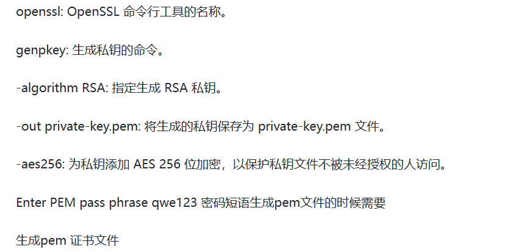
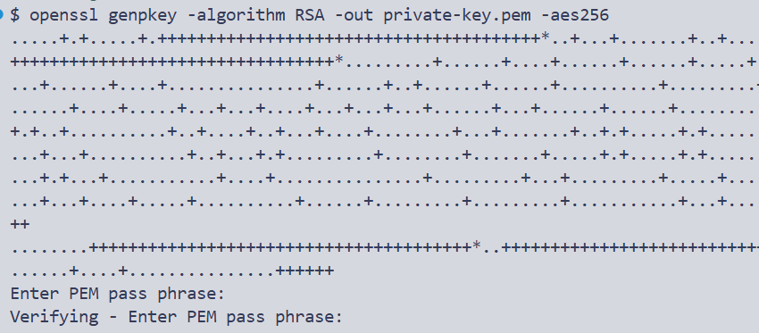
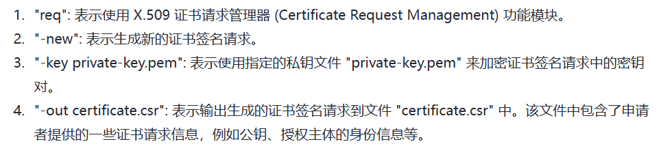
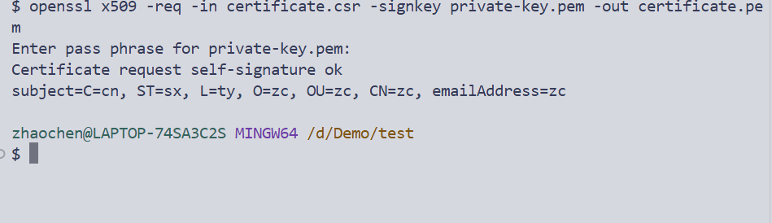

# HTTPS
HTTPS是HTTP的安全版本，使用了SSL/TLS协议来加密数据，保护敏感数据在传输过程中不会被窃取

## 与HTTP的区别
- HTTP使用明文传输，HTTPS使用SSL/TLS协议加密传输
- HTTP默认端口是80，HTTPS默认端口是443
- HTTPS需要SSL证书，HTTP不需要

## SSL/TLS
TLS是SSL的前身，SSL已经被弃用，TLS的功能是：加密+完整性校验+认证

# 加密手段
## 对称加密
- 常用AES、DES加密
- 通信双方之间有共享密钥
  - A：AES+密钥+明文 = 密文
  - B：AES+密钥+密文 = 明文
## 非对称加密
- 常见算法：RSA、DSA
- 通信双方之间有公钥和私钥
  - 公钥加密，私钥解密
  - A: RSA+公钥+明文 = 密文
  - B: RSA+私钥+密文 = 明文

# 模拟实现：
1. 安装OpenSSL
2. 创建私钥
    `openssl genpkey -algorithm RSA -out private-key.pem -aes256`
    
    
3. 生成请求文件
    `openssl req -new -key private-key.pem -out certificate.csr`
    
    
4. 生成证书
    `openssl x509 -req -in certificate.csr -signkey private-key.pem -out certificate.pem`
    
    

```js
const https = require('https');
const fs = require('fs');
https.createServer({
    key:fs.readFileSync('private-key.pem'),
    cert:fs.readFileSync('certificate.pem'),
    passphrase:'123456'
},(req,res)=>{
    res.writeHead(200);
    res.end('hello world\n');
}).listen(443,()=>{
    console.log('running')
})
```