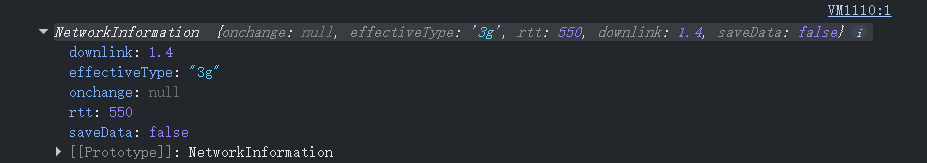

# 网络状态判断
- `online`和`offline`是两个浏览器自带事件，可以通过监听这两个事件来判断当前网络状态
  - 当发生网络变化时，这两个事件会被触发
```js
window.addEventListener('online', () => {
  console.log('Online');
});

window.addEventListener('offline', () => {
  console.log('Offline');
});
```
# navigator.onLine & navigator.connection
- 除了事件监听以外，JS提供了`navigator.onLine`属性，该**属性是一个布尔值**，表示当前的网络状态，true表示当前在线，false表示当前离线
---
- `navigator.connection`是一个**只读属性**，返回返回一个包含有关系统网络连接信息的对象，该对象类似于对当前网络情况的一份检测报告,提供以下只读属性：
  - downlink：有效带宽，以兆比特每秒为单位
  - downlinkMax：最大有效带宽，以兆比特每秒为单位
  - effectiveType：连接类型，可能的值有slow-2g、2g、3g、4g等
  - rtt：往返时间，以毫秒为单位
  - saveData：一个布尔值，表示用户是否设置了浏览器的减少数据使用功能
  - type：连接类型，可能的值有bluetooth、cellular、ethernet、none、wifi、wimax、other、unknown
  
- `navigator.connection`属性**在部分浏览器中可能不可用**，在使用前需要进行判断


# 面试：如何判断当前是强网环境还是弱网环境
弱网的判断依据是："高延迟、高丢包、低吞吐、不稳定"  
可以根据navigator.connection的返回指标  
  - effectiveType === 'slow-2g' | '2g' → 直接当弱网
  - saveData === true → 主动降级

>高延迟、高丢包、低吞吐、不稳定的表现是什么
- 高延迟：开始响应的速度慢
- 高丢包：慢+错+断，有重连、断线情况
- 低吞吐：传输过程慢
- 不稳定：上述指标综合表现