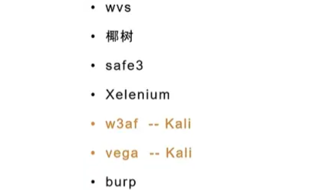
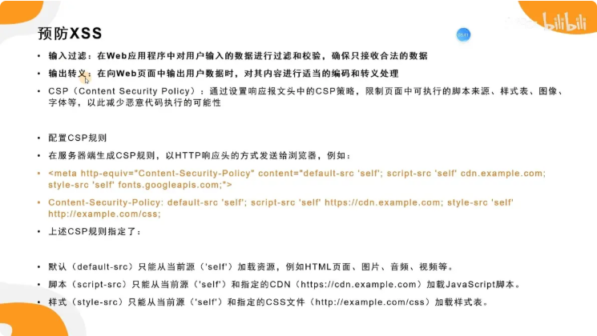
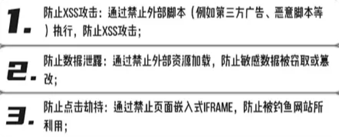

# XSS跨站脚本攻击
## XSS是怎么发生的
浏览器只有代码与数据两类东西，当我们把用户输入拼接在代码中，若没有做正确的上下文处理，那么输入的数据可能就会变成代码被浏览器错误的执行
常见的错误写法包含：
1. 把用户输入直接塞进 innerHTML
2. 把用户输入拼进 HTML 属性（如 onclick="..."）
3. 把用户输入拼进 \<script> 里的字符串
4. 把用户输入拼进 URL（如 href=...）并允许 javascript: 或危险协议
5. 服务端模板渲染时关闭转义或使用“raw 输出”

## XSS的类型
1. 存储型：常见于网站的评论、昵称或者帖子正文
2. 反射型：通常来自于URL参数或者表单中，常见于链接的参数
3. DOM型：利用前端

## XSS漏洞扫描工具


## 预防XSS

CSP策略：

```js
app.use((req, res, next) => {
  res.setHeader(
    "Content-Security-Policy",
    "default-src 'self'; script-src 'self'; object-src 'none'; base-uri 'self';"
  );
  next();
});
```
- 将字符转义为实体
```js
function escapeHtml(s = "") {
  return s
    .replaceAll("&", "&amp;")
    .replaceAll("<", "&lt;")
    .replaceAll(">", "&gt;")
    .replaceAll('"', "&quot;")
    .replaceAll("'", "&#39;");
}

app.get("/search", (req, res) => {
  const q = req.query.q || "";
  res.send(`<div>${escapeHtml(q)}</div>`);
});
```
- 前端渲染使用textContent / createTextNode来替代 innerHTML

- 使用成熟的库来对HTML进行转义，如DOMPurify
```js
<script src="https://cdn.jsdelivr.net/npm/dompurify@3.1.6/dist/purify.min.js"></script>
<script>
  const clean = DOMPurify.sanitize(userHtml, {
    ALLOWED_TAGS: ["b", "i", "em", "strong", "a", "p", "ul", "li", "br"],
    ALLOWED_ATTR: ["href", "title", "target", "rel"]
  });

  container.innerHTML = clean;
</script>
```