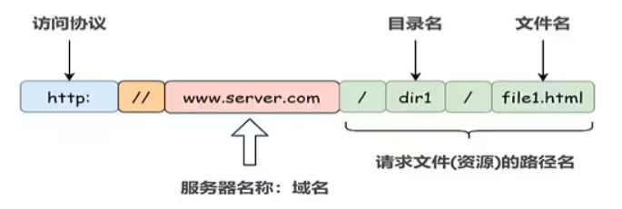
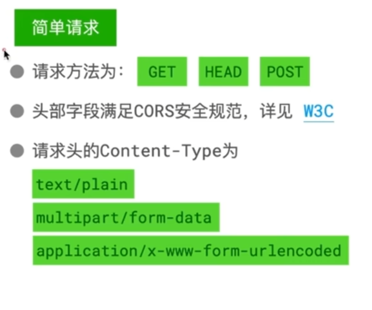
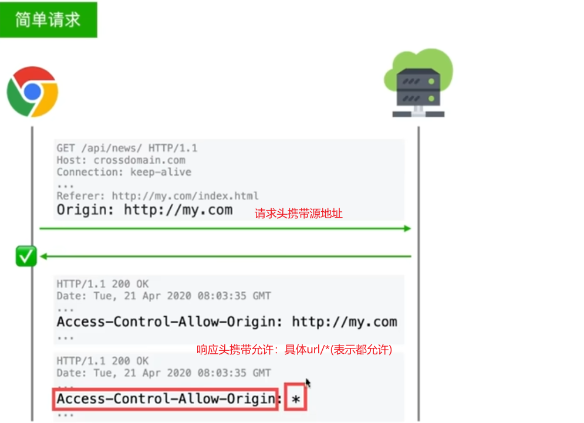
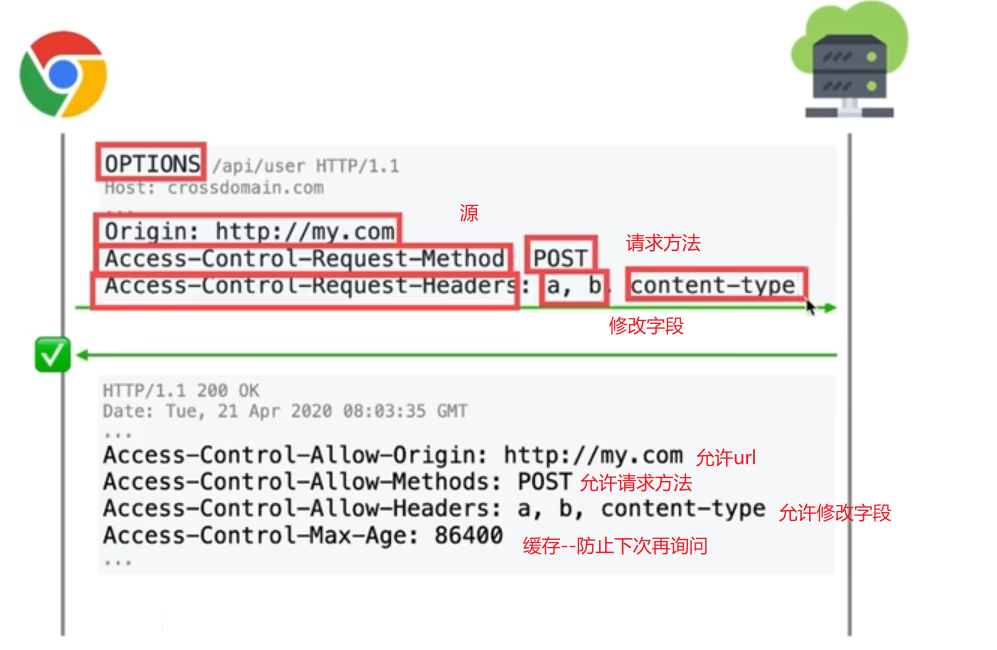
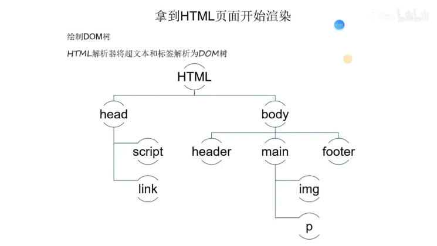
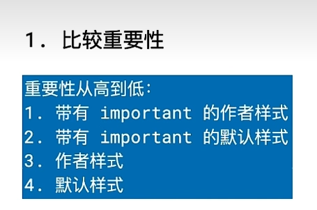
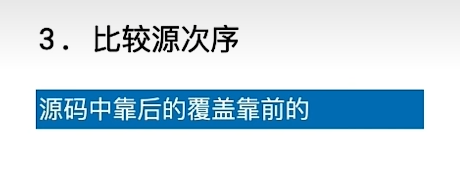
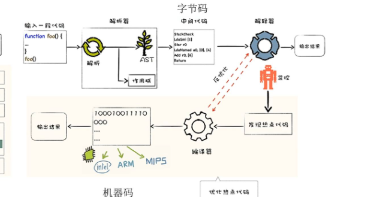

# 浏览器输入URL后发生了什么

## 流程
输入url -> DNS解析 - > TCP连接 - > 发送HTTP请求 - > 服务器处理请求并返回HTTP报文 - > 浏览器解析渲染页面 - > 连接结束

## 认识URL


## DNS解析
> 为什么要有DNS？
DNS的作用是将域名解析成IP地址，因为IP地址是互联网中计算机的唯一标识，而域名是人们更容易记忆的标识。发生在应用层
---

> DNS查询顺序
1. 浏览器缓存
2. 系统缓存
3. hosts文件
4. 域名服务器请求
---
> 域名服务器的请求规则
1. 根服务器：返回顶级域名服务器地址
2. 顶级域名服务器：返回权威域名服务器地址
3. 权威域名服务器：返回对应的IP地址
解析顺序**是从右往左**，精确到具体主机
> DNS是"编辑地址，告诉你快递目的地"。网络层是"运输快递，送到目的地"。

> DNS优化
> 目的:第一次请求时的长时间白屏问题，解析HTML阶段遇到\<link>\\<script>元素，浏览器会自动发起DNS请求，导致白屏
> 方案:在HTML头部加入dns-prefetch标签，提前异步解析DNS
```html
<link rel="dns-prefetch" href="//www.baidu.com">
```
一般是编写专门的脚本文件，自动化执行

---

## 预检请求
预检请求是在**发送跨域请求**前自动发送一个OPTIONS请求，用于检查目标服务器是否允许跨域请求。
前提条件：
   1. 跨域 
   2. 非GET、HEAD、POST请求 
   3. 带有自定义请求头 
   4. Content-Type不是application/x-www-form-urlencoded、multipart/form-data、text/plain
> cors解决跨域
> cros将请求分为两类:简单请求 & 预检请求
> 
> 浏览器通过CORS规则，判断校验是否通过，通过则执行JS解析，不通过就报错。
> cors规则理念:服务器允许就通过，服务器拒绝或者不表示就不通过
> 解决方案:
> 前提:服务器是"自己人"
> 简单请求：
> 预检请求：
> 1. 
> 2. 发送请求
> 
---

## 浏览器缓存
### 强缓存
- 浏览器强制缓存服务端资源，不需要发送请求
- 响应头：
  - Cache-Control: (更高的优先级)
    - max-age=秒 在这个时间段内，浏览器不会发送请求，直接使用缓存
    - public / private
      - public：允许被共享缓存（CDN、代理）缓存
      - private：只能浏览器私有缓存，共享缓存不该存
    - immutable：告诉浏览器：在新鲜期内不要做任何验证
    - no-store：完全不允许存储（最严格）
    - no-cache：允许存储，但在使用时需要向服务器确认
  - Expires：(旧机制)
    - 绝对时间，例如 Expires: Wed, 21 Oct 2026 07:28:00 GMT
    - 缺点：依赖客户端/服务器时间一致，易受时钟偏差影响
    - 规则：**Cache-Control 存在时通常覆盖 Expires**
  - Date / Age
    - Date：响应产生时间（服务器时间）
    - Age：资源在缓存中“已存活秒数”（常见于 CDN 返回）
- 使用场景:静态资源
### 协商缓存
- 当强缓存过期（或被要求必须验证）时，浏览器会带着“我这份版本标识”去问服务器
- 相关字段
  - E-Tag:(推荐)
    - 服务器返回资源时携带，在下一次请求时，先进行对比(If-None-Match: "abc123",)如果相同，则返回304，否则返回 200 + 新内容 + 新 ETag
  - Last-Modified:
    - 服务器返回资源时携带，在下一次请求时，先进行对比(If-Modified-Since: Wed, 21 Oct 2026 07:28:00 GMT)如果相同，则返回304，否则返回 200 + 新内容 + 新 Last-Modified
## HTML渲染
### 解析HTML

在遇到外链资源时触发相关资源下载


### 解析CSS
- 浏览器获取css文件后会被解析为**cssom**，样式规则树
- 浏览器对DOM+CSSOM进行**样式计算**：将所有值转换为浏览器易于理解的值
  - 选择器匹配
  - 层叠
  - 继承与默认值
> CSS样式计算
> 确保每一个css属性都有值
> 步骤：
> 1. 确定声明值
>  对浏览器默认样式与作者样式进行对比，找到没有冲突的值，作为计算后的样式
> 2. 层叠
>  对冲突样式做处理
>     
>   比较权重
>     
> 3. 继承
>  对仍然没有值的属性，若可以继承就使用继承
> 4. 使用默认值
>  没有值的属性就直接使用默认值
#### 回流
- 元素的尺寸/位置/排版规则变了，浏览器必须重新 Layout
- 触发条件：
  - 页面首次渲染
  - 元素尺寸/位置/内容(字号/行高/...)变化
  - 添加/删除 DOM 元素
  - 浏览器窗口尺寸变化
- **回流一定触发重绘，重绘不一定触发回流**
#### 重绘
- 不需要重新算布局，但需要重新画像素。
- 一般是颜色的变化
- 触发:`color`、`background-color`、`box-shadow`、`outline`、`visibility`等
### 解析JS
- 
- 字节码是为了跨平台
- 解释器JIT，边解析边执行

---

> 简述
> url输入->进行dns解析，获取ip->若是http连接，走TCP三次握手，若是HTTPS连接，在三次握手后，还需要进行TLS握手建立安全连接->服务器返回资源->浏览器下载资源(下载一部分，通常是边下载边解析)->后续的css、js也通过该链路进行传输