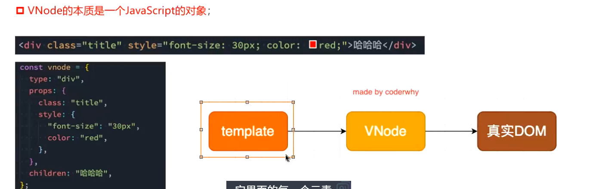
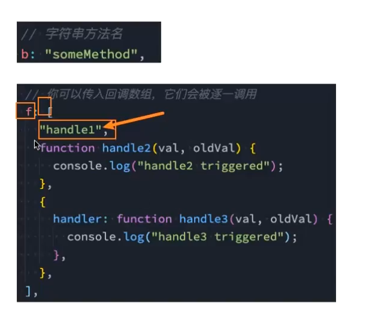

# 插值语法
1. 基本使用
```html
<p>{{ msg }}</p>
data() {
  return { msg: 'hello' }
}
```
2. 表达式
```js
<p>{{ count + 1 }}</p>
//...
data() {
  return { count: 1 }
}

```
3. 三元运算符
```js
<p>{{ isVip ? 'VIP' : '普通用户' }}</p>
data() {
  return { isVip: true }
}
```
4. 注意：不能定义语句
```js
//下列用法是错误的
{{ let a = 1 }}
{{ if (ok) {} }}
```
5. 调用methods函数
```js
<p>{{ getTitle() }}</p>
methods: {
  getTitle() {
    return '标题'
  }
}
```
---
# 指令
## v-once
- 渲染一次
> 底层数据仍在变化
```js
<p v-once>{{ msg }}</p>
data() {
  return { msg: '只渲染一次' }
}
```
## v-text
- 与插值语法的差异:
    - 插值语法前后是可以添加其他文本的，更灵活
    - V-text直接替换元素内文本
```vue
<p v-text="msg"></p>
data() {
  return { msg: '文本内容' }
}
```
## v-html
- 可以直接渲染html
```vue
<p v-html="html"></p>
data() {
  return { html: '<span>HTML内容</span>' }
}
```
## v-pre
- 跳过元素与子元素的解析渲染过程
```vue
<p v-pre>{{ msg }}</p>
```
## v-cloak 
- 配合CSS：display：none使用
- 在渲染过程慢的情况下，防止原生样式直接展示在页面上
- 在渲染结束后，该属性就消失了 
```vue
[v-cloak] {
  display: none;
}
<p v-cloak>{{ msg }}</p>
```
## v-memo
- 条件渲染，数组，接受一个或者多个数据变量，判断这些变量是否发生改变，然后决定是否渲染
```vue
<div v-memo="[count]">
  {{ count }}
</div>
data() {
  return { count: 1 }
}
```
## v-bind
- 绑定属性
- 动态的绑定一个或者多个属性，或者一个组件prop到表达式
1. 基本使用
   - 绑定img的src属性
   - 绑定a的href属性
```vue

<a :href="link">跳转</a>

data() {
  return { imgUrl: '/logo.png' ,link: 'https://example.com'}
}
```
2. 绑定class
   - 基本使用
```vue
<div :class="active"></div>
data() {
  return { active: 'is-active' }
}
```
   - 使用对象语法，可以绑定多个键值对、可以与普通class混用
     - 若对象过于繁杂，可以使用函数返回，将属性绑定函数即可
```vue
<div :class="{ active: isActive, error: hasError }"></div>
data() {
  return {
    isActive: true,
    hasError: false
  }
}
```
   - 使用数组语法
```vue
<div :class="[activeClass, errorClass]"></div>
data() {
  return {
    activeClass: 'active',
    errorClass: 'error'
  }
}
```
3. 绑定style
   - 使用对象，值是确定的
```vue
<div :style="{ color: 'red' }"></div>
```
   - 使用对象，值来自data
   - 使用对象，对象来自data
```vue
<div :style="styleObj"></div>
data() {
  return {
    styleObj: {
      color: 'blue',
      fontSize: '14px'
    }
  }
}
```
   - 数组语法
```vue
<div :style="[baseStyle, extraStyle]"></div>
data() {
  return {
    baseStyle: { color: 'red' },
    extraStyle: { fontSize: '16px' }
  }
}
```
4. 绑定属性名
   - `:[name]=xxx`,name来自于data
```vue
<input :[attrName]="value" />
data() {
  return {
    attrName: 'placeholder',
    value: '请输入内容'
  }
}
```
5. 绑定对象
   - 常用来给组件传值
```vue
<input v-bind="attrs" />
data() {
  return {
    attrs: {
      type: 'text',
      disabled: true
    }
  }
}
```

## v-on
- 事件绑定
- 基本写法
- 语法糖写法
- 可直接写一个表达式
- 绑定多个事件使用对象语法
- 绑定事件的参数传递
  - 默认参数 event会被默认传递
  - 显式参数传递->可传递data值，若未匹配，则为undefined
  - 显式参数+event ，event使用`$event`表示
### 修饰符

## v-if条件渲染
- v-if
- v-else
- v-else-if

- template
  - 避免了额外的元素渲染

- v-show
  - 不支持template：因为v-show所在的元素会被渲染，template不会
  - v-show不支持v-else

v-show & v-if的选择
- 需要再显示与隐藏之间频繁切换的->v-show
- 不会频繁切换的，->v-if


## v-for
- 遍历数组
  - 遍历普通数组
  - 遍历数组的复杂数据
- 遍历对象
  - 参数为：值-键名-索引
- 遍历字符串
- 遍历数字

- 所有可迭代对象都可以遍历
- 支持使用template代替不必要的元素渲染

### key属性
- key要求唯一
- 作用：
  - 主要用于**虚拟DOM算法**，用于对比新旧VNodes

### VNode
- 虚拟节点
- 无论是组件还是元素，在Vue中表现出来都是**VNode**
- VBode本质上是一个JS对象

- 大量虚拟节点构成的2树结构被称为虚拟DOM
- 用处：
  - 方便跨平台(针对不同的平台处理对象)
  - diff算法
    - 为每一个元素绑定一个key，在虚拟DOM修改时，直接修改对应值，并复用其他旧值
- key不是唯一会怎样：
  - 数据错位(diff算法会对新旧数据对比，更新新的，复用旧的)

## 数组更新检测
- 直接将数组修改为一个新数组
- vue对数组方法做了包装，支持对数据的更新
  - 包括：
- 不修改原数组的方法不能侦听


# computed计算属性
- 对于如何包含响应式数据的复杂逻辑都应该使用计算属性 
- 插值语法的设计初衷是为了简单的数据展示 
- 计算属性是一个对象，对应的是一个函数
- 计算属性的优势
  - 计算属性有**缓存**
  - 根据依赖数据的变化决定是否重新计算

- 计算属性的完整写法
  - 包含get、set函数

# watch侦听器
- 用于完善数据变化时需要执行的逻辑
- 是一个对象，函数是侦听数据 
  - 默认参数：newValue oldValue
  - 若值是一个字符串，则直接返回字符串，若为对象类型，返回的是代理对象
  - **如何获取原始对象**：
    - 使用结构语法
    - 使用`toRaw()`-Vue提供的方法
- 可以对变化频繁的数据单独开启侦听器
## 配置项
- deep深度监听
  - 默认不开启深度监听
- immediate-立即执行，在第一次渲染时就执行一次
## 侦听器的其他使用方式
1. 字符串方法名-执行逻辑在methods中/使用数组语法，同时执行多个逻辑 

2. `$watch()`，在created阶段（组件渲染结束阶段）绑定一个侦听属性
   - 参数一：侦听对象，参数二：回调函数，参数三：侦听配置项

# 阶段性案例：购物车案例

```html
<!DOCTYPE html>
<html lang="en">
<head>
    <meta charset="UTF-8">
    <meta name="viewport" content="width=device-width, initial-scale=1.0">
    <title>Document</title>
    <style>
       table{
            border-collapse: collapse;
            text-align: center;
        }
        td,th{
            border: 1px solid #ccc;
            padding: 10px;
        }
    </style>
</head>
<body>
    <div id="app">
        <table>
            <thead>
                <tr>
                    <td>序号</td>
                    <td>书籍名称</td>
                    <td>出版日期</td>
                    <td>价格</td>
                    <td>购买数量</td>
                    <td>操作</td>
                </tr>
            </thead>
            <tbody>
                <tr v-for="(book,index) in books">
                    <td>{{index}}</td>
                    <td>{{book.name}}</td>
                    <td>{{book.date}}</td>
                    <td>{{formatPrice(book.price)}}</td>
                    <td>
                        <span @click="sub(index)" >-</span>
                        {{book.num}}
                        <span @click="add(index)">+</span>
                    </td>
                    <td>
                        <button @click="remove(index)">移除</button>
                    </td>
                </tr>
                <tr></tr>
                <tr></tr>
                <tr></tr>
            </tbody>
        </table>
        <h2>总价：{{totalPrice}}</h2>

    </div>
    <script src="../lib/vue.js"></script>
    <script>
    Vue.createApp({
        data(){
            return{
                books:[
                    {name:'《算法导论》',date:'2006-9',price:85,num:1},
                    {name:'《UNIX编程艺术》',date:'2006-2',price:59,num:1},
                    {name:'《编程珠玑》',date:'2008-10',price:39,num:1},
                    {name:'《代码大全》',date:'2006-3',price:128,num:1},
                ]
        }},
        methods:{
            formatPrice(price){
                return "￥" + price;
            },
            add(index){
                this.books[index].num++
            },
            sub(index){
                if(this.books[index].num >1){
                this.books[index].num--}
            },
            remove(index){
                this.books.splite(index,1)
            }
        },
        computed:{
            totalPrice(){
                return this.books.reduce((pre,book)=>{
                    return pre+(book.price*book.num)
                },0)
            }
        }
    }).mount('#app')


    </script>
    
</body>
</html>
```