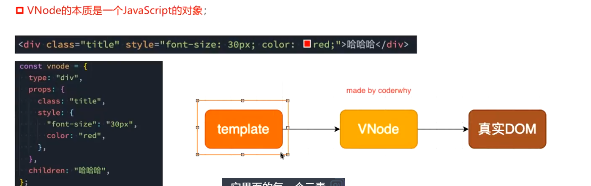
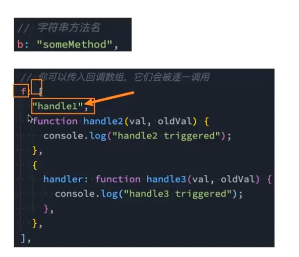
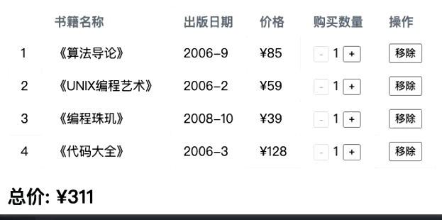

# 插值语法
1. 基本使用
```html
<p>{{ msg }}</p>
data() {
  return { msg: 'hello' }
}
```
2. 表达式
```js
<p>{{ count + 1 }}</p>
//...
data() {
  return { count: 1 }
}

```
3. 三元运算符
```js
<p>{{ isVip ? 'VIP' : '普通用户' }}</p>
data() {
  return { isVip: true }
}
```
4. 注意：不能定义语句
```js
//下列用法是错误的
{{ let a = 1 }}
{{ if (ok) {} }}
```
5. 调用methods函数
```js
<p>{{ getTitle() }}</p>
methods: {
  getTitle() {
    return '标题'
  }
}
```
---
# 指令
## v-once
- 渲染一次
> 底层数据仍在变化
```js
<p v-once>{{ msg }}</p>
data() {
  return { msg: '只渲染一次' }
}
```
## v-text
- 与插值语法的差异:
    - 插值语法前后是可以添加其他文本的，更灵活
    - V-text直接替换元素内文本
```vue
<p v-text="msg"></p>
data() {
  return { msg: '文本内容' }
}
```
## v-html
- 可以直接渲染html
```vue
<p v-html="html"></p>
data() {
  return { html: '<span>HTML内容</span>' }
}
```
## v-pre
- 跳过元素与子元素的解析渲染过程
```vue
<p v-pre>{{ msg }}</p>
```
## v-cloak 
- 配合CSS：display：none使用
- 在渲染过程慢的情况下，防止原生样式直接展示在页面上
- 在渲染结束后，该属性就消失了 
```vue
[v-cloak] {
  display: none;
}
<p v-cloak>{{ msg }}</p>
```
## v-memo
- 条件渲染，数组，接受一个或者多个数据变量，判断这些变量是否发生改变，然后决定是否渲染
```vue
<div v-memo="[count]">
  {{ count }}
</div>
data() {
  return { count: 1 }
}
```
## v-bind
- 绑定属性
- 动态的绑定一个或者多个属性，或者一个组件prop到表达式
1. 基本使用
   - 绑定img的src属性
   - 绑定a的href属性
```vue

<a :href="link">跳转</a>

data() {
  return { imgUrl: '/logo.png' ,link: 'https://example.com'}
}
```
2. 绑定class
   - 基本使用
```vue
<div :class="active"></div>
data() {
  return { active: 'is-active' }
}
```
   - 使用对象语法，可以绑定多个键值对、可以与普通class混用
     - 若对象过于繁杂，可以使用函数返回，将属性绑定函数即可
```vue
<div :class="{ active: isActive, error: hasError }"></div>
data() {
  return {
    isActive: true,
    hasError: false
  }
}
```
   - 使用数组语法
```vue
<div :class="[activeClass, errorClass]"></div>
data() {
  return {
    activeClass: 'active',
    errorClass: 'error'
  }
}
```
3. 绑定style
   - 使用对象，值是确定的
```vue
<div :style="{ color: 'red' }"></div>
```
   - 使用对象，值来自data
   - 使用对象，对象来自data
```vue
<div :style="styleObj"></div>
data() {
  return {
    styleObj: {
      color: 'blue',
      fontSize: '14px'
    }
  }
}
```
   - 数组语法
```vue
<div :style="[baseStyle, extraStyle]"></div>
data() {
  return {
    baseStyle: { color: 'red' },
    extraStyle: { fontSize: '16px' }
  }
}
```
4. 绑定属性名
   - `:[name]=xxx`,name来自于data
```vue
<input :[attrName]="value" />
data() {
  return {
    attrName: 'placeholder',
    value: '请输入内容'
  }
}
```
5. 绑定对象
   - 常用来给组件传值
```vue
<input v-bind="attrs" />
data() {
  return {
    attrs: {
      type: 'text',
      disabled: true
    }
  }
}
```
---
## v-on
- 作用：事件绑定
  - 基本写法
  - 语法糖写法
```vue
<template>
  <!-- 完整写法 -->
  <button v-on:click="inc">+1</button>

  <!-- 语法糖 -->
  <button @click="inc">+1</button>

  <p>count: {{ count }}</p>
</template>

<script setup>
import { ref } from 'vue'
const count = ref(0)
const inc = () => count.value++
</script>

```
  - 可直接写一个表达式
```vue
<template>
  <button @click="count++">+1</button>
  <p>{{ count }}</p>
</template>

<script setup>
import { ref } from 'vue'
const count = ref(0)
</script>
```
  - 绑定多个事件使用对象语法
```vue
<template>
  <input
    v-on="{
      focus: onFocus,
      blur: onBlur,
      input: onInput
    }"
    placeholder="focus / blur / input"
  />
  <p>{{ msg }}</p>
</template>

<script setup>
import { ref } from 'vue'
const msg = ref('')

const onFocus = () => console.log('focus')
const onBlur = () => console.log('blur')
const onInput = (e) => (msg.value = e.target.value)
</script>
```
  - 绑定事件的参数传递
    - 默认参数 event会被默认传递
```vue
<template>
  <button @click="logEvent">点我</button>
</template>

<script setup>
const logEvent = (event) => {
  console.log(event.type) // 'click'
}
</script>
```
    - 显式参数传递->可传递data值，若未匹配，则为undefined
```vue
<template>
  <button @click="pick(10)">传 10</button>
  <button @click="pick()">不传</button>
</template>

<script setup>
const pick = (n) => {
  console.log(n) // 10 / undefined
}
</script>
```
    - 显式参数+event ，event使用`$event`表示
```vue
<template>
  <button @click="pickWithEvent(10, $event)">传 10 + event</button>
</template>

<script setup>
const pickWithEvent = (n, event) => {
  console.log(n)          // 10
  console.log(event.type) // 'click'
}
</script>
```
### 修饰符
```vue
<template>
  <!-- 阻止默认行为（例如 a 标签跳转） -->
  <a href="https://example.com" @click.prevent="onLink">不会跳转</a>

  <!-- 阻止冒泡 -->
  <div @click="outer">
    <button @click.stop="inner">只触发 inner</button>
  </div>

  <!-- 键盘修饰符 -->
  <input @keyup.enter="onEnter" placeholder="按 Enter" />
</template>

<script setup>
const onLink = () => console.log('clicked')
const outer = () => console.log('outer')
const inner = () => console.log('inner')
const onEnter = () => console.log('enter')
</script>
```
---
## v-if条件渲染
- v-if
- v-else
- v-else-if
```vue
<template>
  <p v-if="score >= 90">A</p>
  <p v-else-if="score >= 60">B</p>
  <p v-else>C</p>

  <button @click="score = (score + 10) % 110">变更</button>
  <p>score: {{ score }}</p>
</template>

<script setup>
import { ref } from 'vue'
const score = ref(50)
</script>
```
- template
  - 避免了额外的元素渲染
```vue
<template>
  <template v-if="loggedIn">
    <p>欢迎回来</p>
    <button @click="logout">退出</button>
  </template>
  <template v-else>
    <p>请登录</p>
    <button @click="login">登录</button>
  </template>
</template>

<script setup>
import { ref } from 'vue'
const loggedIn = ref(false)
const login = () => (loggedIn.value = true)
const logout = () => (loggedIn.value = false)
</script>
```
- v-show
  - 不支持template：因为v-show所在的元素会被渲染，template不会
  - v-show不支持v-else
```vue
<template>
  <button @click="open = !open">切换</button>

  <div v-show="open" class="panel">
    我一直在 DOM 里，只是 display: none / block
  </div>
</template>

<script setup>
import { ref } from 'vue'
const open = ref(true)
</script>

<style scoped>
.panel { padding: 8px; border: 1px solid #ddd; }
</style>
```
v-show & v-if的选择
- 需要再显示与隐藏之间频繁切换的->v-show
- 不会频繁切换的，->v-if

---
## v-for
- 遍历数组
  - 遍历普通数组
  - 遍历数组的复杂数据
```vue
<template>
  <ul>
    <li v-for="(item, index) in list" :key="item.id">
      {{ index }} - {{ item.name }}
    </li>
  </ul>
</template>

<script setup>
const list = [
  { id: 1, name: 'apple' },
  { id: 2, name: 'banana' }
]
</script>
```
- 遍历对象
  - 参数为：值-键名-索引
```vue
  <template>
  <ul>
    <li v-for="(value, key, index) in user" :key="key">
      {{ index }} | {{ key }}: {{ value }}
    </li>
  </ul>
</template>

<script setup>
const user = {
  name: 'Chen',
  age: 24,
  city: 'Shenzhen'
}
</script>
```
- 遍历字符串
```vue
<template>
  <span v-for="(ch, i) in text" :key="i">{{ ch }}</span>
</template>

<script setup>
const text = 'hello'
</script>
```
- 遍历数字
```vue
<template>
  <ul>
    <li v-for="n in 5" :key="n">第 {{ n }} 项</li>
  </ul>
</template>
```
- 所有可迭代对象都可以遍历
- 支持使用template代替不必要的元素渲染

### key属性
- key要求唯一
- 作用：
  - 主要用于**虚拟DOM算法**，用于对比新旧VNodes

### VNode
- 虚拟节点
- 无论是组件还是元素，在Vue中表现出来都是**VNode**
- VBode本质上是一个JS对象

- 大量虚拟节点构成的2树结构被称为虚拟DOM
- 用处：
  - 方便跨平台(针对不同的平台处理对象)
  - diff算法
    - 为每一个元素绑定一个key，在虚拟DOM修改时，直接修改对应值，并复用其他旧值
- key不是唯一会怎样：
  - 数据错位(diff算法会对新旧数据对比，更新新的，复用旧的)
---
## 数组更新检测
- 直接将数组修改为一个新数组
```vue
<template>
  <button @click="replaceArray">替换新数组</button>
  <ul>
    <li v-for="(x, i) in list" :key="i">{{ x }}</li>
  </ul>
</template>

<script>
export default {
  data() {
    return { list: [1, 2, 3] }
  },
  watch: {
    list() {
      console.log('list changed (ref changed)')
    }
  },
  methods: {
    replaceArray() {
      // ✅ 改引用：一定触发更新/渲染
      this.list = [...this.list, 4]
    }
  }
}
</script>
```
- 整个引用地址发生变化，所以会触发响应式
- vue对数组方法做了包装，支持对数据的更新
  - 包括：`push / pop / shift / unshift / splice / sort / reverse`
```vue
<template>
  <button @click="mutateByMethods">用数组方法更新</button>
  <p>{{ list.join(', ') }}</p>
</template>

<script>
export default {
  data() {
    return { list: [1, 2, 3] }
  },
  watch: {
    list: {
      handler() {
        console.log('list changed (deep)')
      },
      deep: true
    }
  },
  methods: {
    mutateByMethods() {
      // ✅ 这些方法会被 Vue2 侦测到
      this.list.push(4)
      this.list.splice(1, 1, 99) // 把索引 1 的值改成 99
    }
  }
}
</script>
```
- 不修改原数组的方法不能侦听,因为他们返回的是新的数组，如果将结果返回，依然是可以被响应式触发的
```vue
<template>
  <button @click="wrong">错误：不赋值</button>
  <button @click="right">正确：赋值成新数组</button>
  <p>{{ list.join(', ') }}</p>
</template>

<script>
export default {
  data() {
    return { list: [1, 2, 3, 4] }
  },
  watch: {
    list() { console.log('list ref changed') }
  },
  methods: {
    wrong() {
      // ❌ filter 返回新数组，但你没接住它
      this.list.filter(x => x % 2 === 0)
      // this.list 没变 → 不会更新/不会触发 watch
    },
    right() {
      // ✅ 返回新数组，并且赋回去 → 更新/触发 watch
      this.list = this.list.filter(x => x % 2 === 0)
    }
  }
}
</script>
```
---
# computed计算属性
- 对于如何包含响应式数据的复杂逻辑都应该使用计算属性 
- 插值语法的设计初衷是为了简单的数据展示 
- 计算属性是一个对象，对应的是一个函数
- 计算属性的优势
  - 计算属性有**缓存**
  - 根据依赖数据的变化决定是否重新计算
```vue
<template>
  <p>总价：{{ totalPrice }}</p>
</template>

<script>
export default {
  data() {
    return {
      cart: [
        { name: 'A', price: 10, count: 2 },
        { name: 'B', price: 5,  count: 3 },
      ]
    }
  },
  computed: {
    totalPrice() {
      return this.cart.reduce((sum, item) => sum + item.price * item.count, 0)
    }
  }
}
</script>
```
- 计算属性的完整写法
  - 包含get、set函数
```vue
<template>
  <input v-model="fullName" placeholder="输入：名 姓" />
  <p>first: {{ firstName }} | last: {{ lastName }}</p>
</template>

<script>
export default {
  data() {
    return { firstName: 'Chen', lastName: 'Zai' }
  },
  computed: {
    fullName: {
      get() {
        return `${this.firstName} ${this.lastName}`
      },
      set(v) {
        const [first = '', last = ''] = String(v).trim().split(/\s+/, 2)
        this.firstName = first
        this.lastName = last
      }
    }
  }
}
</script>
```
---
# watch侦听器
- 用于完善数据变化时需要执行的逻辑
- 是一个对象，函数是侦听数据 
  - 默认参数：newValue oldValue
```vue
<script>
export default {
  data() {
    return { keyword: '' }
  },
  watch: {
    keyword(newValue, oldValue) {
      console.log('new:', newValue, 'old:', oldValue)
    }
  }
}
</script>
```
  - 若值是一个字符串，则直接返回字符串，若为对象类型，返回的是代理对象
  - **如何获取原始对象**：
    - 使用解构语法
```vue
watch(() => form.name, (name) => { /* 这里拿到的是普通字符串 */ })
```
    - 使用`toRaw()`-Vue提供的方法
```vue
toRaw(form)
```
- 可以对变化频繁的数据单独开启侦听器
```vue
<script>
export default {
  data() {
    return {
      form: { keyword: '', other: { big: { obj: 1 } } }
    }
  },
  watch: {
    // 只监听高频字段，不 deep 整个 form
    'form.keyword'(kw) {
      console.log('search:', kw)
    }
  }
}
</script>
```
## 配置项
- deep深度监听
  - 默认不开启深度监听
```vue
<script>
export default {
  data() {
    return {
      form: { name: 'Chen', age: 24 }
    }
  },
  watch: {
    // 不开 deep：只有 form 被整体替换时触发（this.form = {...}）
    form(newVal, oldVal) {
      console.log('form changed:', newVal, oldVal)
    }
  }
}
</script>
```

```vue
<script>
export default {
  data() {
    return {
      form: { profile: { city: 'SZ' } }
    }
  },
  watch: {
    form: {
      handler(newVal, oldVal) {
        console.log('deep changed:', newVal.profile.city)
      },
      deep: true
    }
  }
}
</script>
```
- immediate-立即执行，在第一次渲染时就执行一次
```vue
<script>
export default {
  data() {
    return { keyword: '' }
  },
  watch: {
    keyword: {
      handler(n, o) {
        console.log('run now + later:', n, o)
      },
      immediate: true
    }
  }
}
</script>
```
## 侦听器的其他使用方式
1. 字符串方法名-执行逻辑在methods中/使用数组语法，同时执行多个逻辑 

2. `$watch()`，在created阶段（组件渲染结束阶段）绑定一个侦听属性
   - 参数一：侦听对象，参数二：回调函数，参数三：侦听配置项
```vue
<script>
export default {
  data() {
    return { count: 0 }
  },
  created() {
    // 参数1：监听表达式（函数或字符串路径）
    // 参数2：回调
    // 参数3：配置项
    this.unwatch = this.$watch(
      () => this.count,
      (n, o) => console.log('count:', n, o),
      { immediate: true }
    )
  },
  beforeUnmount() {
    this.unwatch?.() // 取消监听
  }
}
</script>
```
---
# 阶段性案例：购物车案例

```html
<!DOCTYPE html>
<html lang="en">
<head>
    <meta charset="UTF-8">
    <meta name="viewport" content="width=device-width, initial-scale=1.0">
    <title>Document</title>
    <style>
       table{
            border-collapse: collapse;
            text-align: center;
        }
        td,th{
            border: 1px solid #ccc;
            padding: 10px;
        }
    </style>
</head>
<body>
    <div id="app">
        <table>
            <thead>
                <tr>
                    <td>序号</td>
                    <td>书籍名称</td>
                    <td>出版日期</td>
                    <td>价格</td>
                    <td>购买数量</td>
                    <td>操作</td>
                </tr>
            </thead>
            <tbody>
                <tr v-for="(book,index) in books">
                    <td>{{index}}</td>
                    <td>{{book.name}}</td>
                    <td>{{book.date}}</td>
                    <td>{{formatPrice(book.price)}}</td>
                    <td>
                        <span @click="sub(index)" >-</span>
                        {{book.num}}
                        <span @click="add(index)">+</span>
                    </td>
                    <td>
                        <button @click="remove(index)">移除</button>
                    </td>
                </tr>
                <tr></tr>
                <tr></tr>
                <tr></tr>
            </tbody>
        </table>
        <h2>总价：{{totalPrice}}</h2>

    </div>
    <script src="../lib/vue.js"></script>
    <script>
    Vue.createApp({
        data(){
            return{
                books:[
                    {name:'《算法导论》',date:'2006-9',price:85,num:1},
                    {name:'《UNIX编程艺术》',date:'2006-2',price:59,num:1},
                    {name:'《编程珠玑》',date:'2008-10',price:39,num:1},
                    {name:'《代码大全》',date:'2006-3',price:128,num:1},
                ]
        }},
        methods:{
            formatPrice(price){
                return "￥" + price;
            },
            add(index){
                this.books[index].num++
            },
            sub(index){
                if(this.books[index].num >1){
                this.books[index].num--}
            },
            remove(index){
                this.books.splite(index,1)
            }
        },
        computed:{
            totalPrice(){
                return this.books.reduce((pre,book)=>{
                    return pre+(book.price*book.num)
                },0)
            }
        }
    }).mount('#app')


    </script>
    
</body>
</html>
```
## 排他思想
- 利用数据本身的唯一标识，对选中的数据做样式处理
---
# v-model
- 常用于**表单提交**
  - 比如用户的身份信息以及提交的数据
- 支持双向绑定，根据表单控件自动选择合适的方法更新元素
- 是一种语法糖，负责监听输入事件来更新数据
- 值多数情况下来自于服务器，所以多采用template+v-for来补充属性的值绑定
- 手动实现双向绑定：v-bind+\@input事件
```vue
<template>
  <input
    :value="username"
    @input="username = $event.target.value"
    placeholder="手写双向绑定"
  />
  <p>{{ username }}</p>
</template>

<script>
export default {
  data() {
    return { username: '' }
  }
}
</script>
```
- 基本使用：
```vue
<template>
  <form @submit.prevent="submit">
    <input v-model="form.name" placeholder="姓名" />
    <input v-model="form.idNo" placeholder="身份证号" />
    <button type="submit">提交</button>
  </form>

  <pre>{{ form }}</pre>
</template>

<script>
export default {
  data() {
    return {
      form: { name: '', idNo: '' }
    }
  },
  methods: {
    submit() {
      // 这里通常发请求：axios.post('/api', this.form)
      console.log('submit payload:', this.form)
    }
  }
}
</script>
```
## 绑定textarea
- 不需要name属性，因为不再依靠原生submit提交，而是依靠Vue提交数据对象
```vue
<template>
  <textarea v-model="bio" rows="3" placeholder="个人简介"></textarea>
  <p>字数：{{ bio.length }}</p>
</template>

<script>
export default {
  data() {
    return { bio: '' }
  }
}
</script>
```

## 绑定checkbox
- 单选框：绑定的是个布尔值，**不需要value**
- 多选框：绑定的是一个数组，**需要value**，用于表示选中的值，默认是on
```vue
<template>
  <label>
    <input type="checkbox" v-model="agree" />
    同意协议
  </label>
  <p>agree: {{ agree }}</p>
</template>

<script>
export default {
  data() {
    return { agree: false }
  }
}
</script>

```
```vue
<template>
  <label>
    <input type="checkbox" v-model="hobbies" value="run" />
    跑步
  </label>
  <label>
    <input type="checkbox" v-model="hobbies" value="code" />
    编程
  </label>
  <label>
    <input type="checkbox" v-model="hobbies" value="music" />
    音乐
  </label>

  <p>hobbies: {{ hobbies }}</p>
</template>

<script>
export default {
  data() {
    return { hobbies: [] } // 关键：数组
  }
}
</script>
```

## 绑定radio
- 依靠name实现选择互斥，绑定值是一个字符，默认值是on，需要value明确绑定值
```vue
<template>
  <label>
    <input type="radio" name="gender" v-model="gender" value="male" />
    男
  </label>
  <label>
    <input type="radio" name="gender" v-model="gender" value="female" />
    女
  </label>

  <p>gender: {{ gender }}</p>
</template>

<script>
export default {
  data() {
    return { gender: 'male' }
  }
}
</script>
```

## 绑定select
- 单选，绑定值是一个字符串，需要value确定绑定值
```vue
<template>
  <select v-model="city">
    <option disabled value="">请选择城市</option>
    <option value="shenzhen">深圳</option>
    <option value="shanghai">上海</option>
  </select>

  <p>city: {{ city }}</p>
</template>

<script>
export default {
  data() {
    return { city: '' }
  }
}
</script>
```
- 多选(配合multiple+size开启)，绑定值是一个数组，需要value确定绑定值
```vue
<template>
  <select v-model="skills" multiple size="3">
    <option value="vue">Vue</option>
    <option value="react">React</option>
    <option value="ts">TypeScript</option>
  </select>

  <p>skills: {{ skills }}</p>
</template>

<script>
export default {
  data() {
    return { skills: [] } // 关键：数组
  }
}
</script>
```

## 修饰符
- lazy：
  - 绑定事件由input->change，只有在提交时触发
```vue
<template>
  <input v-model.lazy="keyword" placeholder="lazy：失焦/回车才更新" />
  <p>keyword: {{ keyword }}</p>
</template>

<script>
export default {
  data() {
    return { keyword: '' }
  }
}
</script>
```
- number：
  - 双向绑定的数据为字符串类型，该修饰符转换为数字类型
```vue
<template>
  <input v-model.number="age" placeholder="number：转数字" />
  <p>age: {{ age }}（type: {{ typeof age }}）</p>
</template>

<script>
export default {
  data() {
    return { age: 0 }
  }
}
</script>
```
- trim：
  - 支持去除输入值的两侧空格
```vue
<template>
  <input v-model.trim="username" placeholder="trim：去首尾空格" />
  <p>'{{ username }}'</p>
</template>

<script>
export default {
  data() {
    return { username: '' }
  }
}
</script>
```
- 支持多个修饰符使用
```vue
<template>
  <input v-model.trim.number.lazy="price" placeholder="trim + number + lazy" />
  <p>price: {{ price }}（type: {{ typeof price }}）</p>
</template>

<script>
export default {
  data() {
    return { price: 0 }
  }
}
</script>
```
---