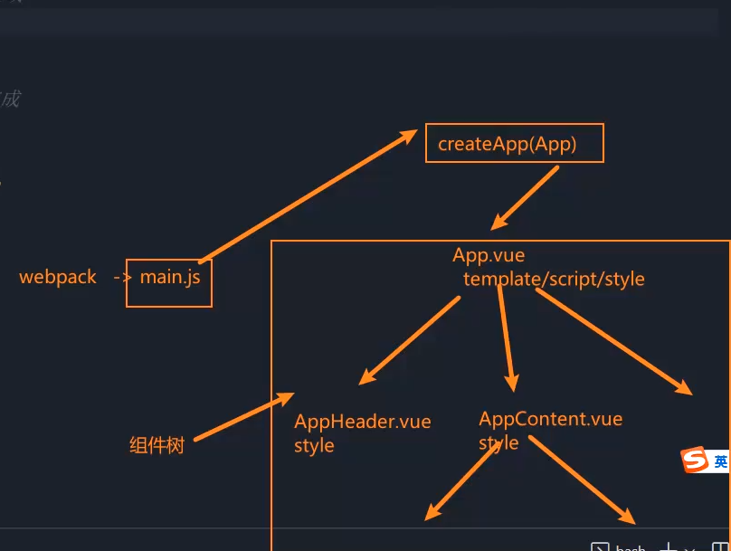
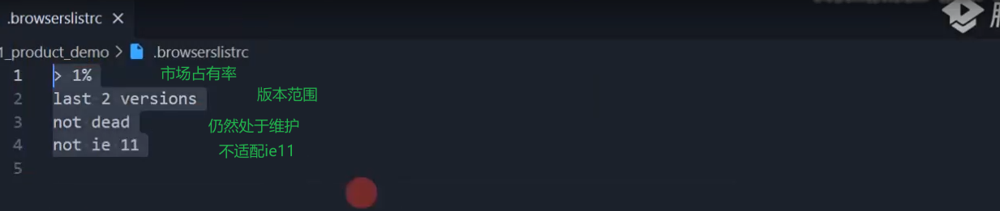
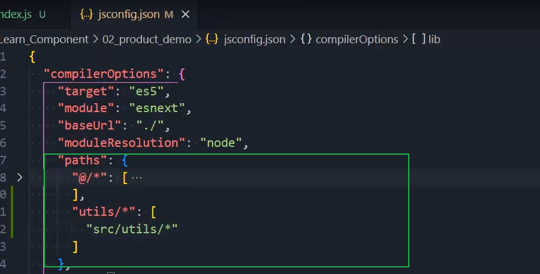
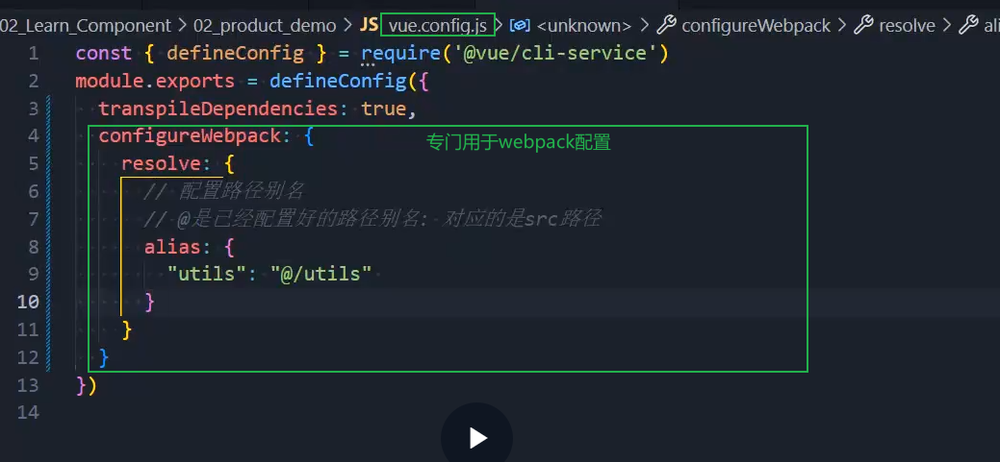
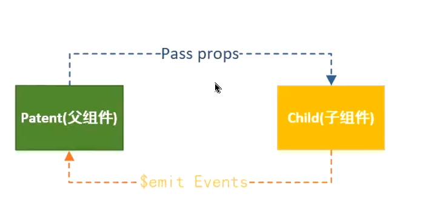

# 组件化开发
- 拆分思想
- 抽象可复用的框架

## 组件注册
- 组件分类
  - 全局组件：注册后可以在全局使用，在打包过程中，**所有的全局组件都会被打包**，增加了负担
  - 局部组件：按需打包，**只有被使用的组件会被打包**
- 全局组件注册
  - 第一步：创建实例`app = vue.createApp()`
  - 第二步：注册组件`app.component(名称,组件对象)`
- 局部组件注册：
  - 第一步：明确组件的使用位置
  - 第二步：`components:{}`注册
### 组件名称
- 短横线分割风格
  - 名称与组件应用名称相同
- 大驼峰风格
  - 可采用大驼峰与短横线分割两种

## SFC开发
- 单文件组件开发
  - 单个组件的模板与数据逻辑处于同一文件，逻辑清晰，易于处理


- 支持方式：
  - 使用`Vue CLI`开发
  - 使用打包工具打包处理

## Vue CLI开发
- `npm i @vue/cli -g`：全局安装脚手架
  - `npm update @vue/cli`:升级脚手架

- 使用脚手架创建项目：
  - 方式一:`vue create "项目名称"`：选择一系列配置需求后自动创建项目
  - 方式二:`npm init vue@latest`:初始化Vue项目-安装create-vue工具->创建项目
### .browserslistrc文件解析
- 浏览器适配文件


### jsconfig.json文件配置
- Vscode配置文件，用于更好的支持Vue开发
  - `compilerOptions->paths`：配置路径简写，用于Vscode提示


### vue.config.js文件配置
- 
- 解决多层嵌套带来的阅读性差问题

### Vue文件选择问题
- 常规的Vue版本有:runtime/runtime+compile(编译)两个版本
- Vue模板元素会编**译生成createVNode()函数(该过程由Vue源码负责完成)**->VNode->VDOM->真实DOM
- 脚手架生成的Vue项目默认采用的是runtime版本的Vue，利用**webpack的Vue-loader**来渲染元素

### 组件化样式隔离
- scoped
  - 在样式上加上了生成的字符属性进行区分
---

## 组件通信
- props向下传状态，events向上传变化
### 父传子

- props
  - 是在组件上注册的自定义属性，**通过父组件为属性赋值，子组件通过属性的名称获取对应的值**
- props的数组语法：
  - 不能对类型进行验证
  - 没有默认值
```vue
//parents:（直接在组件上传值）
<template>
  <!-- 父组件给子组件“赋值” -->
  <UserCard
    :user-name="name"
    :age="age"
    :tags="tags"
  />
</template>

<script>
import UserCard from './UserCard.vue'

export default {
  components: { UserCard },
  data() {
    return {
      name: 'Chen',
      age: 24,
      tags: ['frontend', 'vue']
    }
  }
}
</script>
=====================
//son：(通过props获取)
<template>
  <div>
    <p>userName: {{ userName }}</p>
    <p>age: {{ age }}</p>
    <p>tags: {{ tags.join(', ') }}</p>
  </div>
</template>

<script>
export default {
  // 子组件注册 props
  props: ['userName', 'age', 'tags']
}
</script>
```
- props的对象语法：
  - 支持的类型：`string/number/boolean/array/object/function`
  - 默认值为对象时必须是一个函数的返回值
    - 带有默认值的函数
    - 自定义验证函数(很少使用)
```vue
<script>
export default {
  props: {
    status: {
      type: String,
      default: 'draft',
      validator(v) {
        return ['draft', 'published', 'archived'].includes(v)
      }
    }
  }
}
</script>
```
    - 具有默认值的函数
```vue
<script>
export default {
  props: {
    // ✅ 基本类型默认值可以直接写
    pageSize: { type: Number, default: 10 },

    // ✅ 数组/对象默认值必须用函数返回（避免多个组件实例共享同一引用）
    tags: {
      type: Array,
      default() {
        return []
      }
    },
    config: {
      type: Object,
      default() {
        return { theme: 'light' }
      }
    }
  }
}
</script>
```
- props的大小写命名
```vue
//parent:
<template>
  <!-- 传参用 kebab-case -->
  <UserCard :user-name="name" />
</template>
===========
//son:
<script>
export default {
  // 接收用 camelCase
  props: { userName: String }
}
</script>
```
  - HTML是对大小写不敏感的，所以若采用了驼峰命名法，需要使用短线分割法等价
- 若传递值没有被props接收，就称为非Props的属性，默认会被组件的**根节点**接收
  - **在对象语法中，可以使用inheriAttrs:false来禁用接收**
    - 禁用接收的情况是：数据不是根组件接收的，而是其他元素接收的，需要在需要的元素上手动绑定：`v-bind="$attrs"`
  - 若需要读取值，可直接使用`$attrs.xxx`接收
  - 多节点的需要手动指定，否则会被警告

### 子传父
- 子传父常见于**将子组件触发的事件传递来影响父组件的数据**
- 直接将父组件数据传递子组件不会影响父组件数据，因为这是做了数据的复制【这里的复制是建立在子组件的data中做了接收，若直接props接受修改是不被允许的】
  - 注意：若接收的是一个对象，实际上还是会产生影响，因为引用的是同一个对象，这是危险的
- 使用:
  - 在子组件触发事件监听->触发父组件事件监听
  - 属性emits用于注册上传的事件
    - 数组语法
    - 对象语法：可用于对传出数据的校验
```vue
//child
<template>
  <button @click="add">+1（子通知父）</button>
</template>

<script>
export default {
  // Vue3：用于“声明/注册”可向上触发的事件
  emits: ['add'],
  methods: {
    add() {
      this.$emit('add', 1) // 向父组件抛出事件 + 数据
    }
  }
}
</script>
=================
//parents
<template>
  <Child @add="onAdd" />
  <p>count: {{ count }}</p>
</template>

<script>
import Child from './Child.vue'

export default {
  components: { Child },
  data() {
    return { count: 0 }
  },
  methods: {
    onAdd(step) {
      this.count += step
    }
  }
}
</script>
```
- 子组件传递的数据不能在父组件显式调用，因为不属于父组件作用域，数据由event携带，可显式调用event。

### 案例
```vue
//TabController
<template>

<div class="tab-control">
    <template v-for="(item,index) in titles">
        <div class="tab-control-item" 
        @click="itemClick(index)"
        :class="{active:index === currentIndex}">{{ item }}</div>
    </template>
</div>

</template>

<script >
export default{
    data(){
        return{
            currentIndex : 0,
        }
    },
    emits:["tab-item-click"],
    props:['titles'],
    methods:{
        itemClick(index){
            console.log(index)
            this.currentIndex = index
            this.$emit('tab-item-click',index)
        }
    }
}

</script>

<style scoped>
.tab-control{
    display: flex;
    height: 44px;
    line-height: 44px;
    text-align: center;
}
.tab-control-item{
    flex:1;
}

.active{
    color: red;
    font-weight: 700;
}

</style>
```
```vue
//app
<template>
  <div id="app">
    <tab-control :titles="['衣服','鞋子','裤子']" @tab-item-click="tabItemClick"/>
    <h1>{{ products[currentIndex] }}</h1>
  </div>
</template>

<script>
  import TabControl from './TabControl.vue';
  export default{
    data(){
        return{
            products:["衣服列表","鞋子列表","裤子列表"],
            currentIndex:0,
        }
    },
    components:{
      TabControl,
    },
    methods:{
        tabItemClick(index){
            console.log(this.currentIndex)
            this.currentIndex = index
        }
    }
  }
</script>
```