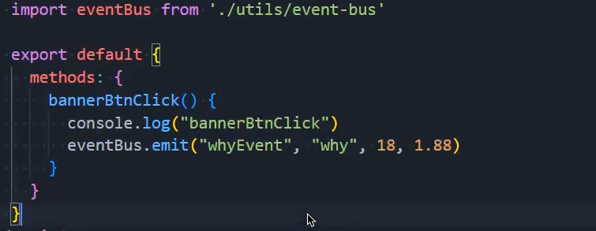
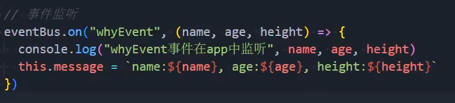

# 插槽
## 基本使用
- 作用于可复用组件内容
  - 页面首部的不同插值内容
- 核心：抽取共性的部分，将自定义内容作为插槽补充
### 基本使用
- 内容基本是按钮、超链接、图片
- 常见设置插槽的默认内容
```vue
<slot/>
```
```vue
<Child>hello slot</Child>
```
### 具名插槽
- 关键点一：`name`属性
- 关键点二：在父组件使用`<template v-slot:"x">`表示匹配插槽
- 插槽默认命名default
```vue
<header><slot name="header" /></header>
<main><slot /></main>
```
```vue
<Child><template #header>H</template>Body</Child>
```
### 动态插槽名
- 在子组件中可以设定插槽名为动态：`<slot :name="name" />`
  - 通常场景是父组件给子组件传递一个插槽名数据，子组件使用props接收后动态绑定在插槽上，使得父子组件的命名一致
- 在父组件中使用`v-slot:[name]`或者简写形式`#[name]`实现
```js
<template #[name]>X</template>
```
### 作用域插槽
- 常见的插槽使用场景：子组件提供位置，父组件提供数据渲染
- 作用域插槽场景：数据来自子组件，父组件首先需要获取子组件的数据
```vue
<!-- 将数据暴露给插槽 -->
<slot :item="item" />
```
```vue
<!-- 在组件中使用暴露的数据 -->
<Child v-slot="{ item }">{{ item.name }}</Child>
```
### 独占默认插槽的简写
- 意思就是该组件只使用默认插槽时，可以直接在组件中使用`v-slot`或者`#default`
- 注意：当存在多种类型的插槽，仍然需要完整写法
```vue
<Child #default>插槽内容</Child>
```
## 渲染作用域
- 在Vue中，父子组件有各自的作用域，若需要使用对方的数据，需要显式引入
---
# 非父子组件通信
## 方式一：Provide & inject
- Provide:只负责提供数据
- Inject：只负责使用数据 
- 使用
  - 对象语法：
    - this为undefined，不能使用data数据,只能传递"死"数据
  - 函数写法
    - 可以使用this获取data数据
    - 共享数据的值是值复制，不会响应式变化
      - 如何获取响应式：使用`computed`函数->返回一个ref对象，需要通过value获取值
```js
// 对象语法适合传递静态值
export default { provide: { theme: 'dark' } }
// 函数语法适合传递响应式值
export default { data:()=>({ n:1 }), provide(){ return { n: this.n } } }
```
```js
// 父组件
provide('theme', 'dark')
// 子组件
const theme = inject('theme', 'light')
console.log(theme)
```
- 可直接传递ref对象，进行响应式数据共享
```js
const count = ref(0); provide('count', count)
// 子组件
const count = inject('count'); count.value++
```
## 方式二：全局事件总线
- vue3取消了之前版本中关于全局事件总线的方法，借助第三方库来实现
  - mitt、tiny-emitter
  - 通过emit触发并传递数据，通过on来接受

> 为什么有的导入需要{}，有的不需要？  
> 根据导出方式决定，`export default{}`->不需要大括号，若导出方式是`export{}`就需要大括号来接受


- 使用全局事件总线在组件卸载前，**建议清除相关的事件监听**

```js
import mitt from 'mitt'
export const bus = mitt()
```
```js
// 发送方
bus.emit('cart:add', { skuId: 1, count: 2 })
```
```js
// 接收方
const h = (p:any) => console.log(p); 
bus.on('cart:add', h)
onUnmounted(() => bus.off('cart:add', h))
```