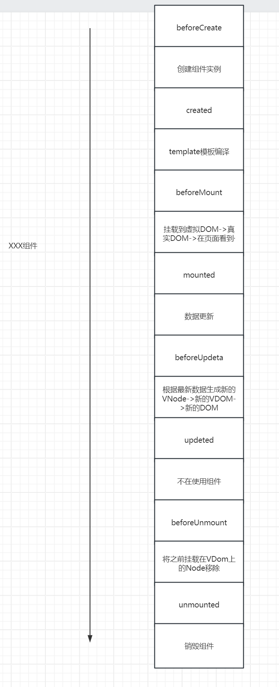
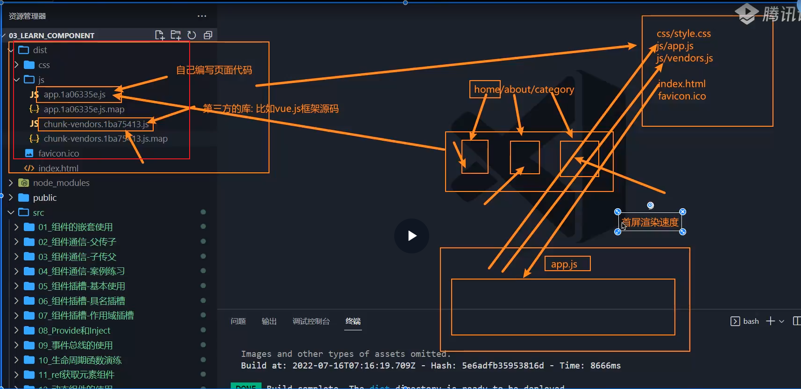
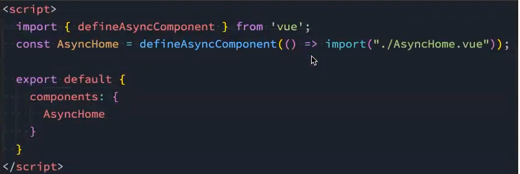
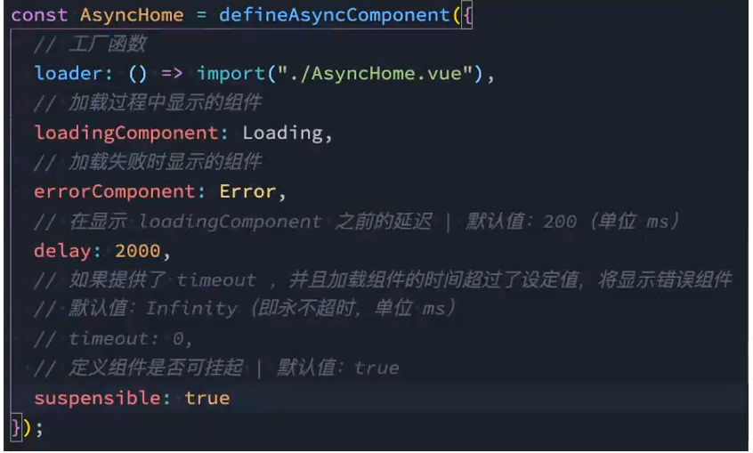
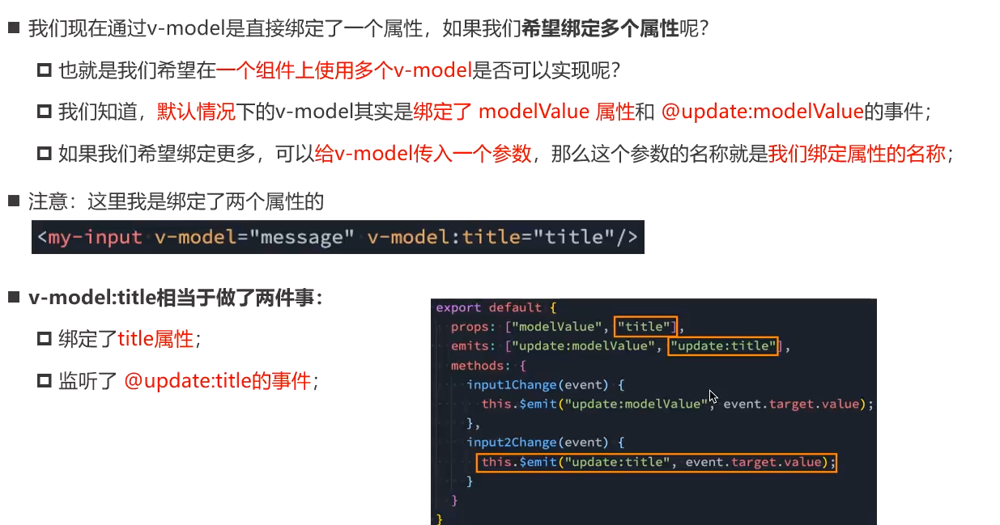
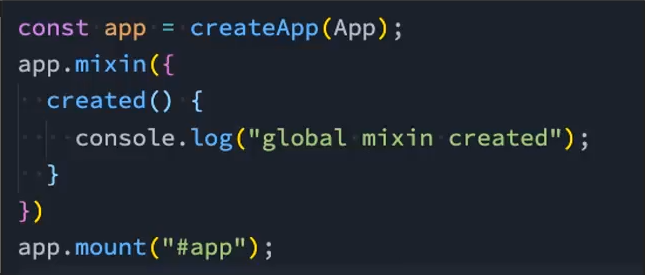

# 生命周期
生命周期演示：

- created（发生网络请求、事件监听、数据监听）
- mounted（获取DOM）
- inmounted（回收操作）
# ref
- 不要在Vue中主动获取DOM元素，并修改DOM内容
- 通过ref属性->`$refs.xxx`获取
- 获取组件元素
  - 获取组件实例
    - 可以调用子组件的实例方法
    - 可通过`$el`获取组件元素 -->当有多个根元素时会获取第一个Node节点
      - 若想获取有实际内容的节点-->`$el.nextElementSibling`
```vue
<template>
  <input ref="inputEl" />
  <Child ref="childRef" />
</template>

<script>
import Child from './Child.vue'

export default {
  components: { Child },
  mounted() {
    // 获取 DOM
    this.$refs.inputEl.focus()

    // 获取组件实例
    this.$refs.childRef.sayHi()
  }
}
</script>
```
```vue
this.$refs.childRef.$el          // 根节点
this.$refs.childRef.$el.nextElementSibling // 下一个真实元素节点
```
---

# `$parent&$root`
- 用于获取父组件与根组件
```vue
<script>
export default {
  mounted() {
    console.log(this.$parent) // 父组件实例
    console.log(this.$root)   // 根组件实例
  }
}
</script>
```
---
# 动态组件
- 通过v-if动态决定组件展示
```vue
<ComponentA v-if="type === 'A'" />
<ComponentB v-else />
```
- 通过**动态组件component 以及 属性"is"决定**
  - is中的组件来自：全局注册组件，局部注册组件
  - 动态组件传递数据
```vue
<component :is="current" :msg="msg" />
export default {
  data() {
    return {
      current: 'ComponentA',
      msg: 'hello'
    }
  }
}
```
---
# keep-alive
- 用于保存组件状态，缓存组件，防止组件切换后卸载
- include:用于选择缓存的组件，依据是组件对象的name属性
- exclude：匹配的组件不会被缓存
- max:最多缓存组件数量，超过后会根据最近使用频率进行销毁
- 被缓存的组件再次进入时是不会执行created和mounted的
  - 使用**`actived`和 `deactivated`两个生命周期函数来监听 
```vue
<keep-alive include="A,B" :max="2">
  <component :is="current" />
</keep-alive>
export default {
  name: 'A',
  activated() {
    console.log('activated')
  },
  deactivated() {
    console.log('deactivated')
  }
}
```
---
# 异步组件
## webpack代码分包
- 背景：构建组件树过程中，由于组件之间通过模块化依赖，所有组件文件会被打包在一个js文件中，庞大的文件会影响首屏渲染速度
- 对不需要立即使用的组件，我们采用单独拆分手段->chunk.js,会在需要的时候下载

- import函数可以让webpack对导入文件进行分包处理（import函数返回的是promise对象）
  - 所以在对组件进行分包处理时，不能直接使用
```vue
const AsyncComp = () => import('./Comp.vue')
```
- Vue提供了函数:`defineAsyncComponent`
  - 参数类型一：工厂函数，工厂函数返回一个promise对象
  
  - 参数类型二：对象，对异步函数进行配置
  
```vue
import { defineAsyncComponent } from 'vue'

export default {
  components: {
    AsyncComp: defineAsyncComponent(() =>
      import('./Comp.vue')
    )
  }
}
```
---
# 组件v-model
- 为组件使用v-model=**为组件绑定一个modelValue的值并监听一个Update事件(`modelValue = $event`)**
```vue
<!-- Parent -->
<Child v-model="count" />
<!-- Child -->
<script>
export default {
  props: ['modelValue'],
  emits: ['update:modelValue'],
  methods: {
    inc() {
      this.$emit('update:modelValue', this.modelValue + 1)
    }
  }
}
</script>
```
- 自定义绑定值名称：`v-model:name = "xxx"`,`update:name` 表示指定监听的数据，基于此实现**多值绑定**
- 
```vue
<Child v-model:title="title" v-model:count="count" />
export default {
  props: ['title', 'count'],
  emits: ['update:title', 'update:count']
}
```
---
# 混入组件Mixin
- 目的是为了对组件之间的相同的代码逻辑进行抽取
- 混入文件就是导出一个对象，实现多个组件相同的逻辑
- 合并规则：
  - data数据默认会合并，若遇到冲突的数据，优先保留组件自己的数据
  - 生命周期函数会合并，全部执行
  - 值为对象的数据：methods，components，directives会被合并为同一个对象，对于冲突的键值对，优先保留组件自身的数据
- 全局混入：使用Vue实例的mixin方法，传入混入对象

```vue
// mixin.js
export default {
  data() {
    return { msg: 'from mixin' }
  },
  created() {
    console.log('mixin created')
  },
  methods: {
    hello() {}
  }
}
//===================
import mixin from './mixin'

export default {
  mixins: [mixin],
  data() {
    return { msg: 'from component' } // 优先生效
  }
}
```
