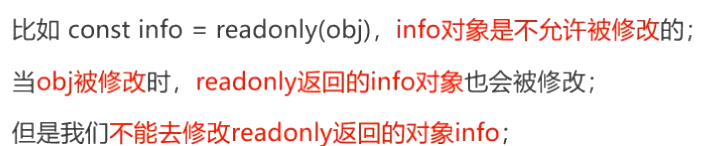
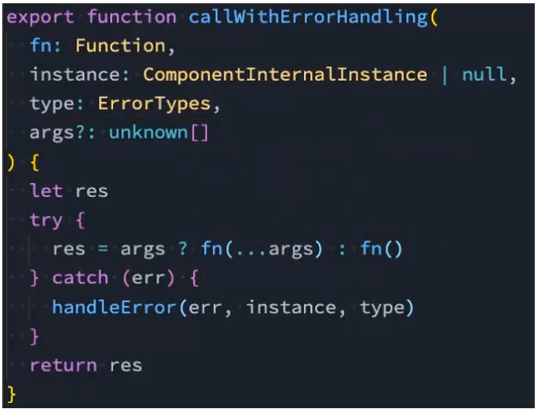
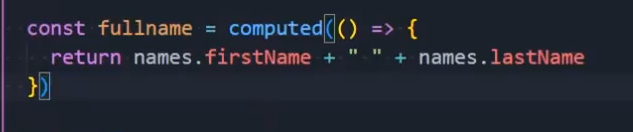
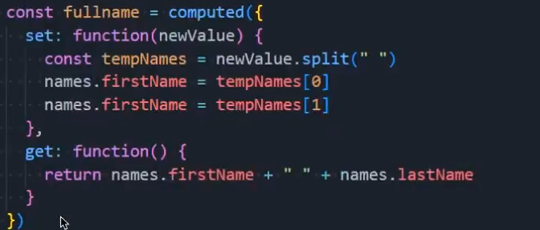
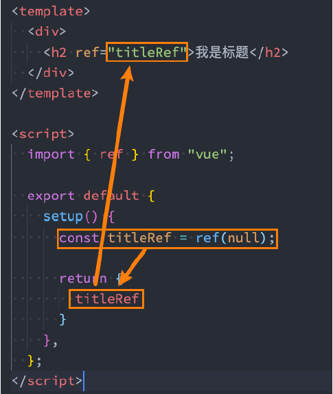
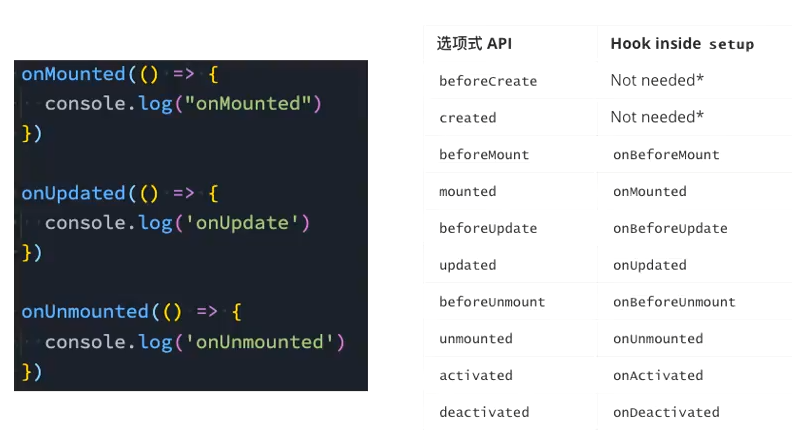

# 组合式语法
- 选项式语法：
  - 将数据的不同逻辑放在不同的参数中，逻辑清晰
  - 随着组件的内容变多，对于数据的管理较为分散，不易管理
- 组合式语法将同一个逻辑相关的代码收集在一起
## 基本体验
- 入口：setup函数
- 通过在setup函数中实现所有相关逻辑，然后返回一个对象
  - 默认数据不是响应式数据
- 响应式数据使用ref()函数
  - template自动对响应式数据解包 
```vue
import {ref} from "vue"
setup(){
    ...
    return{
        ...
    }
}
```
## 基本使用：数据定义
- setup的返回值代替了data的作用，可以直接被template拿来使用，缺点是数据不是响应式的
  - setup()中访问this是undefined
  - 参数一是props，解构得到的props会丢失响应式，建议使用props.xxx
  - 参数二是上下文对象
- reactive函数可以收集数据依赖，在数据发生变化时，进行响应式操作，这也是data函数的底层逻辑，不要随便对reactive对象解构，会丢失响应式
- reactive被用来定义复杂类型的数据，必须传入一个对象或者数组类型，基本数据类型会报警告
- ref函数可以用于简单类型数据的传输，返回一个**ref对象**，template会对该数据自动解包
  - 在对象内使用时，需要`.value`操作数据
- ref对象是浅层解包
  - 若只是读取，template会自动解包获取数据
  - 若在template中需要修改响应式的值，还是需要.value的
- 使用场景
  - reactive常用于一组本地&有联系的数据
  - ref常用于本地简单数据&网络获取的数据

## 单向数据流
- 数据只能是上游到下游，而下游不能修改上游数据
  - 数据的来源是唯一的
  - 组件像函数一样，只负责渲染
- 子组件修改数据应该依靠emit事件监听触发父组件来修改数据

## readonly函数
- readonly返回原始对象的只读代理，防止其他组件对数据的修改  
- readonly返回的对象是不允许修改的，但readonly处理的原来的对象是可以修改的

```vue
import { reactive, readonly } from 'vue'

const state = reactive({ count: 0 })
const ro = readonly(state)

// ro.count++ ❌ 报错（开发环境警告）
state.count++     // ✅
console.log(ro.count) // 1
```
## 其他API
- `isProxy`检查对象是否是由reactive或者readonly返回的代理对象
- `isReactive`检查对象是否是由reactive创建的代理对象
  - readonly返回的对象不算，但readonly返回的reactive创建的对象算
- `isReadonly`
  - 同理
```vue
import { reactive, readonly, isProxy, isReactive, isReadonly } from 'vue'

const a = reactive({})
const b = readonly(a)

isProxy(a)     // true
isReactive(a)  // true
isReadonly(a)  // false

isReactive(b)  // false
isReadonly(b)  // true
```
- `toRaw`
  - 返回reactive或者readonly代理的原始对象 
```vue
import { reactive, toRaw } from 'vue'

const state = reactive({ count: 0 })
const raw = toRaw(state)

raw.count++ // 不触发更新
```
- `shallowReactive`
  - 浅层响应式对象，不关心嵌套对象的响应式
- `shallowReadonly`
  - 同理
```vue
import { shallowReactive } from 'vue'

const state = shallowReactive({
  foo: { bar: 1 }
})

state.foo.bar++ // ❌ 不触发更新
state.foo = { bar: 2 } // ✅ 触发
```
- `unref`
  - 如果是ref对象，就返回ref值，若不是，则直接返回参数
- `isRef`
  - 判断是否是ref对象
```vue
import { ref, unref, isRef } from 'vue'

const a = ref(1)
const b = 2

unref(a) // 1
unref(b) // 2
isRef(a) // true
```
- `shallowRef`
  - 浅层ref对象 
- `triggerRef`
  - **手动触发和shallowRef相关的副作用**
  - 配合shallowref使用，当对象内部变化时，强制更新
```vue
import { shallowRef, triggerRef } from 'vue'

const state = shallowRef({ count: 0 })

state.value.count++ // ❌ 不更新
triggerRef(state)   // ✅ 强制更新
```

### toRefs & toRef
- Reactive对象直接解构会丢失响应式  
- toRefs->解构后的对象属性转换为ref对象
- toRef->对单独的属性转换为ref对象
```vue
import { reactive, toRefs } from 'vue'

const state = reactive({ a: 1, b: 2 })
const { a, b } = toRefs(state)

a.value++ // 等价于 state.a++
//============================
import { reactive, toRef } from 'vue'

const state = reactive({ count: 0 })
const count = toRef(state, 'count')

count.value++
```

## setup中的this
- setup中this不是指向Vue实例，原因是因为没有为setup绑定对应的实例对象
- 

## computed计算属性函数
- 使用方式一：接收的是一个getter函数，返回一个不变的ref对象
- 使用方式二：接受一个对象，包含getter和setter，返回一个可变的ref对象
- 
- 
- 返回的是一个ref对象，
```vue
<script setup>
import { reactive, computed } from 'vue'

const names = reactive({ first: 'Zhang', last: 'San' })

const fullname = computed(() => `${names.first} ${names.last}`)
// fullname.value => "Zhang San"
</script>

<template>
  <p>{{ fullname }}</p> <!-- 模板自动解包，不写 .value -->
</template>
```
```vue
<script setup>
import { reactive, computed } from 'vue'

const names = reactive({ first: 'Zhang', last: 'San' })

const fullname = computed({
  get: () => `${names.first} ${names.last}`,
  set: (val) => {
    const [first, last = ''] = val.trim().split(/\s+/, 2)
    names.first = first
    names.last = last
  }
})

// fullname.value = "Li Si" -> names.first/last 会被改
</script>

<template>
  <input v-model="fullname" />
  <p>{{ names.first }} | {{ names.last }}</p>
</template>
```
## ref使用
- ref获取元素与组件-必须配合`onmounted`才可靠
  1. 在组件上定义ref属性
  2. 定义一个ref对象，绑定元素
  

  - 获取组件：组件 ref 拿到的是实例代理，能调用什么取决于子组件 defineExpose 暴露了什么
    - 获取的是一个代理对象
    - xxxx.value == proxy
```vue
<script setup>
import { ref, onMounted } from 'vue'

const titleRef = ref(null)

onMounted(() => {
  titleRef.value?.focus?.() // 例如：如果是 input，就能 focus
})
</script>

<template>
  <input ref="titleRef" placeholder="focus on mount" />
</template>
```
```vue
<!-- Child.vue -->
<script setup>
const hello = () => console.log('hello from child')
defineExpose({ hello })
</script>

<template>child</template>

<!-- Parent.vue -->
<script setup>
import { ref, onMounted } from 'vue'
import Child from './Child.vue'

const childRef = ref(null)

onMounted(() => {
  childRef.value?.hello?.()
})
</script>

<template>
  <Child ref="childRef" />
</template>
```
## 生命周期函数
- setup函数也代替了生命周期钩子，但不是完全代替
- 在setup中使用生命周期函数采用OnX的方式使用
- 
- beforeCreated和Created被合并在setup函数执行期间

## provide&inject
- provide：
  - 接收一个对象或者有返回值的对象
```vue
provide("name",xxx)
provide({
  name:xxx,
  age:xx
})
provide(){
  return{
    name:xx,
    age:xxx
  }
}
```
  - 默认传递值是没有响应式的，需要手动ref()
- inject
  - 在setup函数中，inject注入的数据不需要解包
  - 若使用选项式语法，需要手动解包
```vue
inject("",xxx)
```
- xxx是默认值

## 侦听属性
- watch函数
  - 参数一是属性名
  - 参数二是回调函数，接受新值与旧值两个value 
  - 参数三是配置项
  - 默认开启深度监听
  - 对于对象的侦听，返回的是代理对象
>若不想返回代理对象？
参数一选择为函数，返回对象的解构对象，此时不再深度监听，需要手动开启
```vue
<script setup>
import { ref, watch } from 'vue'

const count = ref(0)

watch(count, (n, o) => {
  console.log('count:', o, '->', n)
}, { immediate: true }) // 可选：立刻执行一次
</script>
```
```vue
<script setup>
import { reactive, watch } from 'vue'

const form = reactive({ name: 'a', profile: { age: 18 } })

watch(form, (n, o) => {
  // n / o 通常是 proxy（而且 o 可能和 n 指向同一个代理）
  console.log('form changed', n.profile.age)
})

form.profile.age++
</script>
```
```vue
<script setup>
import { reactive, watch } from 'vue'

const form = reactive({ name: 'a', profile: { age: 18 } })

// 1) 只监听某几个字段（推荐，最精准）
watch(
  () => [form.name, form.profile.age],
  ([name, age], [prevName, prevAge]) => {
    console.log(prevName, '->', name, '|', prevAge, '->', age)
  }
)

// 2) 想拿“非 proxy 的普通对象快照”
watch(
  () => ({ ...form, profile: { ...form.profile } }),
  (n, o) => console.log('plain snapshot', o, '->', n)
)
</script>
```
- watchEffect((newvalue,oldvalue)=>{})
  - 回调函数默认立即执行
  - 主动收集组件的依赖，自动触发
  - 停止侦听：利用函数函数返回值

## hook
- 将所有的相关功能逻辑抽取在一个函数文件中
```vue
// useCounter.js
import { ref } from 'vue'

export function useCounter() {
  const count = ref(0)
  const inc = () => count.value++
  return { count, inc }
}
```
```vue
<script setup>
import { useCounter } from './useCounter'

const { count, inc } = useCounter()
</script>

<template>
  <button @click="inc">{{ count }}</button>
</template>
```
### 页面名称
```vue
//page
<script setup>
import{...}from "vue"
import useTitle from "xxx"

const title = useTitle("首页")

function hotClick(){
  title.value = "页面-热搜榜"
}
//...

<script/>

//useTitle
import {ref,watch} from "vue"

export default function useTitle(titleValue){
  const title = ref(titleValue)

  watch(title,(newValue)=>{
    document.title = newValue
  },{
    immediate:true
  })

  return title
  
}
```
- 不建议每一次都单独使用hook导出的函数，而是建议按照以上写法

## setup语法糖
- 所有声明在顶层的内容都默认暴露给模板使用
- defineProps()
- defineEmits()
- defineExpose()


## 案例开发
- 获取数据后可以先打印查看是否正确