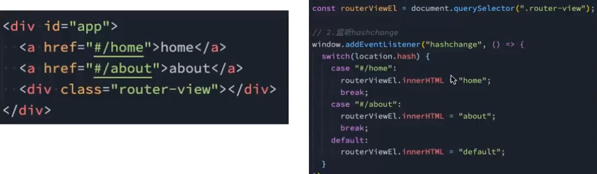
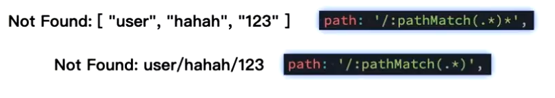

# 认识路由

- 常见的路由器主要是**维护一个映射表，映射表决定数据的流向**

## 发展经过

- 后端路由阶段：路由规则以及页面渲染都发生在服务端，客户端只负责展示。优点是首屏快以及 SEO 友好，缺点是交互差以及当项目复杂时，后端难以维护。
- 前后端分离阶段：页面渲染在客户端发生，但静态资源都需要向服务端请求，服务端只负责提供 API。前后端分工明确，前端负责交互与可视化，后端负责数据。
- 前端路由阶段：SPA 单页面阶段，本质上**在前后端阶段上加入了路由规则**，不需要再向服务端请求资源
  - 常见实现：
    - **hash**：/#/about，靠 hashchange，兼容性好，不需要后端配合
      - hash 起到**锚点**作用，底层上监听 hash 变化将不同的页面渲染。
        
    - **history**：也有六种模式改变 url 而不刷新页面：
      - replaceState：替换原来的路径
      - pushState：使用新的路径
      - popState：路径回退
      - go：向前向后改变路径
      - forward:向前改变路径
      - back：向后改变路径

## Vue-router

1. 安装依赖
2. 创建路由对象
   - createRouter()
   - 指定路由模式
   - 维护路由映射表：routes:[{},{},...]
3. 在入口文件中使用路由(路由生效)
4. 放置路由出口(路由占位)`<router-view/>`
5. 渲染路由切换组件`<router-link to="/home">`

```bash
npm install vue-router
```

```js
//./router/index.js
import { createRouter, createWebHashHistory } from "vue-router";
//引入对应的组件文件
import Home from "./view/Home/index.vue";
import About from "./view/About/index.vue";
export const router = createRouter({
  //指定采用模式
  history: createWebHashHistory(),
  //维护路由映射表
  routes: [
    {
      path: "/home",
      component: Home,
    },
    {
      path: "/about",
      component: About,
    },
    //...
  ],
});
```

```js
//main.js
import router from "./router";
//...
app.use(router);
```

```vue
<template>
<router-link to="/home">首页<router-link/>
<!-- 安排路由切换时组件的渲染位置 -->
<!-- ... -->
<router-view/>
<!-- ... -->
</template>
```

> 服务只有在配置文件发生变化时需要重新启动，其余情况下不需要重新启动

### 细节一：默认路径

- redirect：**重定向**

```js
{
    path:"/",
    // 一般使用重定向到首页组件
    redirect:"/home"
}
```

- 重定向到首页

### 细节二：路由模式选择

- `createWebHashHistory()`:哈希模式
- `createWebHistory`:history 模式

### 细节三：router-link 属性

- to:字符串或者对象，选择跳转路由
- replace：替换模式，直接替换当前网页而不是 push
- active-class：
  - 选中后自动添加的 class，默认 router-link-active，自定义命名时使用 active-class
- exact-active-link:用于路由嵌套时的精准匹配

## 路由懒加载

- 在打包构建应用时，JS 包会变得非常大，影响页面加载
  - 将组件分割为不同的代码块，只有被访问时才加载对应的组件
  - **提高了首页的渲染效率**
- 利用 webpack 的分包，使用 import 函数进行分包处理
- 使用魔法注释，为分包命名

```js
const Home = () => import("./view/Home/index.vue")
const About = () => import(/* webpackChunkName: 'about' */"./view/About/index.vue")
//用法二：
routes:[
  {
    path:"./home"
    component:()=>import("./view/Home/index.vue")
  }
]
```

### 其他配置项

- name:路由记录的独一无二的名称
- meta:自定义数据

## 动态路由

- 将给定匹配模式的路由渲染在同一个组件中，例如多用户对应的 User 组件

```js
{
    path:"/user/:id",
    component:xxx
}
```

### 获取参数

1. 通过模板拿：`$route.params.id`
2. 通过 onBeforeRouteUpdate() ，接收一个回调函数，该回调有两个参数：to&from

```vue
<script setup>
import {useRouter} from "vue-router"
const router =useRouter()

onBeforeRouteUpdate((to,from)=>{
  console，log("to:",to.params.id)
})
</script>

<template>
  <!-- 4) 模板里也能直接读（等价于 useRoute） -->
  <p>template: {{ $route.params.id }} / {{ $route.query.q }}</p>
</template>
```

### NotFound
- NotFound 页面通常用于拦截访问一些不存在或者错误的 URL。

1. 设置路由映射
2. 模板获取错误地址，可直接输出错误的 URL，但不会解析

- 写法二：`pathMatch(.*)*`使用这种匹配模式会获取一个解析后的错误 URL，获取一个数组

```js
// 1. route：
path: "./:pathMatch(.*)";
// 或者
path: "./:pathMatch(.*)*";
// 2. template:{{$route.params.pathMatch}}
```



## 路由嵌套

1. 配置路由映射：children 属性，不需要拼接上级路由，匹配当前路由即可
2. 设置路由出口

- 注意：link 标签的 to 属性需要完整 URL
- 补充：当设置空路径时，默认匹配上级根路径，可以显式设置重定向路径，同时建议设置 name 属性，明确路由
- 多级路由会自动添加`exact-active-link`属性，精准样式匹配

```js
// router.js
routes:[
  {
    path:"/user",
    component:,
    children:[
      {
        path:"home",
        name:home,
        component:
      }
      
  ]
  },
  // ...

]
//xxx.vue
{/* <router-link to="/user/home"> */}
```

## 页面跳转
- useRouter():获取路由对象，执行路由的操作逻辑
- push():
  - 接收一个地址
  - 接收一个对象

```js
import{ useRouter } from "vue-router"
const router = useRouter()
const jumpPage = ()=>{
  router.replace("/home")
  router.push("/home")
  // 或者
  router.push({
    path:"/home",//推荐直接使用路径跳转而不是name
    // name:home
    query:{
      name:,
      id:,
      // ...
      //表现在url中是http://xxx.com?name=xx&id=xx
    }

  })
}

```

### 路由参数：query&params
- params：写在路由规则中，通过`route.params.xx`获取
  - 需要提前在路由映射表中写清楚，eg. id..
  - 表示资源定位
- query："?"后的键值对，通过`route.query.xx`获取
  - 不需要提前在路由映射中写清楚
  - 表示想以什么方式查看资源,eg. 页数/排序方式

### push()&replace()
- push表示直接压入一个页面，可以进行回退操作
- replace表示替换一个页面，无法执行回退

## 页面的前进后退

- router.go()/back()/forward()
  - 调用的是 history 的 api
```js
import{ useRouter } from "vue-router"
const router = useRouter()
const go = ()=>{
  router.forward()
}
const back = ()=>{
  router.back()
}
const pageJump = ()=>{
  router.go(1)//forward()
  router.go(-1)//back()
}