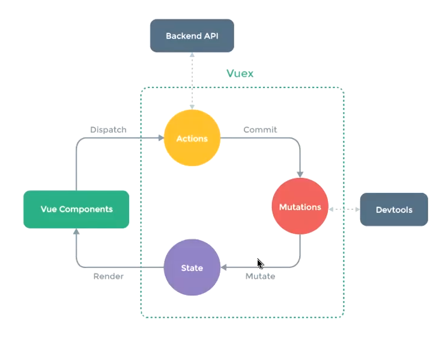

### VueX
## 状态管理
- 存储应用程序需要处理的各种数据叫做状态管理
- 名词简介：
  - 在data&setup中返回的数据=>state
  - 在template中使用的数据，称之为view
  - 在模块中产生的行为事件=>actions
- 对于复杂的数据管理，简单的"props&emit"无法满足需求，需要Vuex和Pinia进行状态管理
  - 创建一个store仓库
  - 将复杂的数据逻辑单独抽离
- Vuex的状态管理：组件树构成一个巨大的"视图View"，无论处于何处，任何组件都可以触发行为获取状态，通过规则月定义，强制维护视图与状态的独立性


## 基本使用
- 使用Vuex第一步需要创建一个Store(仓库)，且该仓库是唯一的，作为唯一数据源，包含了全部组件的状态
- Vuex的最小使用模型包含一个`state`对象和一些`mutation`
  - 我们使用`store.state`获取状态，通过`store.commit`触发状态改变
  - 在组件中需要使用`this.$store.state.xxx`获取状态
```js
//npm install vuex
//mkdir store
import {createStore} from 'vuex'
const store = createStpre({
  state:()=>{},
  mutation:{
    //操作
  }
})

//xxx.vue
{{$store.state.xxx}}
//==========
import {useStore} from 'vuex'
const store = useStore()
store.xxx
```
## State
- Vuex的数据是响应式的，所以**推荐使用Computed返回某个状态**来保证响应式不会丢失
- 在这种模式下，需要组件频繁导入来保证状态使用，一般**通过Vue的插件系统将Store实例从根组件注入到所有的子组件**中使用
- 为了简化每一次使用状态时的复杂写法，引入**`mapState`辅助函数**帮助生成计算属性
- mapState返回的是一个对象，若需要与组件内的其他计算属性混合使用，建议使用展开运算符将多个对象合并为一个对象
```js
//computed配合使用
const Counter = {
  template: `<div>{{ count }}</div>`,
  computed: {
    count () {
      return store.state.count
    }
  }
}

//注入为全局插件使用
const Counter = {
  template: `<div>{{ count }}</div>`,
  computed: {
    count () {
      return this.$store.state.count
    }
  }
}

//mapState辅助
computed:mapState({
  //直接使用箭头函数获取状态
  count:state=>state.count
  //若计算属性与当前组件数据命名冲突，使用重命名来代替此时计算属性count
  countAlias:"count"
  //若计算属性需要状态值与组件内数据运算获取，必须使用函数用'this'获取组件内状态
  countPlusLocalState (state) {
      return state.count + this.localCount
    }
})
```
## Gatters
- gatter是Vuex中对状态进行处理的仓库
- 
## Mutations
- 管理对状态的事件与回调函数，接收State作为第一个参数
- 存在第二参数，该参数被称为载荷(payload)，建议类型是对象，该类型更易读
## Actions
## Modules
