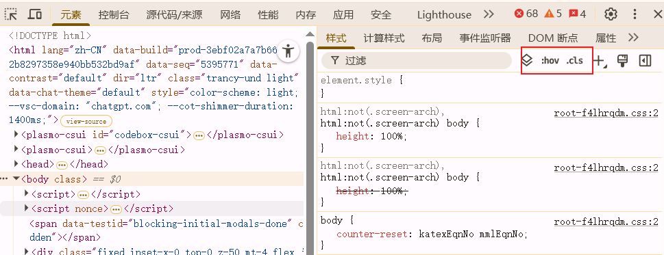
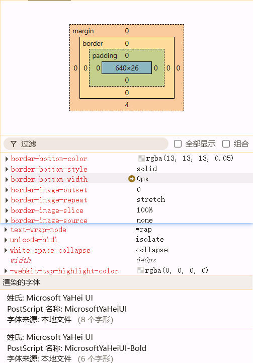
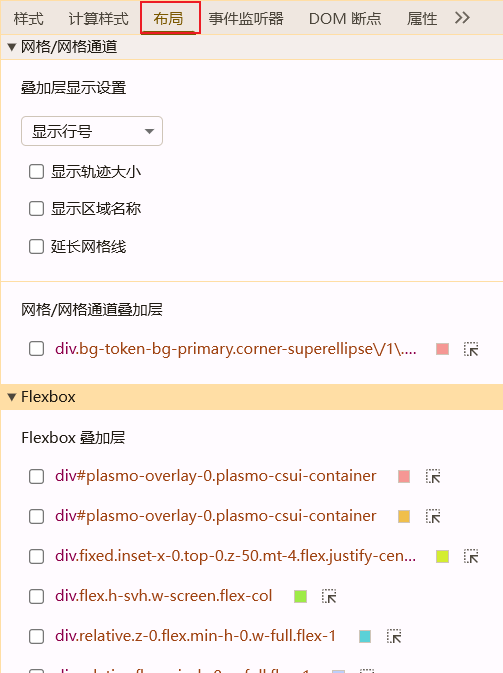
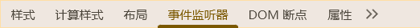
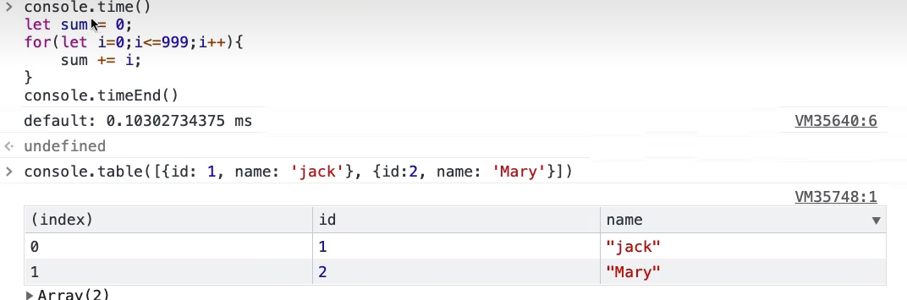
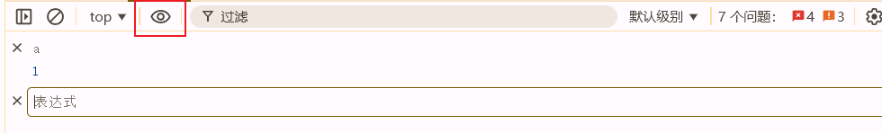
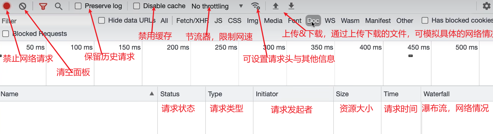

# DevTool 使用
## 打开
- `F12` / 开发者工具

## 命令菜单
- win：`Ctrl` + `Shift` + `P`
- ios：`Commnd` + `Shift` + `P`
- 用处：
  - Dark主题
  - 截图
    - 全尺寸截图
    - 节点截图
  - 调节窗口位置

## Tab介绍
### Element
  - 提供HTML&CSS查询与定位
    - 右键检查快速定位
    - `Ctrl` + `F`查询
      - 文本查询
      - 选择器查询：`section#section_one`
      - Xpath查询：`//section/p`(//表示全局)
      - console面板查询
        - `inspect(document.getElementById('section_one'))`
  -  提供样式修改
     -  
     -  通过`:hov`修改状态
     -  通过`:cls`可修改DOM元素是否拥有此类
     -  右键复制样式
     -  
     -  `computed`计算样式可看到全部生效样式，点击后可查看样式生效元素
     -  全部显示用于显示包括继承而来的属性
     -  组合--对属性进行功能上的划分
  -  提供布局查询
     -  
  -  节点事件监听器&属性
     -  
-  

### Console面板
- 语句执行
- 快捷语
  - `$_`返回上一条执行结果
  - `$0`返回选择的DOM节点(1,2,3,...)
  - `console.log(error/warn/table/clear/group/time/assert/trace)`
    - group--一组输出
    - time--执行时间
  - 
- 
  - 可用于观测变量变化

### Source
- 代码调试
- 通过在代码中添加`debugger`
- 通过在该面板在的JS代码中手动点击添加断点
- 通过命令面板设置代码块折叠
  - `code folding`
- watch功能添加需要观测的变量
- 事件断点，通过事件监听添加断点
  - 框架中事件监听-->框架源码
    - 在调用堆栈中将文件忽略

### NetWork
- 