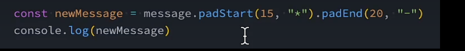
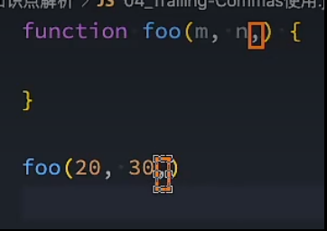
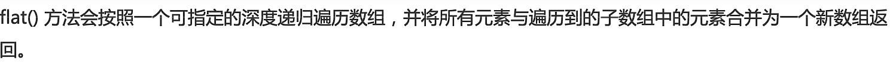
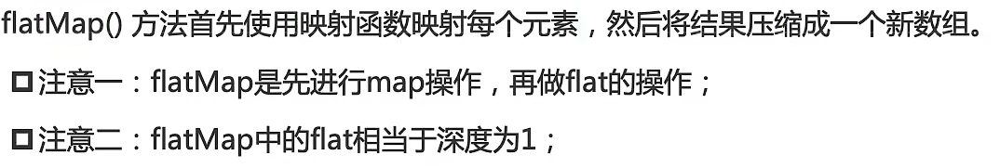

# ES6~ES12重点内容更新
## ES6
### let/const
- let引入了块级作用域，搭配{}使得变量只在该作用域内生效
- const表示常量，赋值后不可以更改
  - 当常量引用为对象时，对象内的属性不受约束
  - 在使用for循环遍历时不能使用const
    - 原因是for循环是先对变量重新赋值，然后再创建新作用域。整个变量的赋值是发生在循环外的，通过**闭包**来获取变量值
  - 使用`for...of`可以使用const
    - 原因是`for...of/in`是在每一次循环中创建新的作用域再创建变量
- let/const不允许重复声明变量
- 暂时性死区
  - 使用let/const声明的变量不能在声明前使用-->**不存在作用域提升**
    - **在变量所处的词法环境被实例化时，变量就被创建了，但是在没有赋值时，无法被访问到**
- 使用选择
  - 优先推荐使用`const`，保证数据安全
  - 明确数据会发生改变，则使用`let`

---
### 块级作用域
- 对`let/const/class`有效
- 对于**在块级作用域中声明的`function`，表现类似`var`，会被提升在外部作用域顶层，值为`undefine`，当执行在所在位置才被赋值**
- 建议在if/for中使用箭头函数，保证数据不会被提升在全局环境中
  - 箭头函数本质上是赋值，不是声明
---
### 模板字符串
- 使用``,在内部使用${}来拼接变量/表达式/函数调用
- 可以用于函数调用
  - 第一参数是模板字符串中的整个字符串，放在一个数组中
    - 当内部拼接了变量时，字符串会被切割放在数组中
  - 第二参数是模板字符串中的`${}`
---
### 默认值处理
- 初始写法
  - 所有**假值**都会被识别，被默认值代替
```js
let boo = m || "aaa"
```
- Es6中，直接在参数中提供默认值
```js
function foo(m = "aaa"){}
//对象类型参数默认值
function foo({m,n} = {m:"aaa",n:"bbb"})
//若没有传参(undefine),{}作为数据
//没有传参，默认值{}
//默认值是"{}，m，n"而不是"{m:xxx,n:xxx}""
function foo({m = "aaa",n = "bbb"} = {})
```
> JS引擎发现"="左侧是一个普通的变量，就是赋值模式  
> 若发现左侧是`{}或者[]`就是解构模式，会在右侧寻找左侧需要的值
- 建议默认值放在参数的最后一位
---
### 解构赋值
```js
// 对象解构，看属性名，不看顺序
const { name, age } = user;

//别名赋值
const user = { id: 101, nickname: "Gemini" };
const { nickname: name } = user; 

console.log(name); // "Gemini"
console.log(nickname); // 报错：ReferenceError，因为 nickname 只是匹配模式，name 才是真正的变量

//嵌套解构
const metadata = {
  title: "ES6 Guide",
  author: { name: "Alice", age: 25 }
};

const { author: { name } } = metadata;
console.log(name); // "Alice"
// 注意：此时并没有生成 author 变量，只生成了最里层的 name

// 数组解构，看顺序
const [first, second] = colors;

```
- 可以通过空位（逗号）来跳过不关心的元素。
- 如果你想要第一个，剩下的打包带走，可以用展开运算符。
- 解构赋值的默认值只有在对应位置的值为 严格的`undefined`时才会生效。
---
### 展开运算符 & 剩余参数
- 展开语法的使用场景
  - 函数调用
  - 数组构造
  - 构建对象字面量
```js
//数组展开
const hardware = ["CPU", "GPU"];
const PC = [...hardware, "RAM", "SSD"]; 
// 结果：["CPU", "GPU", "RAM", "SSD"]

//对象展开
const baseConfig = { host: "localhost", port: 8080 };
const userConfig = { ...baseConfig, port: 9000, debug: true };
// 结果：{ host: "localhost", port: 9000, debug: true }
// 注意：后面的属性会覆盖前面的同名属性（覆盖重写）

//函数调用
const numbers = [10, 5, 100, 2];
Math.max(...numbers); // 相当于 Math.max(10, 5, 100, 2)
```
- 剩余参数代替了`argument`(类数组)
  - `argument`包含了所有实参，剩余参数只包含没有对应形参的实参

---
### Symbol
---
### Map&weakMap
- Map的键可以为任何类型，包括对象与`NaN`
- 支持"entries"类型进行保存
  - 可以快速将对象转化为map
- 操作包括`get/set/has/delete/clear`
```js
const myMap = new Map();
const objKey = { id: 1 };

myMap.set(objKey, "这是对象键的值");
myMap.set(123, "这是数字键的值");

console.log(myMap.get(objKey)); // "这是对象键的值"

const obj = { x: 1, y: 2 };
const mapFromObj = new Map(Object.entries(obj));

```
- weakMap的键只能是对象，但对对象的引用是弱引用，不干扰垃圾回收
  - weakMap的键值对何时被清空是不确定的，所以没有迭代能力
  - 用于Vue的响应式，保存所有属性的依赖，当属性被清理后，所有属性相关的依赖一并被清理，防止内存泄漏

---
### Set&weakSet


---
## ES7
### includes
- 用于数组元素查询
- `includes(查询内容,初始查询位置)`
- 原始查询方法:`indexOf()`
  - 若没有查询到，返回-1
- 缺陷
  -  无法查询`NaN`

### 指数运算符
- `**`

## ES8
### Object.values
- `Object.keys`用于获取对象中的全部"key"
- `Object.values`用于获取对象中的"value"
  - 使用数组表示
  - 可以接受传入参数
    - 数组-->结果还是数组
    - 字符串-->将字符串**拆分**作为数组返回
---
### Object.entries
- 获取数组形式的对象键值对
- 接收参数
  - 接收数组
    - 返回以索引为key,元素为value的数组配合
  - 接收字符串
    - 返回以索引为key,单个字符为value的数组配合
---
### String Padding
- 表示**字符串填充**
  - `padStart`&`padEnd`
    - 
    - 
    - 
---
### Traliling-Commas
- 方便对参数的拓展
- 
---
### Object Descriptors
- `Object.getOwnPropertyDescriptors`
  - 用于返回对象所有的自身属性的描述符
- `async await`

## ES9
- 迭代器
- 对象的展开语法
- Promise finally

## ES10
### flat & flatMap
- 用于**数组拍平**
- `flat`
  - 
```js
//默认1层
const arr = [1, [2, [3, 4]]]
console.log(arr.flat()) // [1, 2, [3, 4]]
//多层
const arr = [1, [2, [3, 4]]]
console.log(arr.flat(2)) // [1, 2, 3, 4]
//无限
const arr = [1, [2, [3, [4]]]]
console.log(arr.flat(Infinity)) // [1, 2, 3, 4]
```
- 返回一个**新数组**
- 跳过空位
- 用处：对**嵌套数组**的处理
---
- `flatMap`
  - 
  - 将返回的数组组合合并为一个数组
```js
const arr = ['前端', '后端']

const res = arr.flatMap(item => [item, item + '工程师'])
console.log(res)
// ['前端', '前端工程师', '后端', '后端工程师']
```
- `flatMap`**只能拍平一层，无法指定深度**
---
### entries & fromEntries
- `fromEntries`直接将数组形式的键值对展开在一个新的对象中
- `Object.entries(obj)`：**对象 → 二维数组**
- `Object.fromEntries(arr)`：**二维数组 → 对象**
- 使用场景
  - 将查询字符串转化为对象格式
```js
const obj = {
  name: '宸',
  age: 24
}

const arr = Object.entries(obj)
console.log(arr)
// [['name', '宸'], ['age', 24]]

const newObj = Object.fromEntries(arr)
console.log(newObj)
// { name: '宸', age: 24 }
```
---
### trimStart & trimEnd
- trim家族：
  - `trim()`:清除两侧空白字符
  - `trimStart()`:清除首端空白字符
  - `trimEnd()`:清除末端空白字符
- 返回一个**新的字符串，不会修改原字符串**

---

## ES11
### BigInt
- 用于解决大整数的精度问题
- 可以表示任意精度的整数，不会因为超过安全范围而丢失精度
  - `Number.MAX_SAFE_INTEGER`
  - `Number.MIN_SAFE_INTEGER`
- 表示方式
  - 后跟"n"
  - `BigInt()`

```js
const n = 1234567890123456789012345678901234567890n
const n = BigInt("1234567890123456789012345678901234567890")
```
- 使用场景
  - 生活中常见大数**不是用于计算而是用于标识的**
    - 使用字符串表示
  - BigInt不**能和Number混算**
  - BigInt对于高精度的运算，比如**小数运算无效**
---
### 空值合并操作
- `??`
- 当操作符左边为`null`&`undefined`时，返回右边的值
- 与`||`的区别：
  - `||`看到的是**假值**
    - 空字符串/0/NaN
  - `??`看到的是空值
- **只有左边是`null`&`undefined`时才起作用**
- 有值就用原值，没有才进行兜底操作
- 使用场景
  - **接口字段/表单/配置项**默认值
---
### 可选链
- `?.`
- 当访问链上有一项是`null&undefined`就返回`undefined`，不抛错
- 常用于**访问属性&调用方法**
- 只返回正常访问结果或者`undefined`
- 本质是为了**数据的访问安全性**
--- 
### GlobalThis
- 用于统一浏览器与node环境下的全局环境变量名称
- `window`只在浏览器中成立
---
### for...in...
- 作用是遍历得到对象中的所有键
- 遍历**自身+原型链**上所有可枚举属性
- 使用场景：
  - 遍历普通对象的key
  - 不适合遍历数组
    - 字符串索引是字符串
    - 会遍历到自定义属性
    - 该方式不保证顺序
---
## ES12
### FinalizationRegistry
- 允许你注册一个目标对象`target`，以及一个“持有值” `heldValue`。
  - 当`target`被 GC 回收后，运行时可能在之后某个时间点调用你提供的清理回调，并把 `heldValue` 传进去
- 允许你在对象被 GC 后，请求运行一个清理回调，但**时间不确定，甚至可能永远不执行**
- 某个对象真的被回收后的一段“后处理”登记，但这个处理只是在某个阶段被调用
```js
const registry = new FinalizationRegistry((heldValue) => {
  // cleanup
})

registry.register(target, heldValue)
//unregisterToken，可以用来取消注册。unregister() 会根据这个 token 移除记录
```
> 更像是对GC回收的辅助，heldValue是留下的信息
> - 回调时间不确定
> - 存在不执行的可能
> 由于存在不确定性，所以不触碰核心逻辑
---
### weakRef
- 给你一个**弱引用**，不阻止对象被 GC 回收；你可以通过`deref()`“试着”拿回对象
- 想“知道这个对象是否存在”，但又不想因为这层引用让它活着，这就需要弱引用语义。
```js
const ref = new WeakRef(target)
const obj = ref.deref()
```
- `deref()`返回：
  - 目标对象本身
  - 或 undefined（如果它已经被回收）
> null不是对象不存在，只是与变量之间的连接断了
> 由于存在不确定性，所以不触碰核心逻辑
### 逻辑赋值运算
- 是逻辑判断与赋值操作的结合
- 先判断左侧是否满足条件，若满足就把右侧结果赋值给左侧
- 共有三种语法
  - `||=`
    - 如果 x 是**假值（falsy）**，就把 y 赋给 x
  - `&&=`
    - 如果 x 是**真值（truthy）**，就把 y 赋给 x。
  - `??=`
    - 只有当**x 是`null`或`undefined`**时，才把 y 赋给 x。
> 假值赋值：对于默认值赋值较激进，会错误判断`0/''/false`
> 真值赋值：适用面较窄，因为表达的是已经有值才进行赋值操作
> 空值赋值：**常用于字段初始化**
