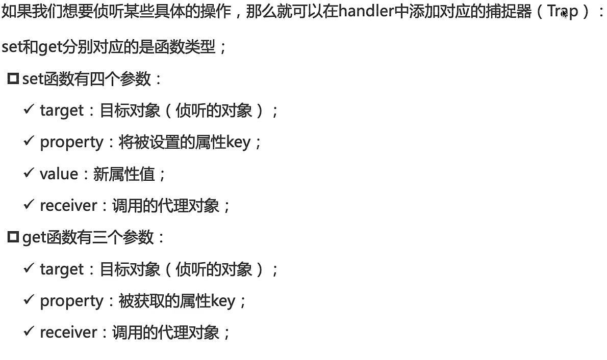
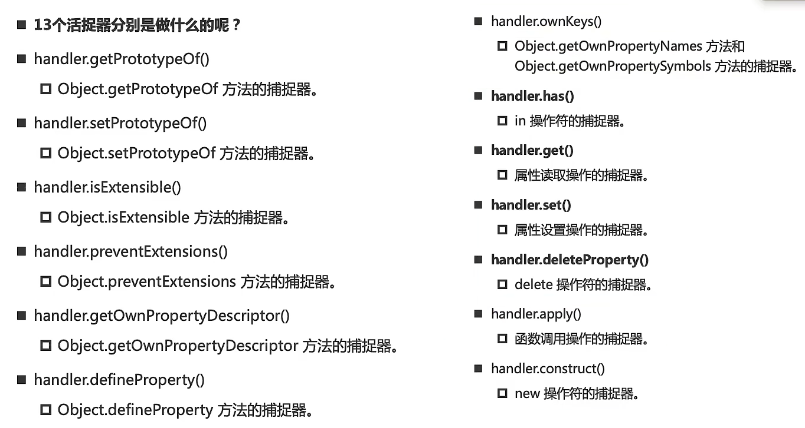
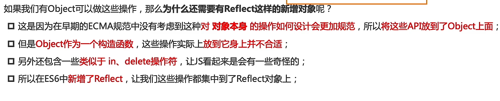

# Proxy-Reflect
## 对象监听方式一:属性拦截器
```js
Object.{
    get(){}
    set(){}
}

//为所有的属性添加拦截 
Object.keys(obj).foreach(key => {
    Object.defineProperty(obj,key,{
        get(){},
        set(newValue){}
    })
})
```
- 拦截器的设计初衷不是监听属性变化
- 拦截器无法监听更多的操作(增删)
## Proxy
- Proxy是一个类
  - 使用前需要创建对象 ————> 代理对象
  - **代理对象主要用于基本操作的拦截与自定义**
- Proxy负责**拦截**,所有的实际行为的发生仍然通过原始对象
```js
//两个参数，若handle为空，那么等于直接在源对象上操作
const proxy = new Proxy(target,handler)
```


  

> - 与`Object.defineProperty`的区别
>   - 拦截深度：Proxy 代理整个对象，而 defineProperty 只能劫持对象的某个特定属性
>   - 对数组的支持：Proxy完美支持数组的索引变化与Length变化
>   - 无法支持对属性的增删操作
---
## Reflect
- 内置对象，提供拦截JavaScript操作的方法，与Proxy的所有属性和方法一致
  - 提供操作JavaScript对象的方法
  -  
  - 完全隔离对原始对象的操作
  - 返回一个布尔值，显示操作是否生效
- Reflect负责**还原行为**
> - 为什么Proxy一定要配合Reflect使用？
>   - 为了保证`this`的指向正确
>     - 当目标对象（target）内部使用了 getter 或 setter，并且依赖了`this`时，如果不使用Reflect传递receiver（代理对象本身），this会指向原对象target，从而导致内部的其他属性访问**绕过代理**
```js
const proxy = new Proxy(obj, {
  get(target, key, receiver) {
    // receiver 就是当前的代理对象 proxy
    return Reflect.get(target, key, receiver); 
  },
  set(target, key, value, receiver) {
    return Reflect.set(target, key, value, receiver);
  }
});
```
### construct
- 是Proxy专门用来拦截new操作符的拦截器
  - 改变一个对象实例化的过程
```js
//target 目标构造函数
//argumentsList 参数列表
//newTarget 被调用的构造函数
Reflect.construct(target, argumentsList, newTarget)
```
---

```js
const user = {
  _name: '前端大牛',
  // 注意：这里是一个 getter 属性，内部依赖了 this
  get info() {
    return `我是 ${this._name}`; 
  }
};

const proxy = new Proxy(user, {
  get(target, key, receiver) {
    console.log(`[拦截日志] 正在访问: ${key}`);
    
    // 错误做法：直接 return target[key]
    // 结果：打印 "[拦截日志] 正在访问: info"，然后输出 "我是 前端大牛"。
    // 致命缺陷：访问 this._name 时，this 指向了原对象 user，_name 的访问被“漏掉”了，没有触发拦截！

    // 正确做法：使用 Reflect 并透传 receiver
    return Reflect.get(target, key, receiver);
  }
});

console.log(proxy.info);
// 理想的输出结果：
// 1. [拦截日志] 正在访问: info  (第一次拦截)
// 2. [拦截日志] 正在访问: _name (成功拦截到了 getter 内部的访问！)
// 3. 我是 前端大牛
```
