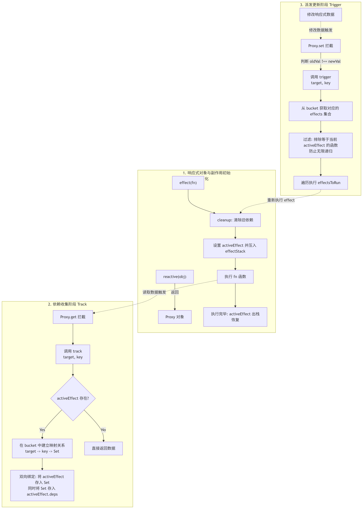

# JavaScript 响应式系统构建
## 1. 概要

响应式系统的本质，是**让“数据变更”与“副作用执行”建立自动关联**：当数据被读取时收集依赖，当数据被修改时精准触发相关逻辑，从而把手动同步状态的负担转移为一套可追踪、可调度的运行时机制。


## 2. 核心语法与基础设施 (Syntax / Attributes & Infrastructure)

响应式系统不是单一 API，而是一组基础设施协同工作后的结果。核心在于**依赖收集结构 + 拦截层 + 调度执行层**。

### 2.1 核心基础设施总览

| 模块       | 作用                            | 常用实现                    | 为什么必须存在                   |
| -------- | ----------------------------- | ----------------------- | ------------------------- |
| 数据拦截层    | 拦截对象读取与写入                     | `Proxy` / `Reflect`     | 不拦截就无法知道“谁读了数据、谁改了数据”     |
| 副作用函数容器  | 包装需要自动重跑的逻辑                   | `effect(fn)`            | 响应式不是更新数据本身，而是重新执行依赖数据的逻辑 |
| 依赖仓      | 建立“目标对象 -> 属性 -> effect集合”的映射 | `WeakMap -> Map -> Set` | 没有映射，就无法精准找到该通知谁          |
| 当前激活副作用  | 标记当前正在收集的 effect              | `activeEffect`          | `get` 时必须知道“当前是谁在读取”      |
| effect 栈 | 处理嵌套 effect                   | `effectStack`           | 防止嵌套副作用覆盖当前上下文            |
| 触发器      | 属性变更后派发更新                     | `trigger(target, key)`  | 将变更传播到依赖该属性的 effect       |
| 调度器      | 控制 effect 执行时机与去重             | `scheduler` + 队列        | 避免频繁同步重跑导致性能崩塌            |
| 清理机制     | 移除旧依赖关系                       | `cleanup(effect)`       | 否则会产生脏依赖、重复依赖、内存残留        |

---

### 2.2 依赖仓的标准数据结构

```js
const bucket = new WeakMap()
```

其完整层级通常为：

```js
WeakMap<
  target,
  Map<
    key,
    Set<effectFn>
  >
>
```

#### 结构拆解

| 层级    | 数据结构      | 键             | 值       | 设计原因                 |
| ----- | --------- | ------------- | ------- | -------------------- |
| 第 1 层 | `WeakMap` | 目标对象 `target` | `Map`   | 对象被 GC 回收后，依赖记录可自动释放 |
| 第 2 层 | `Map`     | 属性名 `key`     | `Set`   | 区分不同属性的依赖            |
| 第 3 层 | `Set`     | effect 函数     | 唯一副作用集合 | 去重，防止同一 effect 重复收集  |

---

### 2.3 最小响应式 API 组成

| API / 机制               | 职责      | 关键点            |
| ---------------------- | ------- | -------------- |
| `reactive(obj)`        | 返回代理对象  | 负责拦截 `get/set` |
| `effect(fn)`           | 注册副作用函数 | 执行时进入依赖收集阶段    |
| `track(target, key)`   | 收集依赖    | 在 `get` 阶段执行   |
| `trigger(target, key)` | 触发更新    | 在 `set` 阶段执行   |
| `cleanup(effectFn)`    | 清理旧依赖   | 解决分支切换导致的脏依赖   |
| `scheduler(job)`       | 调度任务    | 控制刷新时机、合并重复任务  |


## 3. 核心实现与逻辑

---

### 3.1 最小可运行响应式系统

下面这套代码，已经覆盖响应式系统的核心骨架。

```js
const bucket = new WeakMap()

let activeEffect = null
const effectStack = []

function cleanup(effectFn) {
  for (const deps of effectFn.deps) {
    deps.delete(effectFn)
  }
  effectFn.deps.length = 0
}

function effect(fn) {
  const effectFn = () => {
    cleanup(effectFn)
    activeEffect = effectFn
    effectStack.push(effectFn)

    fn()

    effectStack.pop()
    activeEffect = effectStack[effectStack.length - 1] || null
  }

  effectFn.deps = []
  effectFn()
  return effectFn
}

function track(target, key) {
  if (!activeEffect) return

  let depsMap = bucket.get(target)
  if (!depsMap) {
    depsMap = new Map()
    bucket.set(target, depsMap)
  }

  let deps = depsMap.get(key)
  if (!deps) {
    deps = new Set()
    depsMap.set(key, deps)
  }

  deps.add(activeEffect)
  activeEffect.deps.push(deps)
}

function trigger(target, key) {
  const depsMap = bucket.get(target)
  if (!depsMap) return

  const effects = depsMap.get(key)
  if (!effects) return

  const effectsToRun = new Set()

  effects.forEach(effectFn => {
    if (effectFn !== activeEffect) {
      effectsToRun.add(effectFn)
    }
  })

  effectsToRun.forEach(effectFn => effectFn())
}

function reactive(obj) {
  return new Proxy(obj, {
    get(target, key, receiver) {
      track(target, key)
      return Reflect.get(target, key, receiver)
    },
    set(target, key, newVal, receiver) {
      const oldVal = target[key]
      const result = Reflect.set(target, key, newVal, receiver)

      if (oldVal !== newVal) {
        trigger(target, key)
      }

      return result
    }
  })
}
```

#### 使用示例

```js
const state = reactive({ count: 0 })

effect(() => {
  console.log('count changed:', state.count)
})

state.count++
// 输出：count changed: 0
// 输出：count changed: 1
```

---

### 3.2 数据流向：从读取到更新的完整链路

这是响应式系统最核心的逻辑主线：

#### 阶段 1：注册副作用

```js
effect(() => {
  document.body.innerText = state.count
})
```

执行 `effect` 后：

1. 当前函数被包装为 `effectFn`
2. `activeEffect = effectFn`
3. 立即执行一次 `fn()`，进入依赖收集阶段

---

#### 阶段 2：读取属性，触发依赖收集

```js
state.count
```

触发 `Proxy.get`：

```js
get(target, key, receiver) {
  track(target, key)
  return Reflect.get(target, key, receiver)
}
```

`track(target, key)` 做的事不是“记录值”，而是：

> 记录“哪个 effect 依赖了 target 的哪个 key”

最终形成：

```js
bucket = WeakMap {
  target => Map {
    'count' => Set([effectFn])
  }
}
```

---

#### 阶段 3：修改属性，触发更新

```js
state.count++
```

触发 `Proxy.set`：

```js
set(target, key, value, receiver) {
  const result = Reflect.set(target, key, value, receiver)
  trigger(target, key)
  return result
}
```

`trigger(target, key)` 会：

1. 找到 `target`
2. 找到对应属性 `key`
3. 拿到其依赖集合 `Set<effectFn>`
4. 逐个重新执行

于是原本依赖 `state.count` 的副作用被重新运行，视图同步更新。

---

### 3.3 为什么必须做依赖清理

看这个分支切换场景：

```js
const state = reactive({
  ok: true,
  text: 'hello'
})

effect(() => {
  document.body.innerText = state.ok ? state.text : 'not'
})
```

第一次执行时，依赖收集为：

* `state.ok`
* `state.text`

然后执行：

```js
state.ok = false
```

副作用重新运行后，逻辑变成只依赖 `state.ok`，此时**不应该继续依赖 `state.text`**。

如果没有 `cleanup(effectFn)`，旧依赖不会被移除，后续执行：

```js
state.text = 'world'
```

仍会错误触发 effect，这就是**脏依赖**。

#### 本质问题

响应式依赖不是静态的，而是**运行时动态决定的**。
所以每次 effect 重新执行前，必须先把旧依赖全部清掉，再重新收集。

---

### 3.4 为什么需要 effect 栈

解决嵌套副作用。

```js
effect(() => {
  console.log('outer', state.foo)

  effect(() => {
    console.log('inner', state.bar)
  })

  console.log('outer again', state.baz)
})
```

若只有一个 `activeEffect`，执行内层 effect 时会覆盖外层 effect，导致：

* `state.bar` 正确收集到内层 effect
* 但 `state.baz` 也可能错误收集到内层 effect

所以必须用栈结构维护上下文：

```js
effectStack.push(effectFn)
...
effectStack.pop()
activeEffect = effectStack[effectStack.length - 1]
```
---

### 3.5 为什么需要调度器

如果每次 `set` 都立刻执行 effect，频繁更新会耗费性能

```js
state.count++
state.count++
state.count++
```

理论上只需最终执行一次副作用，但同步触发会执行三次。

所以需要调度器把 effect 放入任务队列去重后统一执行。

#### 简化实现

```js
const jobQueue = new Set()
const p = Promise.resolve()
let isFlushing = false

function flushJob() {
  if (isFlushing) return
  isFlushing = true

  p.then(() => {
    jobQueue.forEach(job => job())
  }).finally(() => {
    isFlushing = false
    jobQueue.clear()
  })
}
```

给 `effect` 增加调度能力：

```js
function effect(fn, options = {}) {
  const effectFn = () => {
    cleanup(effectFn)
    activeEffect = effectFn
    effectStack.push(effectFn)

    const res = fn()

    effectStack.pop()
    activeEffect = effectStack[effectStack.length - 1] || null
    return res
  }

  effectFn.deps = []
  effectFn.options = options

  effectFn()
  return effectFn
}
```

在 `trigger` 中接入调度器：

```js
function trigger(target, key) {
  const depsMap = bucket.get(target)
  if (!depsMap) return

  const effects = depsMap.get(key)
  const effectsToRun = new Set()

  effects && effects.forEach(effectFn => {
    if (effectFn !== activeEffect) {
      effectsToRun.add(effectFn)
    }
  })

  effectsToRun.forEach(effectFn => {
    if (effectFn.options.scheduler) {
      effectFn.options.scheduler(effectFn)
    } else {
      effectFn()
    }
  })
}
```

使用：

```js
effect(() => {
  console.log(state.count)
}, {
  scheduler(fn) {
    jobQueue.add(fn)
    flushJob()
  }
})
```
## 4. 关键注意点

### 4.1 `WeakMap` 

依赖仓最外层必须优先用 `WeakMap`，因为 key 是目标对象。

若用普通 `Map`：

* 对象即使业务层已不再引用
* 依赖仓仍强引用该对象
* 导致无法被 GC 回收

#### 结论

* `WeakMap`：适合 `target -> depsMap`
* `Map`：适合 `key -> deps`
* `Set`：适合 effect 去重

这不是风格问题，是内存语义问题。

---

### 4.2 `Set` 去重是必要的，不是顺手一写

在一次 effect 执行过程中，同一属性可能被多次读取：

```js
effect(() => {
  console.log(state.count)
  console.log(state.count)
})
```

如果依赖集合不是 `Set`，会产生重复注册，导致重复执行。

---

### 4.3 `Reflect.get` / `Reflect.set` 不要省

错误写法：

```js
return target[key]
```

更合理写法：

```js
return Reflect.get(target, key, receiver)
```

原因：

1. 保持默认对象行为语义一致
2. 支持 getter 中正确的 `this`
3. 避免原型链访问时行为偏差

尤其在 `getter` / 继承 / 原型代理场景中，不传 `receiver` 容易出诡异 bug。前端世界的诡异 bug，一半靠日志，一半靠祭天。

---

### 4.4 避免 effect 自触发死循环

```js
effect(() => {
  state.count++
})
```

执行 effect 时读取了 `count`，同时又修改了 `count`，会再次触发自己。

所以 `trigger` 中要排除当前正在执行的 `activeEffect`：

```js
if (effectFn !== activeEffect) {
  effectsToRun.add(effectFn)
}
```

但这只能避免最直接的递归，复杂场景仍可能因链式依赖导致循环更新，需要额外调度策略或脏值判断。

---

### 4.5 分支切换必须清理依赖

这是很多手写响应式系统最容易漏掉的点。
不清理的后果不是立刻报错，而是：

* 依赖越来越多
* 无关属性更新也触发 effect
* 逻辑行为越来越脏
* 性能逐步恶化

---

### 4.6 响应式只能感知“经过代理”的访问与修改

```js
const obj = { count: 0 }
const state = reactive(obj)

obj.count++     // 不会触发
state.count++   // 会触发
```

因为依赖收集与触发更新都建立在 `Proxy` 拦截之上。
绕开代理直接操作原始对象，系统是感知不到的。

---

### 4.7 深层对象需要递归代理或按需代理

```js
const state = reactive({
  user: {
    name: 'A'
  }
})
```

如果只代理第一层，那么：

```js
state.user.name = 'B'
```

可能不会触发更新。

常见方案：

1. 初始化时递归深代理
2. 在 `get` 时懒代理嵌套对象

后者更常见

---


### 4.8 计算属性与 watch 本质上都是 effect 的变体

它们不是新物种，只是 effect 的不同包装：

| 能力         | 本质                  |
| ---------- | ------------------- |
| `computed` | 带缓存与脏值标记的懒执行 effect |
| `watch`    | 带新旧值比较与调度策略的 effect |
| 渲染更新       | 绑定到视图层的 effect      |

理解响应式系统，应该是：

> **所有高层能力，最终都建立在 effect + track + trigger + scheduler 上。**


## 5. 快速查阅清单

### 5.1 核心链路

```txt
effect(fn)
  -> 执行 fn
  -> 读取属性时 track(target, key)
  -> 建立 WeakMap -> Map -> Set 映射
  -> 修改属性时 trigger(target, key)
  -> 找到依赖 effect 并重新执行
```

---

### 5.2 最小依赖结构

```js
WeakMap(target => Map(key => Set(effectFn)))
```

---

### 5.3 响应式最小骨架

```js
const state = reactive(data)

effect(() => {
  // 使用 state.xxx
})

state.xxx = newValue
```

---

### 5.4 必记原则

```txt
读取时收集，写入时触发
WeakMap 管 target，Map 管 key，Set 管 effect
每次 effect 重跑前先 cleanup
嵌套 effect 必须用栈
高频更新必须引入 scheduler
```

---
<details>
<summary><b>点击展开：响应式系统底层运行个人笔记</b></summary>

> - 为什么需要cleanup()
>   - 比方说一个函数第一次执行时用到了两个属性值，而后一个属性值的变化导致第二个属性值不再被需要，那么就应该删除相关依赖关系
>   - 因为当第二个属性变化时，若该函数没有从依赖集合中删除，那么会无缘无故的执行该函数，造成性能浪费
>   - 所以该函数核心是当函数执行时，先切断所有旧的联系，重新进行收集
> - 依赖是什么？
>   - 函数的执行结果，依赖这个属性的值
> - deps是什么？
>   - 反向记录表，记录该依赖被那些属性收集过，为了避免由于分支切换而导致依赖无效，直接清空
> - 整个系统如何开始工作？
>   - 1.当代码自上而下执行在副作用函数(effect)时
>       - 声明一个函数effectFn, fn被封装在内
>       - 在effectFn上挂载一个deps数组
>       - effectFn()
>           - 执行cleanup()
>           - activeEffect = effectFn(全局告知当前执行的函数)
>           - **执行真正的逻辑fn()**
>       - 将这个包装函数返回
>   - 2.执行fn()时，需要访问了属性A
>       - 访问属性A被拦截
>       - 捕获器内`track(target,A)`将这次访问记录
>   - 3.记录
>       - track检查到activeEffect不为空，于是检查bucket
>       - 发现bucket是空的，于是创建相关记录
>           - 为对象创建一个Map
>           - 为A属性创建一个set集合
>       - 双向绑定
>           - 把activeEffect`push`在A的set中
>           - 把**A的set地址**记录在activeEffect的deps中
>   - 4.执行结束
>       - activeEffect清空
>   - 5.数据变化:修改A的值
>       - 拦截器set拦截该操作
>           - 判断前后两次值确实发生变化
>           - 广播这一变化(`trigger(target, A)`)
>   - 6.寻找订阅者
>       - trigger拿着变化(target.A)去bucket中寻找对应的Map
>       - 拿着A找到对应的Set集合，发现其中的EffectFn
>   - 7.唤醒执行
>       - 判断effectFn不是当前正在执行的函数
>       - 将effectFn放在`effectsToRun`集合中,遍历执行
>   - 8.重新执行
>       - effectFn重新执行，执行cleanup
>           - 遍历deps，找到上次执行时记录的set地址，然后根据地址清除该地址下关于自己的记录
>           - 清空deps(length = 0)
>       - activeEffect = effectFn,表示自己正在执行
>       - 执行真实逻辑fn
>       - 再次读取到A属性，被拦截，触发`track()`
>       - 再次将自己存进A的对应Set中，并在deps中存储A的set地址
>   - 9.执行结束，清空activeEffect

</details>