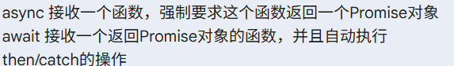
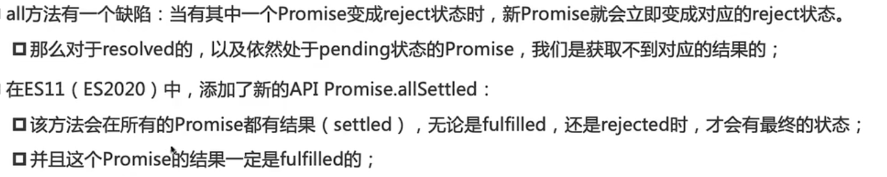

# Promise

## Q:Promise的出现是为了解决什么问题？

- 在开始阶段，我们要获取一个数据返回结果，必须通过设计好的回调函数，或者当我们使用一些第三方库的时候，必须通过阅读源码/文档来清楚使用什么样的回调来接收数据
- Promise通过给予承诺的方式
  - 承诺就表示之后一定会返回一个结果给接收方
  - Promise规定好了所有的代码编写方式，便于接收方使用数据

```js
// 假设我们要依次获取：用户信息 -> 用户的订单 -> 订单的详情
getUserInfo(
  userId,
  function (user) {
    getOrders(
      user.id,
      function (orders) {
        getOrderDetails(
          orders[0].id,
          function (details) {
            console.log("终于拿到订单详情了：", details);
          },
          function (error) {
            console.error("获取订单详情失败", error);
          },
        );
      },
      function (error) {
        console.error("获取订单失败", error);
      },
    );
  },
  function (error) {
    console.error("获取用户信息失败", error);
  },
);
```

- 在Promise出现之前，需要获取数据，需要通过多次调用回调函数，且需要在每次调用时，考虑调用成功与失败的两种情况回调，这会导致出现一种现象--"回调地狱"

---

## Q:Promise的使用规则

- 首先Promise是一个类，通过new来创建一个"承诺"
- Promise接收一个回调函数，该回调函数：
  - 立即执行，且接收两个回调函数
    - resolve:用于表示成功的回调，当承诺中的结果请求成功，会执行该函数
    - reject:用于表示失败的回调，当承诺中的结果请求失败，执行该函数
- 接收方接收一个承诺(Promise)，通过三条路接收结果:
  - then():接收成功的结果
    - then()函数接收resolve()返回的数据结果，同时也可以接收错误处理回调函数
  - catch():兜底错误返回
    - 具有错误穿透机制，无论执行那一步操作，只要发生错误，最后都会被catch()接收
  - finally():执行必须步骤

```js
function fetchOrderInfo() {
  return new Promise((resolve,reject) => {
    setTimeout(() => {
      resolve({
        //...
      },1000);
    });
  });
}

function fetchUserInfo(){
    return new Promise((resolve,reject)=>{
        setTimeout(()=>{
            resolve({
                //...
            })
        }.1000)
    })
}
```

> [!note] 关于Promise使用复盘
>
> - if需要配合async&await使用，if执行是在一瞬间完成的，而异步请求需要时间
> - Promise是一个对象，不是函数-->一张承诺书
> - Promise的使用一定是接收一个回调函数(立即执行)，该回调函数接收两个回调，用于操作数据请求结果

---

## Q:async&await是什么？

- 配合Promise创建的语法糖
- async(异步):放在函数定义的前面。它的作用是告诉 JavaScript：“这个函数里**有异步操作**，并且**这个函数本身会自动返回一个 Promise**”
- await(等待):**只能用在 async 函数的里面**。把它放在一个返回 Promise 的函数前面，它的作用是：“在这里暂停代码的执行，直到这个 Promise 出结果（resolve 或 reject）了，再把实际的数据拿出来，继续往下走”

```js
/*
 *假设你去咖啡店点餐，有三个动作（都是返回 Promise 的异步操作）：
 * orderCoffee() // 点咖啡，需要 1 秒
 * pay() // 付款，需要 1 秒
 * drink() // 喝咖啡
 * 如果要用 async/await 把这三个动作按顺序连起来，并且加上错误处理
 */
async function enjoyCoffee() {
  try {
    const bar1 = await orderCoffee();
    const bar2 = await pay();
    const bar3 = await drink();
  } catch (error) {
    console.log(error.message);
  }
}
```

> [!Note] 复盘

- 
  - (一下是修正后的总结)
- async 贴在函数前，作用是保证这个函数最终吐出来的绝对是一个 Promise 对象（就算 return 的是普通值也会被自动包装）。
- await 放在 Promise 对象前（通常是函数调用后产生的），作用是暂停当前这行代码，**自动帮你完成 .then() 的等待和拆包，或者触发 .catch() 的报错**。

---

## Q:如何提高异步函数的执行效率？

- 多个异步函数是可以并发执行的
  - Promise.all()
    - 多个Promise同时进行，最后将结果打包返回
    - 当存在一个状态为rejected时，全部状态都标记为rejected
  - Promise.race()
    - 多个Promise同时执行，返回第一个状态变化的Promise结果

- Promise.all():接收一个数组，数组中是多个Promise对象

```js
async function getBreakfastFast() {
  try {
    console.log("下单！咖啡和蛋糕同时开始制作...");

    // 1. 发起任务，但先不要用 await 卡住它们！
    const coffeePromise = makeCoffee();
    const cakePromise = bakeCake();

    // 2. 用 Promise.all 将它们打包，然后一次性 await
    // 它会等待最慢的那个任务（蛋糕的 3 秒）完成
    const [coffee, cake] = await Promise.all([coffeePromise, cakePromise]);

    console.log(`我拿到了：${coffee} 和 ${cake}`); // 总共只花了 3 秒！
  } catch (error) {
    // ⚠️ 注意：只要其中有一个失败了（比如蛋糕烤糊了），整个 Promise.all 就会立刻崩溃跳到这里！
    console.error("早餐毁了：", error.message);
  }
}
```

- promise.race():多用于给网络请求添加时间限制

```js
// 假设 fetchData 是去获取服务器数据，timeout(5000) 是一个 5 秒后自动报错的 Promise
// 把它们放在一起赛跑：
const result = await Promise.race([fetchData(), timeout(5000)]);
// 如果 5 秒内 fetchData 还没回来，timeout 就会赢，直接抛出超时错误。
```

```js
async function getUserInfo() {
  try {
    const UserProfile = getUserProfile();
    const UserPost = getUserPost();
    const UserFriends = getUserFriends();

    const [Profile, Post, Friends] = await Promise.all([
      UserProfile,
      UserPost,
      UserFriends,
    ]);
  } catch (error) {
    console.log(error.log);
  }
}
```

---

## Promise的三种状态

- Promise的执行被划分为三个阶段
  - pedding:初始状态，执行回调函数
  - fulfilled:操作成功状态，执行resolve()
  - reject:操作失败阶段,执行reject()
- 状态一旦确定，就无法被更改

---

## resolve()详解

- resolve()接收三种类型的参数
  - 普通参数
  - 接收一个Promise对象
    - 外层Promise的状态由内层Promise的状态决定
  - 接收一个普通对象，且该对象有then(),那么会直接执行这个then()，并且由其决定状态

---

## then()

- then()是Promise上的一个方法(在原型上)，返回值是一个Promise对象
- 同一个Promise对象可以调用多个then()，且在执行resolve()时，所有then()都会执行
- then()接收的回调函数可以有返回值
  - 普通值：被包装为一个Promise的resolve值，默认为undefined
  - Promise对象：代替本来被包装的Promise对象，且外层Promise对象的状态由该Promise对象决定
  - thenable对象：执行then()，同时状态由该then()调用的resolve决定

---

## catch()

- 当Promise的回调抛出异常也会触发错误捕获机制
- catch()写法不符合Promise的A+规范
  - 具有错误穿透机制，默认捕获最开始的Promise的错误

```js
Promise.then();

Promise.catch();
```

- 这种写法在Node环境下会报错，因为这里then()与catch()是两次独立的调用，所以第一次的then()中没有错误捕获机制会抛出错误

---

## Promise的类方法

- `resolve()`
- `reject()`
- `allSettled()`
  - 
  - 该方法返回数组，数组内容为对象(status&value:状态与结果)
- `any()`
  - 必须等待一个resolve()的结果

---

## 手动实现Promise

1. 整体结构设计

```js
//维护状态
const PROMISE_STATUS_PENDING = 'pending'
const PROMISE_STATUS_FULFILLED = 'fulfilled'
const PROMISE_STATUS_REJECTED = 'rejected'

class MYPromise {
  constructor(executor){
    this.status = PROMISE_STATUS_PENDING
    //存储结果
    this.value = undefined
    this.reason = undefined

    const function resolve(value){
      if(this.status === PROMISE_STATUS_PENDING){
        this.status = PROMISE_STATUS_FULFILLED
        this.value = value
      }
    }

    const function rejected(reason){
      if(this.status === PROMISE_STATUS_PENDING){
        this.status = PROMISE_STATUS_REJECTED
        this.reason = reason
      }
    }

    executor(resolve,rejected)
  }
}

```

2. 实现then()

```js
class MYPromise {
  constructor(executor) {
    function resolve() {
      //...
      this.onFulfilled();
    }
    function rejected() {
      //...
      this.onRejected();
    }

    executor(resolve, rejected) {
      //...
    }
  }

  then(onFulfilled, onRejected) {
    //...
    //将onFulfilled/onRejected保存起来
    this.onFulfilled = onFulfilled;
    this.onRejected = onRejected;
  }
}

new MYPromise().then(fun1, fun2);
```

- 执行结果
  - 在执行resolve()或rejected()时，then()还没有调用，没有传入相应的逻辑，onXXX()调用失败
  - 无法实现多个then()链式调用，因为每一个then()都会覆盖之前的回调函数

- 改良
  - setTimeOut()，将相关逻辑添加在一个宏任务队列中，主线继续执行，宏任务会在下一次事件循环中执行
  - queueMicrotask()-作用:将事件添加在一个微任务中，延迟调用，但会在本轮事件循环中执行

```js
const PROMISE_STATUS_PENDING = "pending";
const PROMISE_STATUS_FULFILLED = "fulfilled";
const PROMISE_STATUS_REJECTED = "rejected";

class MYPromise {
  constructor(executor) {
    this.status = PROMISE_STATUS_PENDING;
    //用于存储异步函数的返回结果
    this.value = undefined;
    this.reason = undefined;
    //维护一个onFulfilledFns/onRejectedFns数组，用于存储then()中的回调函数
    this.onFulfilledFns = [];
    this.onRejectedFns = [];
    const resolve = (value) => {
      //修改状态
      //放在外面会导致直接修改状态，在第一次执行then时直接执行遍历回调出错
      // this.status = PROMISE_STATUS_FULFILLED;
      //将逻辑添加到一个微任务中
      queueMicrotask(() => {
        this.status = PROMISE_STATUS_FULFILLED;
        this.value = value;

        this.onFulfilledFns.forEach((fn) => fn(this.value));
      });
    };

    const reject = (reason) => {
      queueMicrotask(() => {
        this.status = PROMISE_STATUS_REJECTED;
        this.reason = reason;

        this.onRejectedFns.forEach((fn) => fn(this.reason));
      });
    };

    executor(resolve, reject);
  }

  then(onFulfilled, onRejected) {
    if (this.status === PROMISE_STATUS_FULFILLED && onFulfilled) {
      onFulfilled(this.value);
    }
    if (this.status === PROMISE_STATUS_REJECTED && onRejected) {
      onRejected(this.reason);
    }

    if (this.status === PROMISE_STATUS_PENDING) {
      this.onFulfilled = onFulfilled;
      this.onRejected = onRejected;
    }
  }
}
```

- 维护一个回调列表，就解决了then()的链式调用问题
- 同时，在then()中添加逻辑判断，实现了then()在状态确定后，仍能调用的功能

- 存在问题:当执行executor()时，若同时调用了resolve()/reject()，那么两种任务都会进入微任务队列中，在执行时会同时执行

```js
queueMicrotask(() => {
  this.reason = reason;

  this.onRejectedFns.forEach((fn) => fn(this.reason));
});
```

3. 优化:then的链式调用

- 当前then()没有返回值，所以无法实现链式调用
- 在then()中返回一个新的Promise对象，并将then()中的回调函数作为参数传递给新的Promise对象

```js
function then(onFulfilled, onRejected) {
  return new MYPromise((resolve, reject) => {
    if (this.status === PROMISE_STATUS_FULFILLED && onFulfilled) {
      try {
        const value = onFulfilled(this.value);
        resolve(value);
      } catch (err) {
        reject(err);
      }
    }
    if (this.status === PROMISE_STATUS_REJECTED && onRejected) {
      try {
        const value = onRejected(this.reason);
        resolve(value);
      } catch (err) {
        reject(err);
      }
    }

    if (this.status === PROMISE_STATUS_PENDING) {
      this.onFulfilledFns.push(() => {
        try {
          const value = onFulfilled(this.value);
          resolve(value);
        } catch (err) {
          reject(err);
        }
      });
      this.onRejectedFns.push(() => {
        try {
          const value = onRejected(this.reason);
          resolve(value);
        } catch (err) {
          reject(err);
        }
      });
    }
  });
}
```

4. 优化:重复代码抽取

```js
function execFunctuonWithErrCatch(fn, value, resolve, reject) {
  try {
    const result = fn(value);
    resolve(result);
  } catch (err) {
    reject(err);
  }
}
```

5. catch()实现

- `then().catch()`

```js
catch(onRejected){
  return this.then(undefined,onRejected)
}

//改动1:防止将undefined传入维护的回调列表中
then(onFulfilled, onRejected){
  if(onFulfilled) this.onFulfilledFns.push(onFulfilled)
  if(onRejected) this.onRejectedFns.push(onRejected)
}

//若Promise1返回的是一个undefined，那么catch()是在Promise2中执行的，但我们希望catch()抛出的是Promise1的错误
//判断当前Promise是否有错误捕获机制，若没有，抛给下一个Promise
then(onFulfilled,onRejected){
  const defaultOnRejected = (err)=>{throw err}
  onRejected = onRejected || defaultOnRejected
}
```

5. finally()实现

```js
finally(onFinally){

  return this.then(onFinally,onFinally)

}

//若执行finally时，上一层没有处理结果，是一个undefined，那finally不会执行，因为没有接收到上一层传递的Promise对象
/*
Promise.then((value)=>{
  return value
}).catch((err)=>{
  console.log(err)
}).finally(()=>{
  //这里不会执行，因为链式调用在catch中断开了，catch没有返回值
  console.log('finally executed')
})
*/

//解决思路与catch()类似，判断并把值向下传递出去，确保链式调用中，后续的finally()能正常执行
const defaultOnFulfilled = (value)=>value

onFulfilled = onFulfilled || defaultOnFulfilled
```

---

### 实现静态方法

```js
static resolve(value){
  return new MYPromise((resolve,reject)=>{
    return resolve(value)
  })
}

static reject(reason){
  return new MYPromise((resolve,reject)=>{
   return  reject(reason)
  })
}

static all(promises) {
  return new MYPromise((resolve, reject) => {

    const values = [];

    let count = 0;

    promises.forEach((promise, index) => {

      promise.then((value) => {

        values[index] = value;

        count++;

        if (count === promises.length) {

          resolve(values);

        }

      }, (err) => {

        reject(err);

      });

    });

  });
}
static allSettled(promises){
  return new MYPromise((resolve, reject) => {

    const results = [];
    let count = 0;

    promises.forEach((promise, index) => {
      promise.then((value) => {
        results[index] = { status: 'fulfilled', value };
      }, (reason) => {
        results[index] = { status: 'rejected', reason };
      }).finally(() => {
        count++;
        if (count === promises.length) {
          resolve(results);
        }
      });
    });
  });
}

static race(promises){
  return new MYPromise((resolve,reject)=>{
    promises.forEach((promise)=>{
      promise.then(value=>{
        resolve(value)
      },reason=>{
        reject(reason)
      })
    })
  })
}

static any(promises){

  return new MYPromise((resolve,reject)=>{

    let count = 0

    promises.forEach((promise)=>{

      promise.then(value=>{

        resolve(value)

      },reason=>{

        count++

        if(count === promises.length){

          reject(reason)

        }

      })

    })

  })

}
```

---

### 总结

1. 构造函数规划

- 定义状态
- 定义回调
  - resolve：修改状态，存储结果，then传入执行回调
  - reject：修改状态，存储结果，then传入执行回调

- 执行executor

2. then()实现
   - 判断onFulfilled&onReject，给默认值
   - 返回Promise，执行resolve&reject
     - 判断之前的Promise状态是否确定，✅-->直接执行onFulfilled&onReject
     - 添加到数组中
