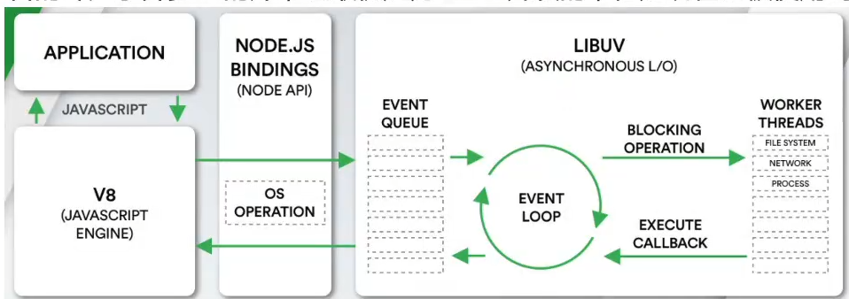
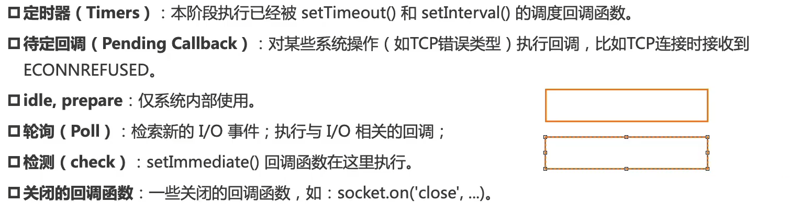
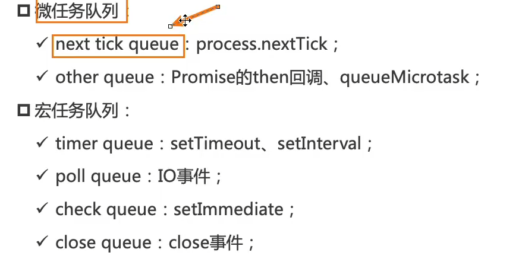
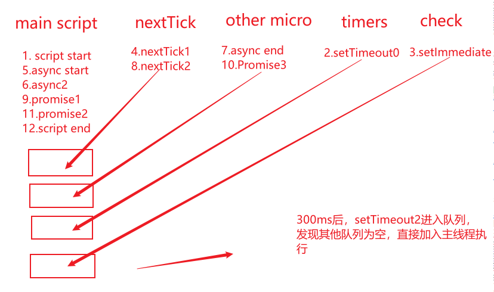

# async&await\_事件循环

## 简单介绍async&await

- async：关键字，用于**声明一个异步函数**
- 基本结构

```js
async function bar() {}

const bar = async () => {};
```

- 异步函数与普通函数的区别
  - 区别一：异步函数的返回值一定是一个Promise对象
  - 区别二：异步函数的异常被抛出后会被作为reject信息被捕获，后续逻辑会继续执行
    - 而普通函数在执行到异常抛出后，后续逻辑无法继续执行

- await: 只能在async下使用
- 后跟表达式/普通值/Promise对象
  - 表达式与普通值会被包装为Promise对象的返回结果直接输出
  - 接收Promise对象的返回结果
  - reject值
    - try...catch捕获
    - 在外部catch()捕获
    - **异常若没有解决，后续代码不会执行**

## 进程&线程

- 进程:计算机已经在运行的程序，是操作系统管理程序的一种方式，**每启动一个程序，就代表开启一个进程**
- 线程:操作系统可**运行计算调度的最小单位**，通常被包含在进程中，进程是线程的容器，每一个进程中，至少会开启一个线程**用于执行代码**

- 操作系统的工作方式:为什么操作系统可以同时执行多个任务？
  - 因为CPU运算速度很快，可以在多个进程之间快速切换，当进程获取对应的时间片后会快速执行代码，而这个变化是用户无法感知的

- JS是单线程语言，线程容器为浏览器与Node
- **浏览器是多进程的**，当打开一个tab页面就表示开启一个新的进程，这是因为为了防止一个页面卡死导致所有页面无法访问，整个浏览器退出
- 每个进程有多个线程，包括JS代码线程
- JS代码在一个单独线程中执行
  - JS只能在同一时间做一件事，若这件事非常耗时，那么会造成阻塞
  - 为了解决这个问题，JS并不用于解决耗时的操作
- 浏览器的每个进程是多线程的，可以用其他线程完成耗时的操作
  - 类似于网络请求，定时器，我们只需要在特定事件执行应该的回调即可

---

## 事件循环

- JS线程在遇到异步操作时，会把异步操作交给浏览器的其他线程处理，浏览器处理完成后会把结果放进一个任务队列中，这个队列由浏览器维护
- JS线程&浏览器线程&任务队列的循环我们称之为时间循环
- 任务队列并非只是一个队列，大体上分为：
  - 宏任务队列:ajax/setTimeout/Dom监听/UI渲染等
  - 微任务队列:Promise.then()/queueMicrotask()/Mutation Observer API等
- 在执行方面，要求每一次宏任务队列执行时都先清空微任务队列

- 主线程执行：变量声明 数学计算 逻辑判断 函数立即调用
- 其他线程执行：计时器 网络请求 DOM事件
- 宏任务队列:浏览器&Node交给代码的任务
- 微任务队列:代码自己产生的任务

- Promise中的代码直接在主线程执行

- 测试:

```js
setTimeout(function () {
  console.log("setTimeout1");

  new Promise(function (resolve) {
    resolve();
  }).then(function () {
    new Promise(function (resolve) {
      resolve();
    }).then(function () {
      console.log("then4");
    });
    console.log("then2");
  });
});

new Promise(function (resolve) {
  console.log("promise1");
  resolve();
}).then(function () {
  console.log("then1");
});

setTimeout(function () {
  console.log("setTimeout2");
}, 0);

console.log(2);

queueMicrotask(() => {
  console.log("queueMicrotask1");
});

new Promise(function (resolve) {
  resolve();
}).then(function () {
  console.log("then3");
});
```

- 说出其中的执行顺序：
- 主线程执行：
  - 主线程：Promise1,2,
  - 宏任务：setTimeout(function(){}),setTimeout(function(){})
  - 微任务：then(),queueMicrotask(),then()

  - 主线程：then1,queueMicrotask1,then3,setTimeout1
  - 微任务：then(),
  - 宏任务：setTimeout()

  - 主线程：then2
  - 微任务：then()
  - 宏任务：setTimeout()

  - 主线程：then4,setTimeout2

- 测试2：

```js
async function bar() {
  console.log("22222");
  return new Promise((resolve) => {
    resolve();
  });
}

async function foo() {
  console.log("111111");

  await bar();

  console.log("33333");
}

foo();
console.log("444444");
```

- 执行过程：
  - 显式调用foo，直接在主线程执行
    - 输出111...
    - 调用bar(),输出222...,返回一个已经resolve的Promise对象，将then()交给微任务队列
    - 输出444....
    - 微任务队列执行then()，输出333...

> [!note]注意：
>
> - async函数调用本身是同步执行的-->所以111和222是同步输出的
> - await会使后续的代码(同一个代码块)异步化【await 不是让被调用函数异步执行，而是让当前函数从 await 这一行往后的代码异步恢复执行。】
>   - await bar():表示bar先执行拿到结果，但await后续的代码会被放进微任务队列中，所以智力先输出了444
> - 执行微任务队列，输出333...

- 训练2:

```js
//情况一
Promise.resolve()
  .then(() => {
    console.log(0);
    return 4;
  })
  .then((res) => {
    console.log(res);
  });

Promise.resolve()
  .then(() => {
    console.log(1);
  })
  .then(() => {
    console.log(2);
  })
  .then(() => {
    console.log(3);
  })
  .then(() => {
    console.log(5);
  })
  .then(() => {
    console.log(6);
  });

//情况二
Promise.resolve()
  .then(() => {
    console.log(0);
    return Promise.resolve(4);
  })
  .then((res) => {
    console.log(res);
  });

Promise.resolve()
  .then(() => {
    console.log(1);
  })
  .then(() => {
    console.log(2);
  })
  .then(() => {
    console.log(3);
  })
  .then(() => {
    console.log(5);
  })
  .then(() => {
    console.log(6);
  });

//情况三
Promise.resolve()
  .then(() => {
    console.log(0);
    return {
      then(resolve) {
        resolve(4);
      },
    };
  })
  .then((res) => {
    console.log(res);
  });

Promise.resolve()
  .then(() => {
    console.log(1);
  })
  .then(() => {
    console.log(2);
  })
  .then(() => {
    console.log(3);
  })
  .then(() => {
    console.log(5);
  })
  .then(() => {
    console.log(6);
  });
```

- 解析：
  - `return 4`：
    - 按照顺序执行主线程在执行两个Promise.resolve()后，后续的then()都会添加在微任务队列中
    - 输出0->1->4->2->3->5->6
  - `return Promise`
    - 返回一个Promise对象，这表示接管的then()需要等待这个Promise先执行，再传递结果
    - 所以在第二轮循环中，先执行Promise.resolve(),结果输出上交给下一次的then()，所以**整体结果向后移动了两轮循环**
    - 输出0->1->2->3->4->5->6
  - `return thenable`
    - 当返回的是一个thenable对象时，结果被交给下一轮循环，**整体上只后移了一轮循环**
    - 输出0->1->2->4->3->5->6

---

## Node环境的事件循环

- 浏览器的事件循环是HTML规范实现的，不同的浏览器有着细微的差别
- 
- Node环境下，V8引擎将JavaScript线程交给**Node的libuv库**实现，线程在线程池中执行后，返回在事件队列中
- libuv是Node环境中一个用于处理异步的库
- 事件循环类似与JavaScript与系统调用之间的桥梁，早期JS无法实现的IO操作，就是通过libuv，在利用Node实现IO后，将结果添加在任务队列中，由JS执行
- Node的事件循环较为复杂，其内部维护多个队列，**一次事件循环称之为Tick**，一个Tick中包含以下任务：
  - 
  - 因为IO操作的及时性，**Node一般会停留在轮询阶段**。
- Node的事件循环依然划分宏任务与微任务，且也遵守每次宏任务执行前都清空微任务的规则
  - 

- 测试：

```js
async function async1() {
  console.log("async1 start");
  await async2();
  console.log("async1 end");
}

async function async2() {
  console.log("async2");
}

console.log("script start");

setTimeout(function () {
  console.log("setTimeout0");
}, 0);

setTimeout(function () {
  console.log("setTimeout2");
}, 300);

setImmediate(() => console.log("setImmediate"));

process.nextTick(() => console.log("nextTick1"));

async1();

process.nextTick(() => console.log("nextTick2"));

new Promise(function (resolve) {
  console.log("promise1");
  resolve();
  console.log("promise2");
}).then(function () {
  console.log("promise3");
});

console.log("script end");
```

- 解析:
  - main
  - nextTick
  - other micro
  - timers
  - cleck
- 按照顺序先执行`script start`
- 将`setTimeout0`加入timers队列中
- 在check队列中加入`setImmediate`
- 在300ms后将`setTimeout2`加入timers队列
- 将`nextTick1`加入nextTick微任务队列中
- 执行async1输出`async statr`
- 执行async2,输出`async2`
- 将输出`async end`加入other micro队列中
- 将`nextTick2`加入nextTick微任务队列中，继续执行
- 输出`Promise1`，执行resolve(),将输出`Promise3`加入`other micro微任务队列`中
- 输出`Promise2`
- 输出`script end`
- 300ms后，由于其他队列均为空，所以执行输出`setTimeout2`
- 
