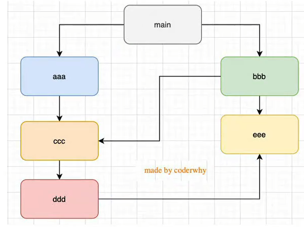

# 模块化

## Q:什么是模块化？

- 模块化的目的是将程序划分为一个个独立的结构
- 结构可以选择希望暴露的变量/函数/对象给其他结构使用
- 同样的，也可以使用这种方式引入需要的变量/函数/对象

---

## Q:JS模块化20年发展历程

- JS模块化的完善经历了20年
- 在官方推出模块化方案之前，社区流行的方案是：**AMD/CMD/CommonJS**
- 官方推出的模块化方案：ES6模块

### 模块化阶段一

- 立即执行函数

```js
//test.js
const moduleA = (function bar() {
  const a = xxx;
  const b = xxx;
  //....

  return {
    a,
    b,
  };
})();
```

- 使用函数创建作用域解决多个JS文件之间的变量冲突，使用立即执行函数+返回对象的模式向外界暴露需要的变量/函数/对象
- 此时仍然存在变量命名以及依赖管理混乱的问题

---

### 模块化阶段二

- CommonJS规范，目的是提供浏览器以外的JS模块化实现
- Node是CommonJS实现的代表
- webpack同时具备对CommonJS的支持与转换

- Node对CommonJS的实现：
  - JS文件都是单独模块
  - 每一个模块中包含CommonJS的核心变量：
    - `exports`,`module.exports`（导出）
    - `require`（导入）

```js
//main.js
//const testModule = require("../../test");
const { name, age, foo } = require("../../test");
//使用导入的变量
console.log(name,age,foo)


//test.js
const name = "ZC";
const age = "25";
function foo() {
  //...
}

module.exports{
   name,
   age,
   foo,
}
```

> [!note]内部原理
> **引用赋值**
> module.exports指向对象地址，同时通过require接收这个地址
> 被引用的与引用的文件使用的是**同一个对象**

- 关闭exports

```js
//源码：
module.exports = {};

exports = module.exports;

//第二种导出方式
exports.name = "ZC";

exports.age = "25";

exports.foo = function () {
  //...
};
```

- 内部维护了一个空对象，该对象可以被导入在其他结构中
- 若`exports = {}`那么不会被导入，因为这是属于两个对象
- 最终导出的一定是module.exports指向的对象

---

## require细节

- require是一个引入模块的函数
- require查找规则
  - 当引入的是Node模块时，直接引入并返回
  - 当引入的是以"./","../","/"(根目录)开头的路径时，有以下规则
    - 若没有后缀名
      - 优先查找X文件
      - X.js
      - X.json
      - X.node
    - 若没有找到对应的文件，则X会被当做目录，在目录下寻找：
      - index.js
      - index.json
      - index.node
  - 若依然没有找到，则返回"not found"

---

## 模块加载过程

- 当模块第一次被引入时，模块中的JS会运行一次
- 当模块被多次加载时，JS被缓存，只运行一次
  - module函数中有一个loaded属性，用于记录模块是否被加载
- 循环引入
  - 
  - node采用深度优先算法，所以加载的顺序是main->aaa->ccc->ddd->eee->bbb

---

## CommonJS规范缺点

- CommonJS采用的是同步加载方式
  - 在Node环境(服务器环境)中，由于文件都是本地的，所以不会造成阻塞问题
  - 在浏览器环境中，同步意味着只有加载完成后才会执行下一步，会导致性能问题，因此在浏览器中，我们不会使用CommonJS规范
    - 在早期没有官方的模块化方案时，浏览器一般采用AMD/CMD规范
- webpack可以将CommonJS规范代码转换为浏览器可以运行的代码
- webpack本身的配置就是使用的CommonJS规范

---

## AMD使用

- AMD全称异步模块定义，主要依靠requirejs和define
- 实现AMD规范
  - 下载require.js文件(./lib)
  - index.html中引入require文件
    - 为了利用模块化，建议在require加载完成后，加载main.js文件
    - `<script src="./lib/require.js data-main="./main.js">`
      - `data-main`属性表示文件将在当前文件加载完成后立即执行加载

```js
//main.js
require.config({
  baseUrl:"./src"
  path:{
    foo:"./doo.js",
    bar:"./bar.js"
});

require(["foo"],function(foo){
  console.log(foo)
})

//foo.js
define(function(){
  const name = "ZC";
  return {
    name
  }
})

//bar.js
//引入模块中的依赖写法
define(function(){
  require(["foo"],function(foo){
    //...
  })
})

//引入模块中的依赖写法二
define(["foo"],funtion(foo){
  //...
})
```

> [!note] 代码解析
>
> - AMD规范要求首先注册对应模块，通过require.config()
>   - baseUrl表示模块的默认根目录，默认为当前目录
> - 引入模块通过require()，参数一为一个数组，在数组中表明引入的模块，参数二是一个回调，将模块作为回调的参数使用
> - 被引入文件通过define()函数，参数一是一个可选数组，表示当前文件所需要引入的依赖，参数二是一个回调函数，在回调函数中，定义变量/对象/方法，通过return一个对象来表示暴露的变量/对象/方法

---

## CMD使用

- CMD全称通用模块定义
- CMD吸收了CommonJS的优点
- CMD的优秀实现方案：seaJS
- CMD具体实现

```html
<script src="./lib/sea.js"></script>
<script>
  sea.use("./src/main.js");
</script>
```

```js
//main.js
define(function(require,exports,module){
  const foo = require("./foo")
 //...
})

//foo.js

define(function(require,exports,module){
  const name = "ZC",

  //exports.name = name

  module.exports = {
    name
  }

})
```

> [!note] 代码解析
>
> - CMD规范中，首先需要sea.use()函数，确认一个主要入口文件
> - 通过define()函数定义模块，参数是一个回调函数，该回调有三个参数，分别为require/exports/module
>   - require用于引入模块
>   - exports用于导出模块，也可以使用module.exports导出(借鉴CommonJS)

---

## ES6模块化

- ES6模块化采用了一下方案
  - 使用`import`&`export`关键字
  - 使用编译期的静态分析以及动态引入的方式
- `import`用于导入模块，`export`用于导出模块
- 在ES6模块化过程中，模块自动执行严格模式

- 基本使用

```html
<script type="module" src="./main.js"></script>
```

```js
//foo.js
//导出方式一
export const name = "ZC";

export const age = "25";

export function foo() {
  //...
}
//导出方式二：声明与导出分离
const name = "ZC";

const age = "25";

function foo() {
  //...
}

export { name, age, foo };

//导出方式三：起别名
const name = "ZC";

export { name as userName };
```

```js
//maim.js
//导入方式一
import { name, age, foo } from "./foo.js";
//导入方式二：起别名
import { userName as name } from "./foo.js";
//导入方式三：导入所有
import * as foo from "./foo.js";
console.log(foo.name);
console.log(foo.age);
console.log(foo.foo);
```

- 首先，在普通文件文件中，需要标明引入的文件是当作一个模块进行处理的->`type = "module"`
- 其次，在需要暴露的变量/函数/对象前直接加上export关键字即可实现暴露
- 最后，在引入的文件中，通过import...from...实现引入，且因为环境不同，规则不同，需要写明文件后缀
- 跨域问题：在插件live-server中，由于是在本地直接开启的服务器，打开文件的Url前缀是file，这种前缀无法识别模块文件，

---

## 代码规范问题

- 工具库封装
  - 假设有目录utils，下有多个工具文件
  - 利用模块化，我们一般设置index文件，将所有工具文件进行一个导入，在将该文件的变量/函数/对象进行一个导出，做统一管理

```js
import {sub,add}} from "./foo.js";

import {timeFormat,dateFormat} from "./bar.js";

export{
  sub,
  add,
  timeFormat,
  dateFormat
}

//导出方式二
export {sub,add}} from "./foo.js";

export {timeFormat,dateFormat} from "./bar.js";
//导出方式三
export * from "./foo.js";
export * from "./bar.js";

```
