## 第一个Vue应用

```html
<!DOCTYPE html>
<html>
  <head>
    <meta charset="utf-8" />
    <title>文档标题</title>
  </head>
  <body>
    <script src="https://unpkg.com/vue@3/dist/vue.global.js"></script>

    <div id="app">
      <input v-model="message" />
      <p>{{ message }}</p>
    </div>

    <script>
      const { createApp } = Vue;
      const vueApp = {
        data() {
          return {
            message: "Hello Vue!",
          };
        },
      };
      createApp(vueApp).mount("#app");
    </script>
  </body>
</html>
```

> 初始使用，可以使用CDN引入Vue库

- 官方提供的上手案例中，可以观察到
  - 首先通过解构语法获取`createApp()`函数，该函数接受一个对象，最后通过mount函数将其挂载在一个id为app的容器上
  - 在`createApp`函数接受的对象中，调用了一个`data()`函数，该函数返回一个message值
  - 该值在容器中通过`{{}}`展现在页面上
- 我们添加input输入框，并赋予属性`v-model`(Vue指令)，该指令同样"引用"了message值，我们可观察到：
  - 输入框同样显示message值
  - 在修改输入框值后，message值同步发生改变
- 在`{{}}`中对message值可以做出特殊处理：
  - 首先，明确message是字符串
  - `.length`
  - `.slice`
  - ...

---

## 插件支持

- vscode官方文档中可查看支持的插件
  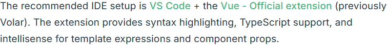

---

## devTools

- 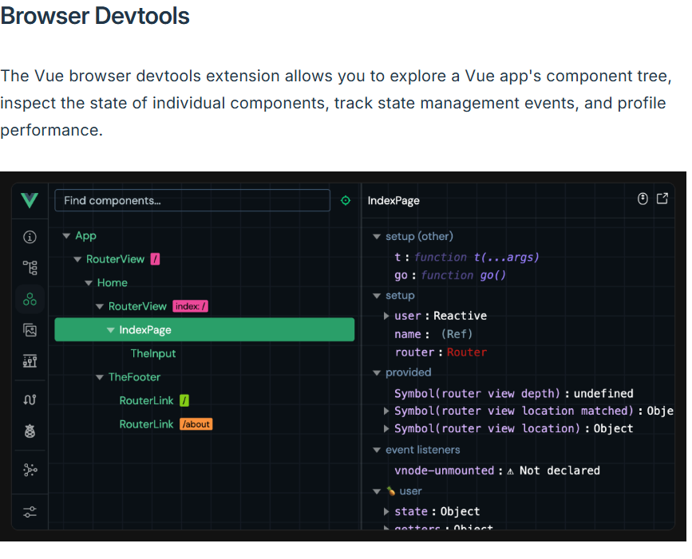
- Vue官方提供了浏览器开发工具帮助完成Vue开发
- 缺陷是**更新不是很频繁**，可能存在Bug
- 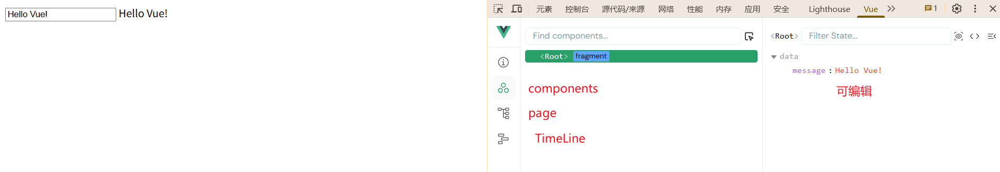

---

## Vue的第一个指令

```html
<!doctype html>
<html lang="en">
  <head>
    <meta charset="UTF-8" />
    <title>Vue Demo</title>
    <meta name="viewport" content="width=device-width, initial-scale=1" />
    <script src="https://unpkg.com/vue@latest"></script>
  </head>
  <body>
    <div id="app">
      <label for="Vue-demo">VueJS Input:</label>
      <input id="Vue-demo" v-model="inputMessage" />
      <p>{{inputMessage}}</p>
    </div>

    <hr />
    <div>
      <label for="input-demo">VanillaJS Input:</label>
      <input id="input-demo" class="input-text" type="text" />
      <p class="p-text"></p>
    </div>

    <script src="vanilla.js"></script>
    <script src="vue.js"></script>
  </body>
</html>
```

```js
//原生JS
const inputEl = document.querySelector(".input-text");
const pEl = document.querySelector(".p-text");

inputEl.addEventListener("input", (e) => {
  pEl.textContent = e.target.value;
});
```

```js
//Vue
const { createApp } = Vue;

createApp({
  data() {
    return {
      inputMessage: "",
      message: "Hello Vue!",
    };
  },
}).mount("#app");
```

- 在原生的JS中，实现输入数据同步显示需要为DOM元素添加事件监听，并将值进行赋值操作。
- 对比Vue语法，通过其函数返回的**响应式的值**直接实现输入框中的值同步显示在屏幕上
  - 其中input标签借助了`v-model`指令，该指令实现了标签与Vue变量的双向绑定，即双方任意一方输入值都会影响对方的显示结果

> [!Note] 官方定义`v-model`
> 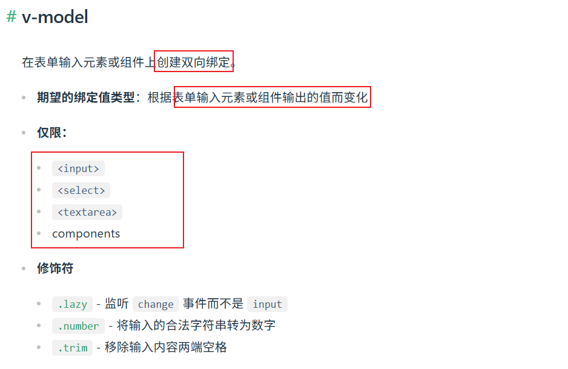

> [!Note] 补充:插值语法
>
> - 最基本的数据绑定形式是文本插值，它使用的是“Mustache”语法 (即双大括号)
> - `<span>Message: {{ msg }}</span>`
> - 双大括号标签会被替换为相应组件实例中 msg 属性的值。同时每次 msg 属性更改时它也会同步更新。

---

## v-bind & v-on

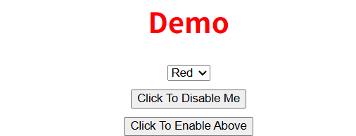

- 要求：
  - 通过修改下拉选择修改Demo字样的颜色
  - 通过disabled按钮禁用，通过Enable取消禁用

---

解决方案:

- Demo需要与下拉选项产生联动，达到响应式效果
  - 不使用Vue-->为DOM添加事件监听
  - 使用Vue，使用响应式数据与指令作为桥梁，连接两个元素：
    - select使用v-model接受选项值并上传给Vue的响应式数据，同时改数据绑定(v-bind)Demo的class属性，实现联动
- 为按钮添加属性:
  - 将属性值与响应式数据绑定，为按钮添加事件监听(v-on)，触发响应式数据改变

```js
const app = {
  data() {
    return {
      textColor: "red-text",
      isDisabled: false,
    };
  },
  methods: {
    ClickToDisabled() {
      this.isDisabled = true;
    },
    ClickToEnabled() {
      this.isDisabled = false;
    },
  },
};
```

```html
<h1 v-bind:class="textColor">Demo</h1>

<select id="color-select" title="Change text color" v-model="textColor">
  <option value="red-text">Red</option>
  <option value="blue-text">Blue</option>
</select>
```

> v-model 绑定在 select 上时，拿到的是 当前被选中的 option 的 value 值。

```html
<button type="button" v-bind:disabled="isDisabled" v-on:click="ClickToDisabled">
  Click To Disable Me
</button>
<button type="button" v-on:click="ClickToEnabled">Click To Enable Above</button>
```

> [!Note] v-bind
> 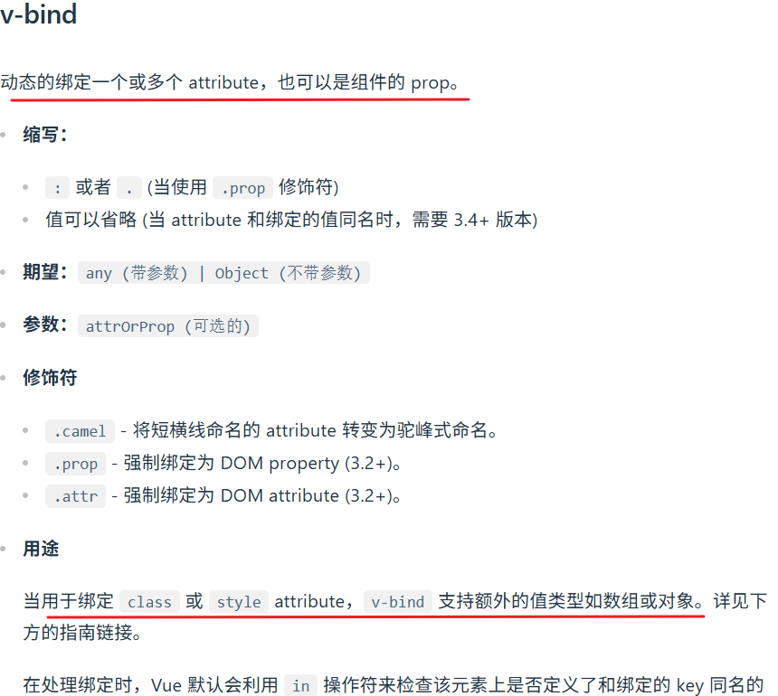

```html
//template !-- 绑定 attribute -->


<!-- 动态 attribute 名 -->
<button v-bind:[key]="value"></button>

<!-- 缩写 -->


<!-- 缩写形式的动态 attribute 名 (3.4+)，扩展为 :src="src" -->

```

> [!Note] v-on
> 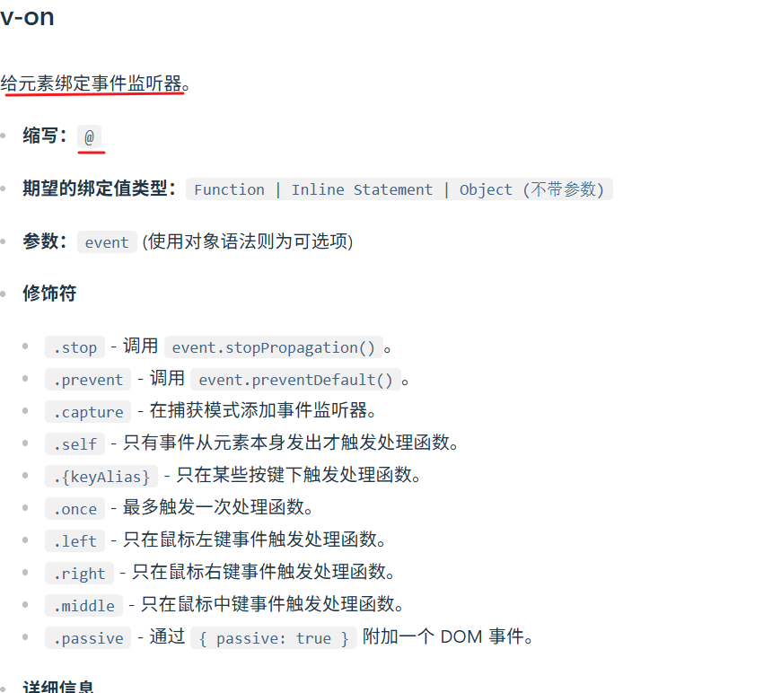

> v-bind绑定的布尔属性，当监函数返回为T，该属性生效，为F，该属性失效

---

## 表单校验


要求：

- 输入用户名与密码后，检验长度是否大于3，并弹出提示框
- 若出现不符合要求的情况，就将对应样式修改为红色边框

```html
<div id="app">
  <form v-on:submit.prevent="handleSubmit">
    <input
      type="text"
      placeholder="enter your username"
      v-model="username"
      v-bind:class="is_username_error"
    />
    <br />
    <input
      type="password"
      placeholder="enter your password"
      v-model="password"
      v-bind:class="is_password_error"
    />
    <br />
    <button type="submit">Login</button>
  </form>
</div>
```

```html
<script>
  const { createApp } = Vue;

  createApp({
    data() {
      return {
        username: "",
        is_username_error: "",
        password: "",
        is_password_error: "",
      };
    },
    methods: {
      handleSubmit() {
        this.is_password_error = this.is_username_error = "";
        if (this.username.length < 3 || this.password.length < 3) {
          alert("用户名或密码的最小长度不应该小于3");
          if (this.username.length < 3) {
            this.is_username_error = "input-error";
          } else {
            this.is_password_error = "input-error";
          }
        } else {
          alert("符合要求，通过！");
        }
      },
    },
  }).mount("#app");
</script>
```

思路:

- 实现用户名&密码在表单提交时的检测，需要通过v-model实时获取输入框的输入，为表单提交事件添加监听，并在其中加入信息弹窗与样式修改的逻辑
- 实现表单输入框的样式修改，需要通过v-bind绑定class属性，动态的决定是否需要添加
- 在实现时，注意初始化，防止样式一直保留在表单元素上

- v-bind常用做样式修改的工作
- 通过指令修饰符可以实现每默认行为的发生

---

- 需求升级：
  - 每次在输入时就进行条件判断并修改样式

解决思路

- 方案一：
  - 为每一个输入框添加事件监听
- 方案二：
  - 使用watch(监听器)对响应式变量进行监测

```js
handleUsernameInput() {
            if (this.username.length < 3) {
              this.is_username_error = "input-error";
              // alert("长度至少大于3");
            } else {
              this.is_username_error = "";
              // alert("通过");
            }
          },
          handlePasswordInput() {
            if (this.password.length < 3) {
              this.is_password_error = "input-error";
              // alert("长度至少大于3");
            } else {
              this.is_password_error = "";
              // alert("通过");
            }
          },
```

```js
watch: {
          username(newName, oldName) {
            if (newName.length < 3) {
              this.is_username_error = "input-error";
            } else {
              this.is_username_error = "";
            }
          },
          password(newPassword, oldPassword) {
            if (newPassword.length < 3) {
              this.is_password_error = "input-error";
            } else {
              this.is_password_error = "";
            }
          },
        },
```

> [!Note] watch监听器
> 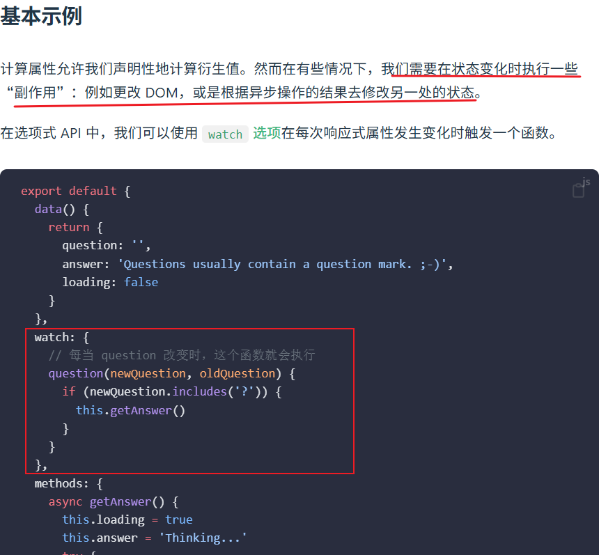
> 侦听器可以检测响应式变量变化，并做出相应的处理
> 侦听器方法需要与响应式变量同名，函数接受两个参数，1-新值，2-旧值

---

## 阶段性挑战

-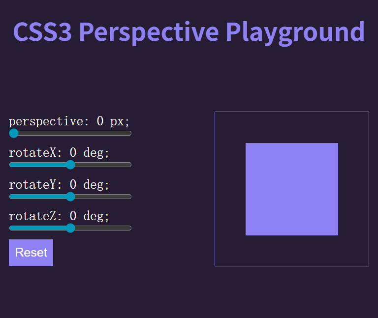
要求：

1. 滑动拖动条，数据响应式变化
2. 点击reset，数据重置
3. 右侧正方形随着数据变化展示相应变化

```js
/*
  1. Sync input value with vue data and show it on the label(v-model 2-ways binding)
  2. Implement reset(v-on and methods)
  3. Apply transform style to the cube(computed)
*/

// {
//   transform: `perspective(0px)rotateX(0deg)rotateY(0deg)rotateZ(0deg)`,
// }
const { createApp } = Vue;

createApp({
  data() {
    return {
      perspectiveX: 0,
      rotateX: 0,
      rotateY: 0,
      rotateZ: 0,
    };
  },
  methods: {
    handleReset() {
      this.perspectiveX = this.rotateX = this.rotateY = this.rotateZ = 0;
    },
  },
  computed: {
    transForm() {
      return {
        transform: `perspective(${this.perspectiveX}px)rotateX(${this.rotateX}deg)rotateY(${this.rotateY}deg)rotateZ(${this.rotateZ}deg)
      `,
      };
    },
  },
}).mount("#app");
```

- 为什么要用计算属性而不是直接使用data？
  - Vue的机制上，需要先创建Vue对象，才能使用数据，transform数据放在data中，相当于在数据没有创建的时候就使用，只会得到undefined

---

## v-for

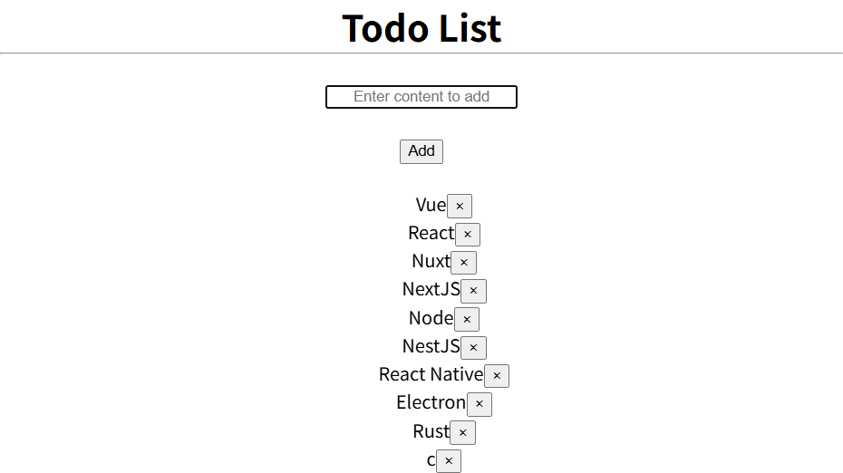

- 要求：
  - 点击add后将输入列在下方
  - 点击删除可将项目删除

方案：

- 使用数组维护输入数据，使用列表展示(v-for)

```js
// ["Vue", "React", "Nuxt", "NextJS", "Node", "NestJS", "React Native", "Electron", "Rust"]
const { createApp } = Vue;

createApp({
  data() {
    return {
      todoArray: [
        "Vue",
        "React",
        "Nuxt",
        "NextJS",
        "Node",
        "NestJS",
        "React Native",
        "Electron",
        "Rust",
      ],
      inputTodo: "",
    };
  },
  methods: {
    addTodo() {
      if (!this.inputTodo.trim().length) {
        alert("请正确输入");
        this.inputTodo = "";
        return;
      }
      this.todoArray.push(this.inputTodo.trim());
    },
    removeTodo(removeidx) {
      this.todoArray = this.todoArray.filter((todo, idx) => idx !== removeidx);
    },
  },
}).mount("#app");
```

> [!Note] v-for
> 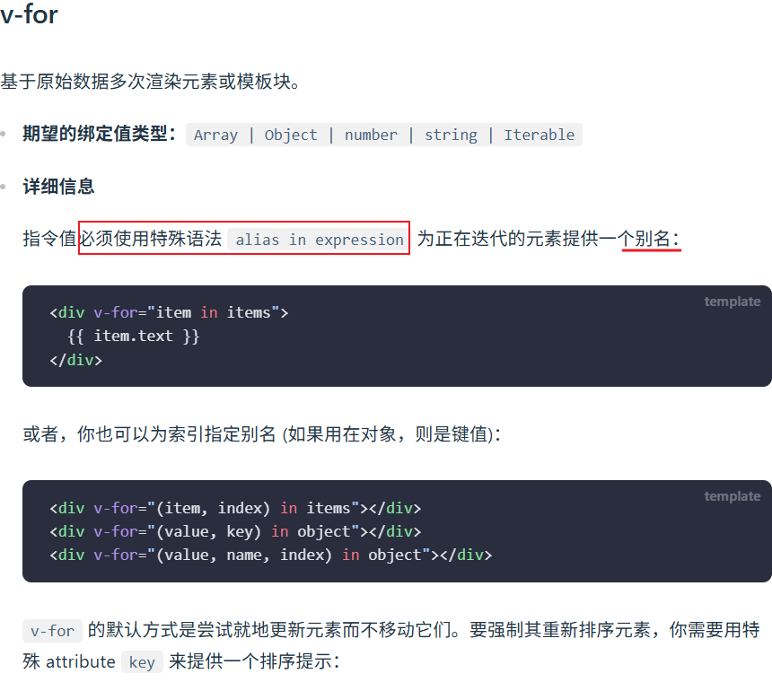
> v-for 是 Vue 中用于根据数组或对象重复渲染一段模板内容的指令
> 为了提升性能，Vue建议使用v-for时，绑定一个key属性，key属性具有唯一性，一般是索引值

---

## v-if

- 要求：
  - 点击complate按钮后，按钮消失且为列表项添加删除线

解决方案：

- 使用v-if进行判断渲染
  - 为列表项添加属性，用于判断
- 为按钮绑定方法，事件发生后修改对应的属性
- 为列表项绑定class，根据对应的属性值判断是否显示对应的样式

```js
isComplate(complateIdx) {
      this.todoArray = this.todoArray.map((todo, idx) => {
        if (idx == complateIdx) {
          return {
            ...todo,
            isComplate: true,
          };
        }
        return todo;
      });
    },
```

``html

<ul>
        <li v-for="(todoItem, idx) in todoArray" v-bind:key="idx">
          <div v-bind:class="todoItem.isComplate?'deleted': ''">
            {{ todoItem.value }}
          </div>
          <button v-if="!todoItem.isComplate" v-on:click="isComplate(idx)">
            Complete</button
          ><button v-on:click="removeTodo(idx)">&times;</button>
        </li>
      </ul>
```

> [!Note] v-if
> 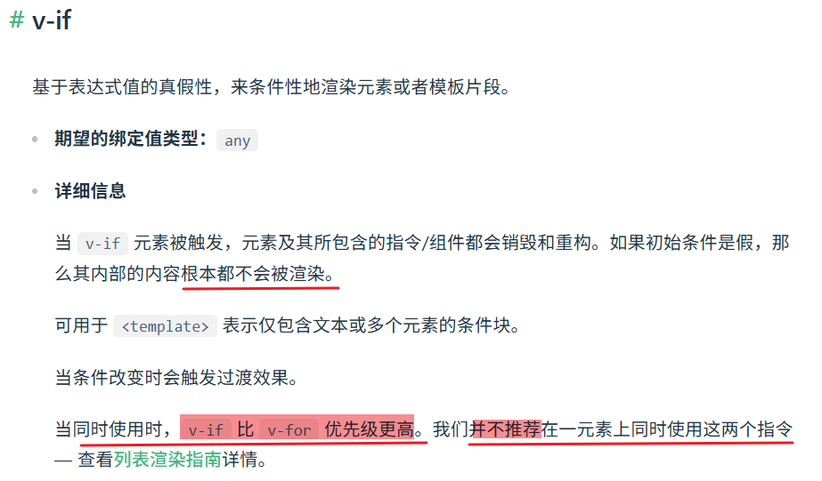
> 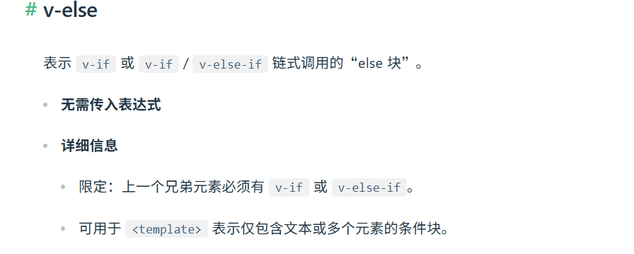
> 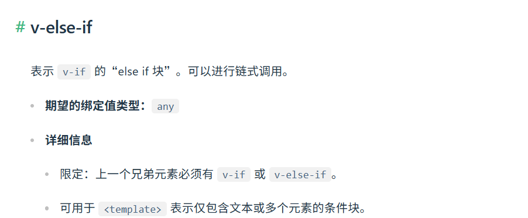
> 用于条件渲染判断，若判断为False，那组件根本不会被渲染

- 在Vue中，凡是可以书写JS表达式的地方，都可以使用三元运算符，常用于：
  - 插值语法
  - class绑定值
  - v-bind属性绑定
  - v-if逻辑判断

---

## computed强化

- 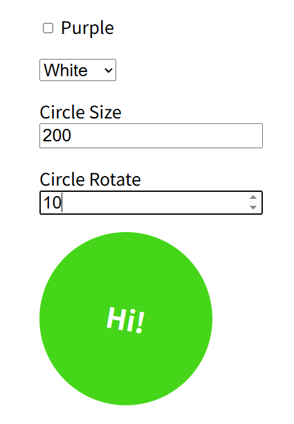

要求：

- 勾选选项以及选择下拉选项可以修改圆圈样式
- 修改参数，可以修改圆圈尺寸与旋转角度、

思路：

- 通过Vue变量将动作&值的改变与圆圈样式联动

```js
/*
  height: 0px,
  width: 0px,
  lineHeight: 0px,
  transform: `rotate(0deg)`,
*/
const { createApp } = Vue;

const app = {
  data() {
    return {
      isPurple: false,
      circleColor: "",
      circleSize: 200,
      circleAngle: 0,
    };
  },
  computed: {
    circleClass() {
      return this.isPurple ? "purple" : "";
    },
    circleStyle() {
      return {
        height: `${this.circleSize}px`,
        width: `${this.circleSize}px`,
        lineHeight: `${this.circleSize}px`,
        transform: `rotate(${this.circleAngle}deg`,
      };
    },
  },
};

createApp(app).mount("#app");
```

> [!Note]
>
> - computed()计算属性常用作优化HTML的标签书写
>   - 不建议在HTML标签中使用过多的JS表达式，会造成结构混乱，使用计算属性，将响应式值组合赋值
> - 一般来说，computed的使用场景有以下：
>   - 文本拼接
>   - 状态文案切换
>   - 动态 class
>   - 动态 style
>   - 列表过滤
>   - 列表排序
>   - 数据统计
>   - 表单联动
>   - 条件展示结果
>   - 展示格式化

---

## Vue脚手架

- 技术支持：
  - NodeJS环境
  - pnpm包管理器

- NodeJS是JS脱离于浏览器运行的环境
  - 安装后通过`node -v`查看是否安装成功，若虫显示当前node版本
  - `nodemon`是nodejs的一个工具，用于实时监控JS文件变化，自动重启服务
  - `node 文件名称`表示运行文件
- npm是包管理器，通过该工具对众多依赖进行管理
  - `npm install pnpm -g`:全局(-g)安装pnpm

---

- 通过以下命令创建脚手架子
- 按照项目需要选择
- 创建好后会生成一个package文件，包含所需要的依赖与命令
  - `npm run dev`安装项目依赖
  - `npm run dev`运行项目

```sh
npm create vue@latest
pnpm create vue@latest
```

---

## 使用脚手架创建Vue项目

```bash
npm create Vue .
```

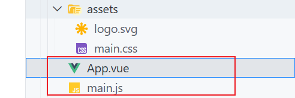

- 后跟一个`.`表示在当前文件夹创建项目(默认是在当前目录下新建目录)
- 安装moudle目录
- 项目主要文件是
  - main.js
  - App.vue
- 在JS中，同样创建一个Vue对象并挂载在容器上
- 该对象由JS模块化工具import引入
- 将原项目的内容迁移在脚手架项目上
  - HTML:将容器内所有内容迁移(不包括容器)在template标签中
  - style文件：将CSS内容迁移在style标签内
    - 这会导致对容器的初始化效果因为找不到容器标签而失效
    - 单独在assets下创建一个css文件，在JS中引入
  - App对象：原先的JS代码贴在script标签内，因为main通过模块化引入了该对象，所以相应的需要在对象上使用导出语法

- 使用技巧:使用脚手架创建Vue项目时，自带一个悬浮的DevTool，也可以在运行项目后，提供的网址下打开页面进行调试
- 禁用功能:在vite.config.js文件中注释该工具

---

## 组件化与props

- 组件：一个或多个HTML标签的集合在一个文件中，该文件就是一个组件
- 创建组件的流程：
  - 创建一个components目录
  - 创建Vue文件
  - 在App文件中使用组件
    - 引入:`import .. from..`
    - 注册：`components:{}`
    - 使用：`<组件名/>`

```Vue

<script>
//1.引入
import ButtonCounter from './ButtonCounter.vue'

export default {
  //2.注册
  components: {
    ButtonCounter
  }
}
</script>

<template>
  <h1>Here is a child component!</h1>
  //3.使用
  <ButtonCounter />
</template>
```

- 在框架中，保证数据是父组件 -> 子组件
- v-model值不能当做接收值，因为这会导致子组件数据 -> 父组件

- 以circleColor组件为例

```js
//子组件
<template>

  <select
    :value="circleColor"
    @change="(event) => changeCircleColor(CustomEventMap.target.value)"
  >
    <option value="">White</option>
    <option value="text-black">Black</option>
    <option value="text-orange">Orange</option>
  </select>
</template>
<script>
export default {
  props: ["circleColor", "changeCircleColor"],
};
</script>

```

```vue
//父组件
<template>
  <!-- <select v-model="circleColor">
    <option value="">White</option>
    <option value="text-black">Black</option>
    <option value="text-orange">Orange</option>
  </select> -->
</template>
```

- select原本接收响应式变量circleColor，并支持双向绑定，用户界面可返回数据给Vue对象
- 将组件抽离出去后，v-model需要解构为初始值+事件监听响应的组合

- 在组件传值时，若值与传值的名称一样时，可以简写

> [!Note] 总结
>
> - 将父组件中的HTML抽象为组件：
>
> 1. 创建专属的组件文件
> 2. 在父组件中显式的引用，注册，使用(代替原先的HTML文本)
> 3. 子组件接收HTML文本，观察需要用到什么数据，使用props属性接收，并对应的在父组件中进行传递
>
> - 若接收值需要v-model控制，那么需要拆分为绑定值+事件监听的组合，防止数据流向失控

---

## emits

- 如何将子组件数据传递给父组件使用？
- 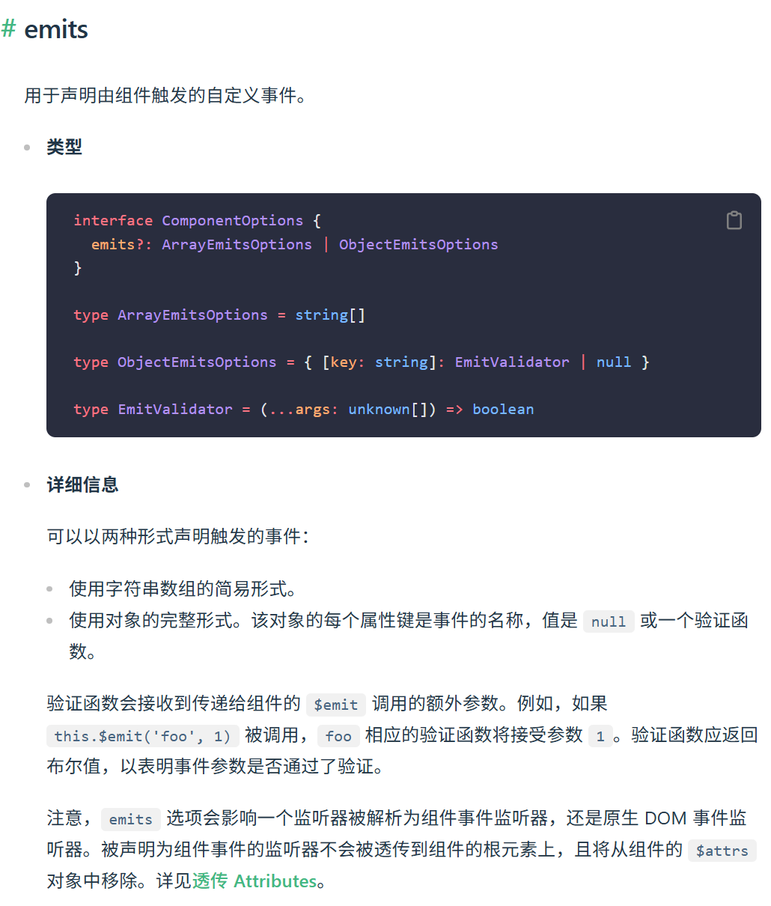
  - 自定义事件
  - 子组件触发事件 -> 父组件监听事件并处理事件
- 最终决策仍然由父组件执行

> [!Note] 总结
>
> 1. 子组件emits自定义事件
> 2. 在相应的事件中触发自定义事件，需要时传递数据
> 3. 父组件监听自定义事件，并定义方法来处理自定义事件

```html
<template>
  <select
    :value="circleColor"
    @change="(event) => $emits('change-circle-color', event.target.color)"
  >
    <option value="">White</option>
    <option value="text-black">Black</option>
    <option value="text-orange">Orange</option>
  </select>
</template>
<script>
  export default {
    // props: ["circleColor", "changeCircleColor"],
    props: ["circleColor"],
    emits: ["change-circle-color"],
  };
</script>

//父组件
<TogglePurple @tuggle-purple="togglePurple" />
```

---

## 插槽slot

- 在保证子组件的整体框架不变的前提下，将可变的内容由插槽代替，让父组件决定内容
- 这个内容一般指的是结构类的，一般的普通数据，可以使用props来决定

```html
<label>
  <slot></slot>
  <input
    type="number"
    :value="circleAngle"
    @input="(event) => changeCircleAngle(event.target.value)"
  />
</label>

//父组件
<CircleRotate :circleAngle :changeCircleAngle>Circle Rotate</CircleRotate>
```

---

## 组件的抽象复用

- 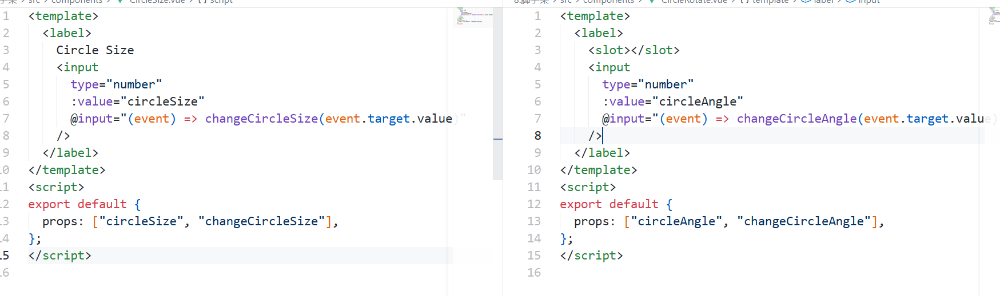
  - 不难发现这两个组件的结构相似，可以抽象为一个组件

```html
<template>
  <label>
    <slot></slot>
    <input
      type="number"
      :value="circleProperty"
      @input="(event) => changeCircleAngle(event.target.value)"
    />
  </label>
</template>
<script>
  export default {
    props: ["circleProperty", "changeCircleProperty"],
  };
</script>

//父组件
<CircleProperty
  :circle-property="circleSize"
  :change-circle-property="changeCircleSize"
  >CircleSize</CircleProperty
>

<CircleProperty
  :circle-property="circleAngle"
  :change-circle-property="changeCircleAngle"
  >CircleRotate</CircleProperty
>
```

---

## 获取API数据


- Api网站："https://api.adviceslip.com/"
- 要求：
  - 点击按钮，获取数据后显示在屏幕上

思路：

- 使用fetch函数发送异步请求获取数据并显示

```html
<template>
  <main>
    <h1>Advices</h1>
    <p>{{ isLoading ? "Loading..." : advice }}</p>
    <button @click="getAdvice" :disabled="isLoading">Get Advice</button>
  </main>
</template>

<script>
  export default {
    data() {
      return {
        advice: "There's no advice yet",
        isLoading: false,
      };
    },
    methods: {
      async getAdvice() {
        this.isLoading = true;
        const response = await fetch("https://api.adviceslip.com/advice");
        const data = await response.json();
        this.advice = data.slip.advice;
        this.isLoading = false;
      },
    },
  };
</script>
```

- 设置isLoading属性值，防止在请求数据过程中被反复请求接口，常见的节流操作

---

- 项目改进：
  - 在用户第一次加载时，自动触发该函数

解决方案：

- 生命周期钩子 -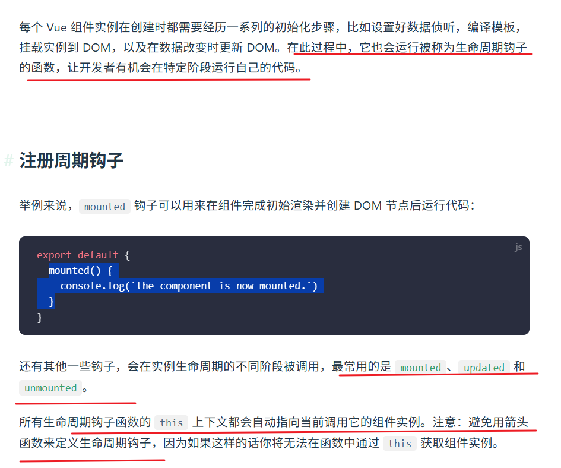

```js
 mounted() {
    this.getAdvice();
  }

```

---

## 动态组件切换与keep-alive配合

- v-if决定的是组件内容是否被真正的渲染，不满足条件时，Dom并不会被创建
  - 每一次切换都需要重新创建与销毁，对于需要频繁切换的页面，会造成反复请求数据的结果
- v-show用于显示控制，元素都会被渲染，只是控制是否显示
  - 优点是切换快，不会销毁组件实例
  - 缺陷是当组件过多时，初始渲染压力大，对性能有要求
  - 适合Tab页面切换

- 动态组件决定当前渲染区域，相比于v-if&v-show结构更清晰，更适合多组件切换的场景
  - 但动态组件在切换时也会销毁旧组件，需要配合缓存

```html
<component :is="currentComponent"></component>
```

```js
data() {
  return {
    currentComponent: 'HotMovieList'
  }
}
```

> [!Note] 总结
> 该组件通过is属性实现目标切换，is的值包括：
> 被注册的组件名&导入的组件对象
> 同时，Vue官方也给出建议：
> 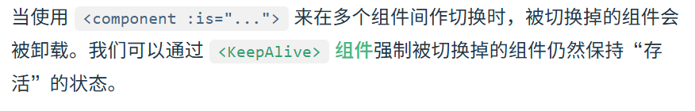

- keepAlive是一个缓存容器，常配合动态组件与路由组件使用
  - 会默认缓存内部所有的组件实例，可以通过include&exclude来定制该行为(使用逗号分隔，可使用字符串&正则表达式&数组)
  - 可通过max属性限制最大缓存数
  - 缓存实例的生命周期
    - 被缓存的实例被切换时并没有被卸载，所以普通的生命周期函数不会被启用
    - 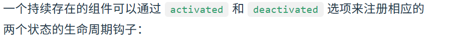
    - 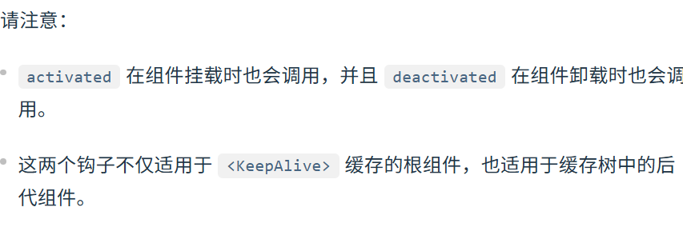

```js
export default {
  activated() {
    // 在首次挂载、
    // 以及每次从缓存中被重新插入的时候调用
  },
  deactivated() {
    // 在从 DOM 上移除、进入缓存
    // 以及组件卸载时调用
  },
};
```

---

## 组合式API

- `setup()`函数是组合式API的入口
- 响应式数据通过`ref()`函数返回
- 在模板中访问`ref()`返回的数据会自动浅层解包，无需`.value`
- `setup()`不包含对实例的访问权，所以**不能使用this访问数据**

```vue
<script>
import { ref } from "vue";

export default {
  setup() {
    const count = ref(0);

    // 返回值会暴露给模板和其他的选项式 API 钩子
    return {
      count,
    };
  },

  mounted() {
    console.log(this.count); // 0
  },
};
</script>

<template>
  <button @click="count++">{{ count }}</button>
</template>
```

```js
import { h, ref } from "vue";

export default {
  setup(props, { expose }) {
    const count = ref(0);
    const increment = () => ++count.value;

    expose({
      increment,
    });

    return () => h("div", count.value);
  },
};
```

---

## 单文件组件的组合式语法

- 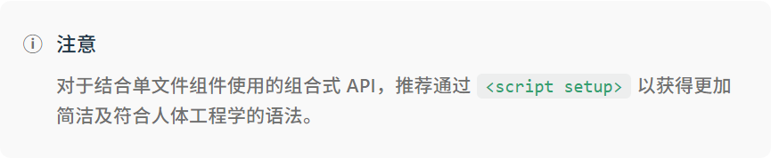

```vue
<script setup>
// 变量
const msg = "Hello!";

// 函数
function log() {
  console.log(msg);
}
</script>

<template>
  <button @click="log">{{ msg }}</button>
</template>
```

- 这种写法不需要`export deafult`，也不需要`return`

### computed()

```js
const count = ref(1);
const plusOne = computed(() => count.value + 1);

console.log(plusOne.value); // 2
```

- 计算属性通过函数`computed()`定义

### defineProps()

```vue
<script setup>
const props = defineProps(["foo"]);

console.log(props.foo);
</script>
```

- 在组合式语法中，props通过defineProps()定义

### defineEmits()

```vue
<script setup>
defineEmits(["inFocus", "submit"]);
</script>
```

- 在组合式语法中，emits通过defineEmits()声明

---

## 组合式函数

```vue
<script setup>
import { ref, onMounted, onUnmounted } from "vue";

const x = ref(0);
const y = ref(0);

function update(event) {
  x.value = event.pageX;
  y.value = event.pageY;
}

onMounted(() => window.addEventListener("mousemove", update));
onUnmounted(() => window.removeEventListener("mousemove", update));
</script>

<template>Mouse position is at: {{ x }}, {{ y }}</template>
```

- 这是一个鼠标追踪案例
  - 可以看到，模板中只使用到了x,y两个响应式变量，而其他逻辑实现细节并不需要
  - 我们可以将所有的实现细节封装在一个函数中，只把需要的数据暴露出去，这种方式称之为组合式

```js
//mouse.js
import { ref, onMounted, onUnmounted } from "vue";

// 按照惯例，组合式函数名以“use”开头
export function useMouse() {
  // 被组合式函数封装和管理的状态
  const x = ref(0);
  const y = ref(0);

  // 组合式函数可以随时更改其状态。
  function update(event) {
    x.value = event.pageX;
    y.value = event.pageY;
  }

  // 一个组合式函数也可以挂靠在所属组件的生命周期上
  // 来启动和卸载副作用
  onMounted(() => window.addEventListener("mousemove", update));
  onUnmounted(() => window.removeEventListener("mousemove", update));

  // 通过返回值暴露所管理的状态
  return { x, y };
}
```

```vue
<script setup>
import { useMouse } from "./mouse.js";

const { x, y } = useMouse();
</script>

<template>Mouse position is at: {{ x }}, {{ y }}</template>
```

- 可以看到，这里的组合式函数，将模板所需要的x,y暴露了出去，其余细节封装在函数中
- 在使用时，引入该组合式函数，并将所需要的变量解构得到

---

- 使用规范：
  - 组合式函数约定用驼峰命名法命名，并以“use”作为开头。

---

- 在项目中，我们更建议将所有的组合式函数单独放置在一个目录下：composables/hooks

## 热点新闻项目

### P1 技术选择与搭建

- 使用Vue+Vant的组合完成
- 项目结构：

- 创建项目以及安装依赖

---

### P2 结构拆分与创建

- 根据最终效果，创建对应的组件

---

### P3 请求数据，构建最小可运行模型

---

### 优化结构

- 推荐阅读：
  - [前端项目结构最佳实践](https://fadamakis.com/a-front-end-application-folder-structure-that-makes-sense-ecc0b690968b)
- 优化1:API请求函数单独封装与抽象
  - 多板块都采用相同的API请求，首先将API请求单独封装在一个目录下
  - 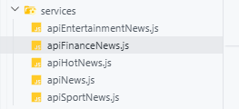
  - 多个API请求函数除了请求接口数据有所不同，其他都相同，所以再次封装：-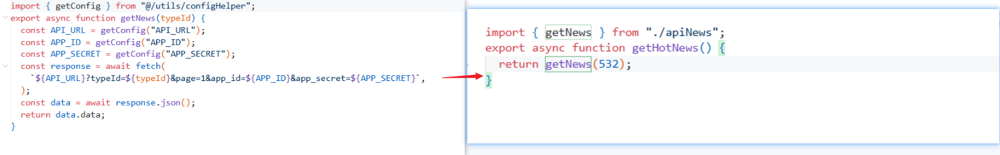
- 优化2:全局变量配置
  - 在请求数据中，多次使用的URL与key可以作为全局变量配置
  - 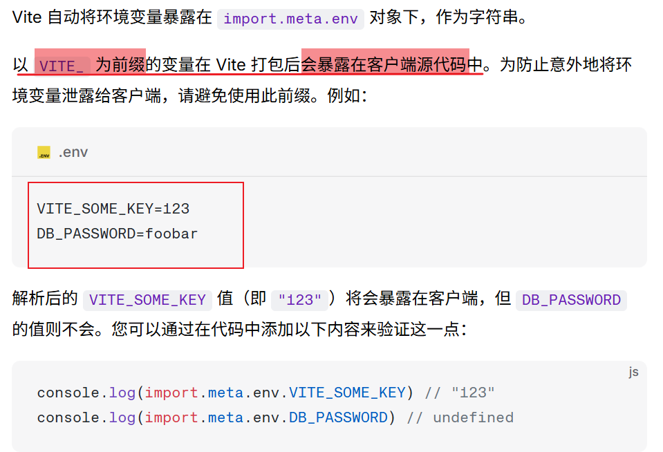
- 优化3:通用组件优化
  - 将组件结构相似的部分抽象出来进行优化

### P4 收藏功能开发

- 收藏的核心之一是把收藏内容存储
  - 由于条件影响，这里采用浏览器本地存储

1. 创建本地存储函数文件

- 存储
- 获取
- 追加

2. 为按钮组件添加方法

- 由于vant的卡片与v-show存在冲突，会导致切换收藏页到新闻列表时，收藏内容也被展示(因为v-show实际上是把内容渲染出来的)
  - 解决:外面包裹一层div

3. 问题:追加收藏内容后，不会在收藏页展示，需要刷新(本地已经存储了)

- 原因:动态组件切换实际上是缓存技术，所以生命周期钩子不会再次请求获取数据，所以列表没有更新

4. 问题：收藏页的新闻仍然有收藏按钮，可以重复收藏
5. 解决列表:

- 收数据应该同步在每一个组件中(这样每一个组件就知道按钮应该是取消收藏)
- 收藏页同步
