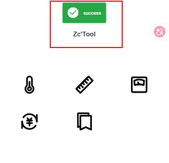
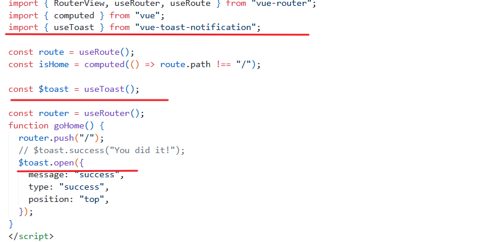

# 理论补充

## Vue-Router

- 新变化：
  - 
- router/index.js:

```js
import { createMemoryHistory, createRouter } from "vue-router";

import HomeView from "./HomeView.vue";
import AboutView from "./AboutView.vue";

const routes = [
  { path: "/", component: HomeView },
  { path: "/about", component: AboutView },
];

const router = createRouter({
  history: createMemoryHistory(),
  routes,
});
```

- 研究router，主要研究`route[] & history`

---


> [!Note] RouterLink
> 
> 由此可见，RouterLink用于路由跳转

> [!Note] RouterView
> 
> RouterView是用于指定路由渲染位置的标签

## 引入路由

- View目录的作用是在component目录与router目录之间产生联系,View目录下的组件是展示在页面上，components组成了这个View页面
- 使用路由代替动态组件切换
  - 
- 实现刷新保存历史页面功能,以及解决悬浮按钮在主页时不需要出现的问题
  - 解决问题需要判断当前路由是否是目标路由(不使用路由时判断当前组件)
    > [!Note] useRouter()
    >
    > - 除了使用 \<router-link> 创建 a 标签来定义导航链接，我们还可以借助 router 的实例方法
    > - 在组件内部，你可以使用 $router 属性访问路由，例如 this.$router.push(...)**。如果使用组合式 API，你可以通过调用 useRouter() 来访问路由器**
    > - 想要导航到不同的 URL，**可以使用 router.push 方法**。这个方法会向 history 栈添加一个新的记录，所以，当用户点击浏览器后退按钮时，会回到之前的 URL。

```js
// 字符串路径
router.push("/users/eduardo");

// 带有路径的对象
router.push({ path: "/users/eduardo" });

// 命名的路由，并加上参数，让路由建立 url
router.push({ name: "user", params: { username: "eduardo" } });

// 带查询参数，结果是 /register?plan=private
router.push({ path: "/register", query: { plan: "private" } });

// 带 hash，结果是 /about#team
router.push({ path: "/about", hash: "#team" });
```

> [!Note] useRoute()
>
> - 作用就是返回当前路径
> - 其返回值包含多种路由参数：
>   - 

# 项目进度

## 项目进度\*1

- 创建Vue项目
- 安装Vant-UI依赖
- 搭建基本页面
  - 
  - 页面布局+页面图标

---

## 项目进度\*2

- 设计组件
  - 温度转化工具
    - 
    - 设计细节：
      - 这里设计当失去焦点时，温度自动完成转换，针对移动端，**用户并不能方便实现移动焦点事件，通过按钮实现，所以这里的按钮没有添加实质性的事件监听**
- 设计组件跳转
  - 添加事件监听，点击事件引起组件变化
    - 通过动态组件+keepAlive保存缓存行为实现
- 设计返回主页事件
  - 添加悬浮按钮，并进行事件监听，点击可回到主页
- 引出问题：
  - 移动端方面，用户存在刷新行为，这会导致工具直接回到首页，不利好用户操作
  - 通过路由保存记录，解决问题

---

## 项目进度\*3

- 实现长度转换工具
  - 表单输入框\*2进行数据输出
  - 设置焦点事件触发转换
  - 下拉表单

- 实现轻通知
  - `vue-toast-notification`
  - npm仓库下载依赖->根据指示使用
  - 
  - 

- 实现重量单位转换组件
  - 大体布局与长度工具一致，修改长度转化单位数值即可
- 实现货币转换组件
  - 创建组件文件爱你+路由
  - 使用函数形式引入组件可以实现**懒加载**，不需要在路由开始引入
